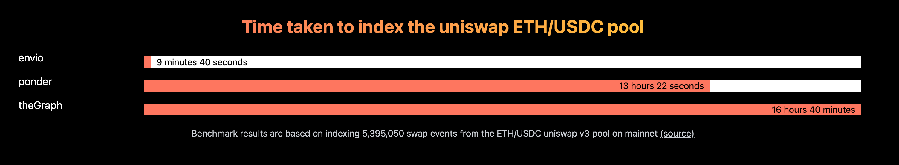

## この記事は

[Envio](https://envio.dev/)のチュートリアルをやってみたので履歴を記事に残します。

## [Envio](https://envio.dev/)とは

ブロックチェイン上のデータをインデックス化するサービスにカテゴライズされており、大量のデータを効率的に検索・アクセスできるサービスのようです。[インデックスサービスの概念については、この記事に](https://gaiax-blockchain.com/the-graph)書いてように、ある本の目次を作ってくれるもののようです。
ブロックチェインのデータは誰もが見ることができますが、そのデータは時系列で記録されてインデックス化されていません。そのため、特定のキーワードやパラメータに基づいてデータを取得するのには手間がかかってしまいます。
しかし、インデックス化するサービスを利用することでデータを効率よく取得できます。

この[Envio](https://envio.dev/)は[Ponder](https://ponder.sh/) や[theGraph](https://thegraph.com/)と比較して早いらしいです。

## チュートリアルをやってみる

まずは[Getting Started](https://docs.envio.dev/docs/getting-started)
