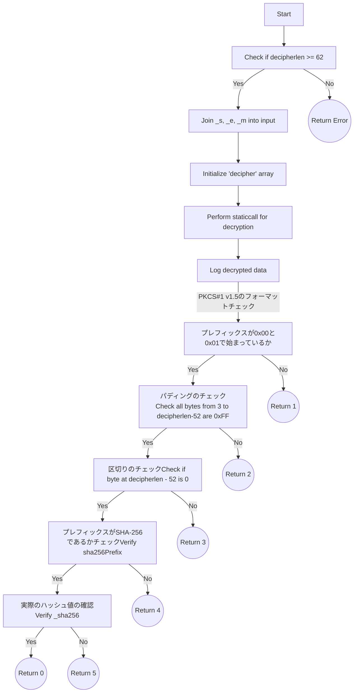

## 2023

### 10/8

#### RsaVerify.solについて

***pkcs1Sha256Verifyのコードは何をしていたのか***
RAS署名の検証をしているコードだった。
フローは以下。



[SHA-256ハッシュのプレフィックスについてはRFC3447に記載があった](https://www.rfc-editor.org/rfc/rfc3447#page-43)

#### 復号化の処理について

```RsaVerify.sol
        assembly {
            pop(
                staticcall(
                    gas(),
                    0x05,
                    add(input, 0x20),
                    inputlen,
                    add(decipher, 0x20),
                    decipherlen
                )
            )
        }
```

この部分で復号化をしている。ここで0×05については、Ethereumのプリコンパイルドコントラクトで復号処理をするものである。

#### Solidity のコンソールログの出力方法について

[forge-std/console.sol](https://github.com/foundry-rs/forge-std/blob/master/src/console.sol) をインポートして、console.logBytesとかでできる。

例えば以下のようにするとログを出せる。

```RsaVerify.sol
import "forge-std/console.sol";
        console.logString("hoge-------------------------");
        console.logBytes(decipher);
        console.logUint(uint8(decipher[1]));
        console.logString("fuga-------------------------");
```

## 足したい Issue

- RsaVerifyのテストケース追加
- RsaVerifyのテストコードのリファクタリングをする。ホワイトボックス的なテストケース名でなく、仕様を表すテストケース名にする
- RsaVerifyのリファクタリング -> バリデーションメソッドに切り出し、returnで数字ではなく例外発生これはガスの増加の影響も計測しながら進めてみる
