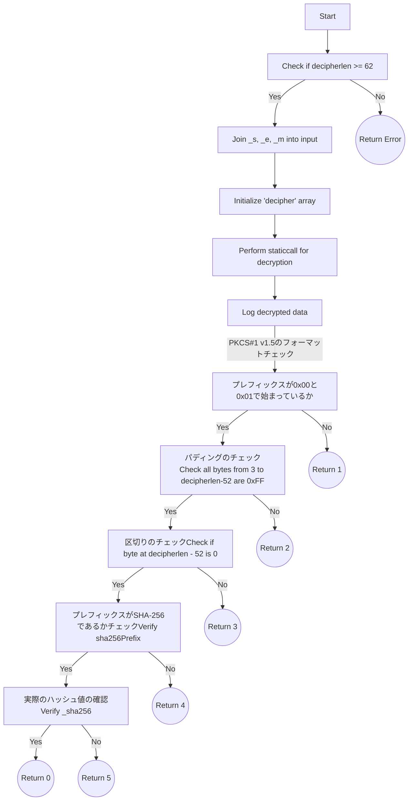

## [MynaWallet Contracts](https://github.com/MynaWallet/contracts)について

読み込んだ結果と気づいたことのログを残しています。

### RsaVerify.solについて

***pkcs1Sha256Verifyのコードは何をしていたのか***
RAS署名の検証をしているコードだった。
フローは以下。



[SHA-256ハッシュのプレフィックスについてはRFC3447に記載があった](https://www.rfc-editor.org/rfc/rfc3447#page-43)

#### 復号化の処理について

```RsaVerify.sol
        assembly {
            pop(
                staticcall(
                    gas(),
                    0x05,
                    add(input, 0x20),
                    inputlen,
                    add(decipher, 0x20),
                    decipherlen
                )
            )
        }
```

この部分で復号化をしている。ここで0×05については、Ethereumのプリコンパイルドコントラクトで復号処理をするものです。
この仕様については[eip-198](https://eips.ethereum.org/EIPS/eip-198)に書かれている。

#### decipherlenがモジュラスの長さとしてある理由

RSA暗号の基本的な概念としては、大きな数値（モジュラス）とその数学的性質を利用して、情報を暗号化および復号化しています。
これは合同式を使うので、得られる暗号文や復号文は必ずモジュラスの長さ以下になります。
しかし、必ずモジュラスの長さと完全に一致するわけではないこともあります。

### RSAの基本的な手順

1. **キー生成**: 2つの大きな素数を選び、それらを掛け合わせて1つの非常に大きな数（モジュラス）を生成します。
2. **公開鍵と秘密鍵**: モジュラスと共に、特定の計算を通じて公開鍵と秘密鍵を生成します。
3. **暗号化**: メッセージ（平文）を取り、数学的な操作（モジュラス演算）を用いて暗号文を生成します。
4. **復号化**: 暗号文を取り、別の数学的な操作（同じくモジュラス演算）を用いて元のメッセージ（平文）に戻します。

### モジュラスと暗号/復号文の長さ

- RSA暗号では、モジュラスの長さが暗号化・復号化できる「ブロック」の長さを決定します。
- 暗号化や復号化はモジュラス演算（mod \( N \) など）を用いて行われるため、結果として得られる数値はモジュラス \( N \) 以下になります。
- したがって、暗号文と復号文はモジュラスと同じ長さになるのです。

#### decipherlenが62バイト以上でなければならない理由

decipherlen（つまりモジュラスの長さ）が62以上でなければならない理由は、PKCS#1 v1.5形式に従った署名の構造に基づいています。
PKCS#1 v1.5でのRSA署名には以下のような形式が一般的です。

```format
0×00 || 0×01 || PS || 0x00 || DigestInfo
```

0×00と0×01は署名のプレフィックスです。
PSはパディング文字列（通常は0xFFで埋められる）です。
0×00はパディングとDigestInfoの区切りです。
DigestInfoはハッシュ値とその他の情報（例えば、ハッシュアルゴリズムのOIDなど）を含みます。
この場合、SHA-256が使われているので、DigestInfoの長さは19 (sha256Prefixの長さ) + 32 (SHA-256ハッシュの長さ)、合計51バイトになります。
さらに、パディングの前に0×00と0×01、そしてDigestInfoの前に00が必要なので、11バイトがそのために使われます。
51 (DigestInfoの長さ) + 11 (その他の部分) = 62
したがって、モジュラス（_m.length）は最低でも62バイト以上でなければならないのです。
これは、それ以下の長さでは、必要な情報を全て格納できないためです。

#### RSA署名を作るためのスクリプトを作る

作ってみたが、どうもRsaVerify.solで復号してみると期待するフォーマットになっていない。

```rsa-generator.py
import argparse
import json
import binascii
from cryptography.hazmat.primitives import hashes
from cryptography.hazmat.primitives.asymmetric import padding, rsa
from cryptography.hazmat.backends import default_backend
from cryptography.exceptions import InvalidSignature


def pad_hex_string(hex_str):
    """
    Pad the hexadecimal string with leading zeros.
    This is often required for cryptographic operations.
    """
    return "0" * (512 - len(hex_str)) + hex_str


def decipher_data(public_key, signature, data):
    """
    Decipher the signature using the public key.
    This provides a way to verify that the signature was created
    using the corresponding private key.
    """
    try:
        public_key.verify(signature, data, padding.PKCS1v15(), hashes.SHA256())
        deciphered_hex = (
            "0x0001"
            + "f" * 478
            + "003031300d060960864801650304020105000420"
            + binascii.hexlify(data).decode()
        )
        return deciphered_hex
    except InvalidSignature:
        return "Signature verification failed"


def generate_rsa_key_pair():
    """
    Generate RSA Key Pair.
    RSA involves a public key and a private key.
    The public key is used for encryption,
    and the private key is used for decryption.
    """
    return rsa.generate_private_key(
        public_exponent=65537, key_size=2048, backend=default_backend()
    )


def get_public_key(private_key):
    """
    Get the public key from a private key.
    In RSA, the public key consists of a modulus and an exponent.
    """
    return private_key.public_key()


def sign_data(private_key, data):
    """
    Sign the given data using RSA digital signature.
    Digital Signature provides a way to verify the origin of messages.
    """
    return private_key.sign(data, padding.PKCS1v15(), hashes.SHA256())


def get_modulus_and_exponent(public_key):
    """
    Get the modulus and exponent from a public key.
    In RSA, the public key is represented as (n, e) where n is the modulus and e is the exponent.
    """
    public_numbers = public_key.public_numbers()
    return public_numbers.n, public_numbers.e


def compute_sha256_hash(data):
    """
    Compute the SHA-256 hash of the given data.
    Hash functions take an input and produce a fixed size string of characters.
    """
    digest = hashes.Hash(hashes.SHA256(), backend=default_backend())
    digest.update(data)
    return digest.finalize()


def main(data_to_sign):
    """
    Main function to demonstrate RSA key generation, signing and relevant value extraction.
    """
    # Generate RSA key pair
    private_key = generate_rsa_key_pair()

    # Get the public key
    public_key = get_public_key(private_key)

    # Convert the data to bytes and sign it
    data = data_to_sign.encode()
    signature = sign_data(private_key, data)

    # Extract modulus and exponent
    modulus, exponent = get_modulus_and_exponent(public_key)

    # Compute the SHA-256 hash of the data
    sha256_hashed = compute_sha256_hash(data)

    # Pad the exponent with leading zeros
    padded_exponent = pad_hex_string(hex(exponent).replace("0x", ""))

    result = {
        "DIGEST": 'hex"' + binascii.hexlify(sha256_hashed).decode() + '"',
        "SHA256_HASHED": 'hex"' + binascii.hexlify(sha256_hashed).decode() + '"',
        "EXPONENT": 'hex"' + padded_exponent + '"',
        "SIGNATURE": 'hex"' + binascii.hexlify(signature).decode() + '"',
        "MODULUS": 'hex"' + hex(modulus).replace("0x", "") + '"',
    }

    # Decipher the data
    decipher_result = decipher_data(public_key, signature, data)
    result["DECIPHER_RESULT"] = decipher_result
    print(json.dumps(result, indent=2))


if __name__ == "__main__":
    parser = argparse.ArgumentParser(
        description="Generate RSA key pair, sign data, and output relevant values."
    )
    parser.add_argument("data_to_sign", help="The data to sign.")
    args = parser.parse_args()

    main(args.data_to_sign)

```

#### opensslを使う

[SolRsaVerify](https://github.com/adria0/SolRsaVerify)のREADMEに書いてある手順に従ってやってみる。

#### Solidity のコンソールログの出力方法について

[forge-std/console.sol](https://github.com/foundry-rs/forge-std/blob/master/src/console.sol) をインポートして、console.logBytesとかでできる。

例えば以下のようにするとログを出せる。
型を出力時に指定しないとだめだった。

```RsaVerify.sol
import "forge-std/console.sol";
        console.logString("hoge-------------------------");
        console.logBytes(decipher);
        console.logUint(uint8(decipher[1]));
        console.logString("fuga-------------------------");
```
