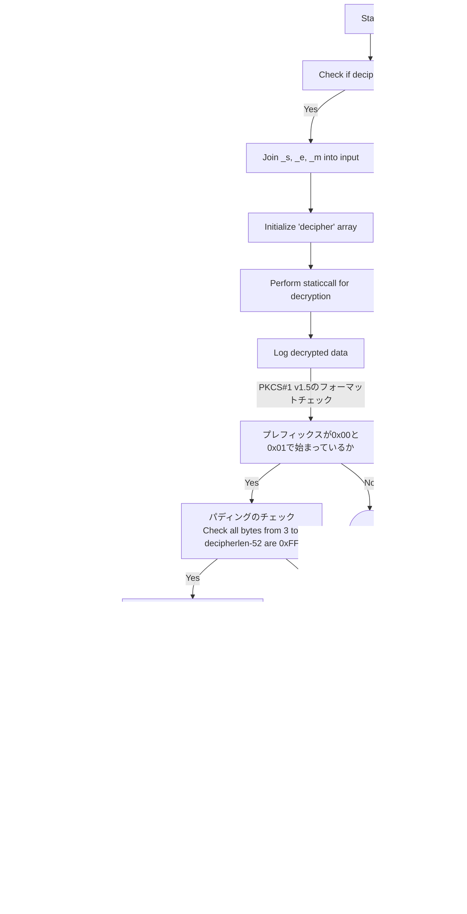

## [MynaWallet Contracts](https://github.com/MynaWallet/contracts)について

読み込んだ結果と気づいたことのログを残しています。

### RsaVerify.solについて

pkcs1Sha256Verifyのコードは何をしていたのか
RAS署名の検証をしているコードだった。
フローは以下。



[SHA-256ハッシュのプレフィックスについてはRFC3447に記載があった](https://www.rfc-editor.org/rfc/rfc3447#page-43)

>MD2:     (0x)30 20 30 0c 06 08 2a 86 48 86 f7 0d 02 02 05 00 04
                   10 || H.
      MD5:     (0x)30 20 30 0c 06 08 2a 86 48 86 f7 0d 02 05 05 00 04
                   10 || H.
      SHA-1:   (0x)30 21 30 09 06 05 2b 0e 03 02 1a 05 00 04 14 || H.
      SHA-256: (0x)30 31 30 0d 06 09 60 86 48 01 65 03 04 02 01 05 00
                   04 20 || H.
      SHA-384: (0x)30 41 30 0d 06 09 60 86 48 01 65 03 04 02 02 05 00
                   04 30 || H.
      SHA-512: (0x)30 51 30 0d 06 09 60 86 48 01 65 03 04 02 03 05 00
                      04 40 || H.

#### 復号化の処理について

```RsaVerify.sol
        assembly {
            pop(
                staticcall(
                    gas(),
                    0x05,
                    add(input, 0x20),
                    inputlen,
                    add(decipher, 0x20),
                    decipherlen
                )
            )
        }
```

この部分で復号化をしている。ここで0×05については、Ethereumのプリコンパイルドコントラクトで復号処理をするものです。
この仕様については[eip-198](https://eips.ethereum.org/EIPS/eip-198)に書かれている。

#### decipherlenがモジュラスの長さとしてある理由

RSA暗号の基本的な概念としては、大きな数値（モジュラス）とその数学的性質を利用して、情報を暗号化および復号化しています。
これは合同式を使うので、得られる暗号文や復号文は必ずモジュラスの長さ以下になります。
しかし、必ずモジュラスの長さと一致するわけではないこともあります。

### RSAの基本的な手順

1. キー生成 - 2つの大きな素数を選び、それらを掛け合わせて1つの非常に大きな数（モジュラス）を生成します。
2. 公開鍵と秘密鍵 - モジュラスと共に、特定の計算を通じて公開鍵と秘密鍵を生成します。
3. 暗号化 - メッセージ（平文）を取り、数学的な操作（モジュラス演算）を用いて暗号文を生成します。
4. 復号化 - 暗号文を取り、別の数学的な操作（同じくモジュラス演算）を用いて元のメッセージ（平文）に戻します。

### モジュラスと暗号/復号文の長さ

- RSA暗号では、モジュラスの長さが暗号化・復号化できる「ブロック」の長さを決定します。
- 暗号化や復号化はモジュラス演算（mod \( N \) など）を用いて行われるため、結果として得られる数値はモジュラス \( N \) 以下になります。
- したがって、暗号文と復号文はモジュラスと同じ長さになるのです。

#### decipherlenが62バイト以上でなければならない理由

decipherlen（つまりモジュラスの長さ）が62以上でなければならない理由は、PKCS#1 v1.5形式に従った署名の構造に基づいています。
PKCS#1 v1.5でのRSA署名には以下のような形式が一般的です。

```format
0×00 || 0×01 || PS || 0x00 || DigestInfo
```

0×00と0×01は署名のプレフィックスです。
PSはパディング文字列（通常は0xFFで埋められる）です。
0×00はパディングとDigestInfoの区切りです。
DigestInfoはハッシュ値とその他の情報（例えば、ハッシュアルゴリズムのOIDなど）を含みます。
この場合、SHA-256が使われているので、DigestInfoの長さは19 (sha256Prefixの長さ) + 32 (SHA-256ハッシュの長さ)、合計51バイトになります。
さらに、パディングの前に0×00と0×01、そしてDigestInfoの前に00が必要なので、11バイトがそのために使われます。
51 (DigestInfoの長さ) + 11 (その他の部分) = 62
したがって、モジュラス（_m.length）は最低でも62バイト以上でなければならないのです。
これは、それ以下の長さでは、必要な情報を全て格納できないためです。

#### RSA署名を作るためのスクリプトを作る

作ってみた。

```rsa-generator.sh
#!/bin/bash

# RSAプライベートキーの生成
openssl genrsa -out private.pem 2048

# メッセージに署名
signature=$(echo -n "hello world" | openssl dgst -sha256 -sign private.pem | xxd -p | tr -d \\n)
echo "Signature: $signature"

# 公開キーを抽出
openssl rsa -in private.pem -outform PEM -pubout -out public.pem

# モジュラス（n）を抽出するためのオフセットを取得
offset=$(openssl asn1parse -inform PEM -in public.pem | grep 'BIT STRING' | head -2 | tail -1 | awk '{print $1}' | cut -d: -f1)
echo "Offset for modulus: $offset"

# 適切なオフセットでモジュラスを抽出
modulus=$(openssl asn1parse -inform PEM -in public.pem -strparse $offset | grep 'prim: INTEGER' |  awk '{print $7}' | cut -d: -f2)
echo "Modulus: $modulus"

```

#### opensslを使う

[SolRsaVerify](https://github.com/adria0/SolRsaVerify)のREADMEに書いてある手順に従ってやってみる。

#### Solidity のコンソールログの出力方法について

[forge-std/console.sol](https://github.com/foundry-rs/forge-std/blob/master/src/console.sol) をインポートして、console.logBytesとかでできる。

例えば以下のようにするとログを出せる。
型を出力時に指定しないとだめだった。

```RsaVerify.sol
import "forge-std/console.sol";
        console.logString("hoge-------------------------");
        console.logBytes(decipher);
        console.logUint(uint8(decipher[1]));
        console.logString("fuga-------------------------");
```
