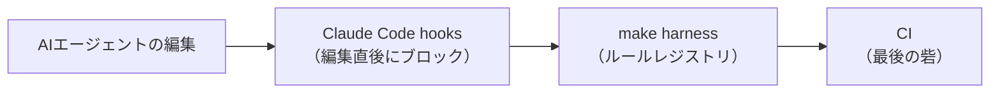

[TenkaCloud](https://www.tenkacloud.com/?lang=ja)という、実際のAWSアカウント上でクラウド競技を開催するOSSを作っています（[susumutomita/TenkaCloud](https://github.com/susumutomita/TenkaCloud)、Apache-2.0）。実装のほとんどをClaude CodeなどのAIエージェントに書かせています。

人が書くコードなら、レビューで気づける前提に頼れます。AIが大量に書くコードは、その前提が崩れます。同じ間違いを高速に繰り返せてしまうからです。だからTenkaCloudでは、「守ってほしいルール」をドキュメントの記述だけで終わらせず、機械が読める形にコード化しています。この記事では、そのルールレジストリとhooksの設計、そして正直に言うとハーネス自体も人が作る以上ドリフトする、という実例を書きます。



## ルールをコードにする: `make harness`

TenkaCloudは、CLAUDE.mdに「守ってほしいルール」を書くだけでなく、機械チェックできるものはコードにしています。実装は`.claude/harness/src/rules/`にルール1本＝ファイル1本です。`make harness`を実行すると`.claude/harness/bin/architecture.ts`が動きます。ステージ済みファイルに対してこのルールレジストリを全部走らせ、違反をエラーとして報告します。

```ts
// .claude/harness/src/rules/index.ts
export const architectureRules = [
  adrMustBeHtml,
  adrSelfContained,
  iamWildcardNeedsJustify,
  fileTooLarge,
  handlerNoDirectSdkImport,
  handlerTenantIsolation,
  noConflictMarkers,
  lambdaEnvSize,
  noAwsTrademarkFictions,
  secretsManagerForbidden, // CLAUDE.md cost-zero principle: Secrets Manager 禁止
  handlerMustNotCallFetch, // lib/handlers/ は fetch( を直接呼ばない
  domainNoInfraImport,
  runtimeCompositionRootOnly,
  // ...
];
```

ルールの中身は、たとえば「Secrets Managerのimportを禁止する」というものです。TenkaCloudは無料枠に収める方針があります。秘匿値はSecrets Manager（1件あたり課金）ではなく、SSM Parameter StoreのSecureString（無料）へ置くと決めています。それを行走査のregexで機械的に検出します。

```ts
// .claude/harness/src/rules/secrets-manager-forbidden.ts
const SECRETS_MANAGER_IMPORT_RE =
  /(?:from\s+|import\s*\(?\s*|require\s*\(\s*)["'](@aws-sdk\/client-secrets-manager|aws-cdk-lib\/aws-secretsmanager)["']/;

export const secretsManagerForbidden: Rule = {
  id: "secrets-manager-forbidden",
  severity: "error",
  check(ctx) {
    return scanLinesByRegex(ctx, {
      ruleId: "secrets-manager-forbidden",
      severity: "error",
      shouldInspect,
      lineRegex: SECRETS_MANAGER_IMPORT_RE,
      buildFinding: ({ line }) => ({
        message: "AWS Secrets Manager is forbidden (per-secret cost).",
        recommendation: "Store the secret in SSM Parameter Store as a SecureString.",
      }),
    });
  },
};
```

このファイルのコメントには、正直な経緯が書いてあります。

> CLAUDE.md / harness.md は本ルールを機械チェック対象として記載していたが、実装が存在しなかった (= 偽りの安全保証)。ドキュメントの契約に実装を合わせる。

つまり「ドキュメントには機械チェックすると書いてあるのに、実装がない」状態が過去に一度あったということです。ドキュメントの記述と実装は、放っておくと簡単にずれます。ほかにも、こういうルールを1つずつ増やしています。

- `handler-must-not-call-fetch`: ハンドラーから直接fetchを呼ばせない
- `adr-self-contained`: ADRにチャットの文脈やAIエージェントの役割分担メモを残さない
- `iam-wildcard-needs-justify`: IAMのワイルドカードは根拠コメント必須

## Claude Code自体をhooksで縛る

ルールレジストリは「コミットの前に自分で`make harness`を叩けば」効きます。ただしAIエージェントが毎回それを覚えて実行してくれる保証はありません。そこでTenkaCloudは、Claude Code自体のhooks機構（`.claude/settings.json`）を使って、エージェントの手を編集の瞬間に止めます。

設定ファイルへの直接編集は、PreToolUse hookで機械的にブロックします。

```bash
# .claude/hooks/guard-config.sh（抜粋）
case "$BASENAME" in
  .eslintrc*|eslint.config.*|biome.json|.prettierrc*|prettier.config.*)
    echo "BLOCKED: $BASENAME の編集は禁止されています。" >&2
    echo "WHY: 設定を緩めるのではなく、コードを修正してください。" >&2
    exit 2
    ;;
  vitest.config.*|jest.config.*)
    echo "BLOCKED: $BASENAME の編集は禁止されています。" >&2
    echo "WHY: テスト設定の変更はカバレッジ基準を下げるリスクがあります。" >&2
    exit 2
    ;;
esac
```

lintやテストのエラーに詰まったAIエージェントが、コードを直す代わりに設定を緩めて「解決」してしまう、というのはありがちな失敗です。それをexit code 2で強制的に止め、`.env`系ファイルへの直接編集も同じ理由で禁止しています。

編集の直後には、PostToolUse hookでスタブやフォールバックのコードを検知します。

```bash
# .claude/hooks/quality-guard.sh（抜粋）
if echo "$CONTENT" | grep -Eqi 'fallback to empty|empty dataset|empty values|stub problem|returning empty'; then
  echo "BLOCKED: 一時しのぎの fallback / stub が検出されました: $FILE_PATH" >&2
  echo "FIX: 空データで握り潰さず、正しい service fallback を実装するか明示的に失敗させてください。" >&2
  exit 2
fi
```

これは「動くように見えるがごまかしているコード」を、書いた本人が気づく前に止める仕組みです。UIレイヤーから直接`fetch(`を呼んだり、`process.env.API_URL`を直読みしたりするコードも、同じhookで検知しブロックします。さらに、`git commit`を含むBashコマンドの実行時には、`make before-commit`（lint・テスト）を先に走らせるPreToolUse hookもあります。ここまでが「コミット前にエージェントの手元で止める」層です。

## 正直ポイント: hook自体もドリフトする

ここまでの仕組みは強力に見えます。ただ、この記事を書くために設定を読み直していて、実際にドリフトを見つけました。`git commit`前フックの実装がこうなっていたのです。

```json
"command": "CMD=$(jq -r '.tool_input.command'); if echo \"$CMD\" | grep -q 'git commit'; then ROOT=$(git rev-parse --show-toplevel); bun \"$ROOT/scripts/ai-improvement-loop.ts\" --staged --fail-on=high --root=\"$ROOT\" && make -C \"$ROOT\" before-commit; fi"
```

`scripts/ai-improvement-loop.ts`は、リポジトリの大規模リファクタ（Trunk migration、#440）で削除済みでした。`&&`でつないでいるので、存在しないスクリプトの実行に失敗すると、後段の`make before-commit`は一度も走りません。実際のGitフック（`.husky/pre-commit`）が別途`make before-commit`を独立して実行しているため、実害はありませんでした。ただしClaude Code経由でコミットする際の「その場での即時フィードバック」だけが、静かに死んでいました。`.husky/pre-commit`のコメントには、旧harnessは移行で撤去し、新しいharnessはPhase 2以降に再導入する予定だと書かれています。

見つけた場でその日のうちに直しました（[TenkaCloud #2730](https://github.com/susumutomita/TenkaCloud/pull/2730)）。死んでいた呼び出しを外し、`make -C "$ROOT" before-commit`だけを実行するようにしています。

前節の`secrets-manager-forbidden`のコメントと合わせると、同じ失敗パターンが2回出てきたことになります。「ドキュメントやフックにはチェックすると書いてある／設定してある。しかし実体が伴っていない」という状態です。ハーネスは一度組んで終わりではなく、リファクタのたびにメンテナンスし続けないと、チェックしているつもりで何もチェックしていない期間が生まれます。

## おわりに

AIエージェントに実装を任せるうえで、TenkaCloudがやっていることを並べるとこうなります。

- ルールをドキュメントで終わらせず、`.claude/harness/`にコードとして持たせる
- Claude Codeのhooksで、設定ファイルの改変やスタブ実装をその場でブロックする
- それでも防ぎきれない部分は、CIの`before-commit`相当のチェックを最後の砦にする

強制の強さには段差があります。hooksはエージェントの手を止める最初の層ですが、スクリプトが1本消えるだけで静かに無効化されうる、いちばん壊れやすい層でもあります。ルールレジストリは、そのルール自体に実装が伴っているかを別途確認しないと、ドキュメントだけの空約束になります。結局、hooksとharnessは「作ったら終わり」ではなく、コードと同じように壊れていないかを時々読み返す対象です。この記事を書く過程でハーネス自体のバグを見つけて直したのが、その一番わかりやすい証拠です。
