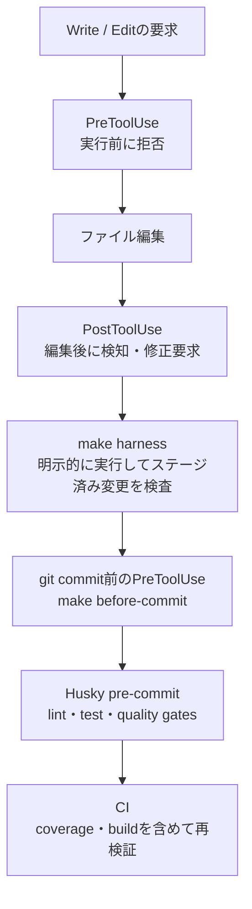

[TenkaCloud](https://www.tenkacloud.com/?lang=ja)という、実際のAWSアカウント上でクラウド競技を開催するOSSを作っています（[susumutomita/TenkaCloud](https://github.com/susumutomita/TenkaCloud)、Apache-2.0）。プロダクト自体の説明は[オンボーディング導線の記事](https://zenn.dev/bull/articles/tenkacloud-onboarding-as-first-problem)を参照してください。実装のほとんどをClaude CodeなどのAIエージェントに書かせています。

人が書くコードなら、レビューで気づける前提に頼れます。AIが大量に書くコードは、その前提が崩れます。同じ間違いを高速に繰り返せてしまうからです。だからTenkaCloudでは、「守ってほしいルール」をドキュメントの記述だけで終わらせず、機械が読める形にコード化しています。

ここでいうハーネスとは、実行前・実行後・コミット前・CIの各段階でAIエージェントの変更を検査する、実行可能な制約群です。ルールレジストリは、その制約を同じインタフェースで登録し、一括実行する仕組みです。この記事では、TenkaCloudのルールレジストリとhooksの設計、そしてハーネス自体も人が作る以上ドリフトする、という実例を書きます。



## ルールをコードにする: `make harness`

TenkaCloudは、CLAUDE.mdに「守ってほしいルール」を書くだけでなく、機械チェックできるものはコードにしています。実装は`.claude/harness/src/rules/`にルール1本＝ファイル1本です。`make harness`を実行すると`.claude/harness/bin/architecture.ts`が動きます。ステージ済みファイルに対してこのルールレジストリを全部走らせ、違反をエラーとして報告します。

```ts
// .claude/harness/src/rules/index.ts
export const architectureRules = [
  adrMustBeHtml,
  adrSelfContained,
  iamWildcardNeedsJustify,
  fileTooLarge,
  handlerNoDirectSdkImport,
  handlerTenantIsolation,
  noConflictMarkers,
  lambdaEnvSize,
  noAwsTrademarkFictions,
  secretsManagerForbidden, // CLAUDE.md cost-zero principle: Secrets Manager 禁止
  handlerMustNotCallFetch, // lib/handlers/ は fetch( を直接呼ばない
  domainNoInfraImport,
  runtimeCompositionRootOnly,
  // ...
];
```

ルールの中身は、たとえば「Secrets Managerのimportを禁止する」というものです。TenkaCloudには常設運用コストを抑える方針があります。秘匿値はSecrets Managerではなく、SSM Parameter StoreのStandard tierのSecureStringへ置くと決めています。Standard tierは追加料金がかかりません（[AWS Systems Manager Pricing](https://aws.amazon.com/systems-manager/pricing/)）。ただし、SecureStringで利用するAWS KMSの料金は別です。これを各行の正規表現走査で機械的に検出します。

```ts
// .claude/harness/src/rules/secrets-manager-forbidden.ts
const SECRETS_MANAGER_IMPORT_RE =
  /(?:from\s+|import\s*\(?\s*|require\s*\(\s*)["'](@aws-sdk\/client-secrets-manager|aws-cdk-lib\/aws-secretsmanager)["']/;

export const secretsManagerForbidden: Rule = {
  id: "secrets-manager-forbidden",
  severity: "error",
  check(ctx) {
    return scanLinesByRegex(ctx, {
      ruleId: "secrets-manager-forbidden",
      severity: "error",
      shouldInspect,
      lineRegex: SECRETS_MANAGER_IMPORT_RE,
      buildFinding: ({ line }) => ({
        message: "AWS Secrets Manager is forbidden (per-secret cost).",
        recommendation: "Store the secret in SSM Parameter Store as a SecureString.",
      }),
    });
  },
};
```

このファイルのコメントには、正直な経緯が書いてあります。

> CLAUDE.md / harness.md は本ルールを機械チェック対象として記載していたが、実装が存在しなかった (= 偽りの安全保証)。ドキュメントの契約に実装を合わせる。

つまり「ドキュメントには機械チェックすると書いてあるのに、実装がない」状態が過去に一度あったということです。ドキュメントの記述と実装は、放っておくと簡単にずれます。ほかにも、こういうルールを1つずつ増やしています。

- `handler-must-not-call-fetch`: ハンドラーから直接fetchを呼ばせない
- `adr-self-contained`: ADRにチャットの文脈やAIエージェントの役割分担メモを残さない
- `iam-wildcard-needs-justify`: IAMのワイルドカードは根拠コメント必須

## Claude Code自体をhooksで縛る

ルールレジストリは、コミット前に`make harness`を明示的に実行すれば効きます。ただし、AIエージェントが毎回それを覚えて実行する保証はありません。そこでTenkaCloudは、Claude Codeのhooks機構（`.claude/settings.json`）を使っています。実行前に判定できるものはPreToolUseで拒否し、編集後にしか判定できないものはPostToolUseで違反を返して修正を要求します。

設定ファイルへの直接編集は、PreToolUse hookで機械的にブロックします。

```bash
# .claude/hooks/guard-config.sh（抜粋）
case "$BASENAME" in
  .eslintrc*|eslint.config.*|biome.json|.prettierrc*|prettier.config.*)
    echo "BLOCKED: $BASENAME の編集は禁止されています。" >&2
    echo "WHY: 設定を緩めるのではなく、コードを修正してください。" >&2
    exit 2
    ;;
  vitest.config.*|jest.config.*)
    echo "BLOCKED: $BASENAME の編集は禁止されています。" >&2
    echo "WHY: テスト設定の変更はカバレッジ基準を下げるリスクがあります。" >&2
    exit 2
    ;;
esac
```

lintやテストのエラーに詰まったAIエージェントが、コードを直す代わりに設定を緩めて「解決」してしまう、というのはありがちな失敗です。PreToolUseの`exit 2`はツール呼び出し自体を拒否するため、設定ファイルは変更されません。`.env`系ファイルへの直接編集も同じ理由で禁止しています。

編集の直後には、PostToolUse hookでスタブやフォールバックのコードを検知します。

```bash
# .claude/hooks/quality-guard.sh（抜粋）
if echo "$CONTENT" | grep -Eqi 'fallback to empty|empty dataset|empty values|stub problem|returning empty'; then
  echo "BLOCKED: 一時しのぎの fallback / stub が検出されました: $FILE_PATH" >&2
  echo "FIX: 空データで握り潰さず、正しい service fallback を実装するか明示的に失敗させてください。" >&2
  exit 2
fi
```

ここはPreToolUseと強制力が異なります。ログ上は`BLOCKED`と表示していますが、PostToolUseはツールが成功した後に発火するため、すでに書かれたファイルを元には戻しません。`exit 2`で標準エラーをClaude Codeへ違反として返し、次の応答で修正を促します。[Claude Codeの公式リファレンス](https://code.claude.com/docs/en/hooks#posttooluse)でも、ツール呼び出し自体を防ぐにはPreToolUseを使うと説明されています。

UIレイヤーから直接`fetch(`を呼んだり、`process.env.API_URL`を直読みしたりするコードも、同じPostToolUse hookで検知して修正を要求します。ただし、現在のmatcherは`Write|Edit`なので、Bash経由のファイル書き換えはこのhookを通りません。hooksだけに完全性を求められない理由の1つです。

さらに、`git commit`を含むBashコマンドの実行時には、PreToolUse hookで`make before-commit`（lint・テスト）を先に走らせます。実際のコミット時にはHuskyの`.husky/pre-commit`も独立して`make before-commit`とquality gatesを実行します。ローカルhooksの外側では、CIがtypecheck・coverage・buildなどを再検証します。

## 正直ポイント: hook自体もドリフトする

ここまでの仕組みは強力に見えます。ただ、この記事を書くために設定を読み直していて、実際にドリフトを見つけました。`git commit`前フックの実装がこうなっていたのです。

```json
"command": "CMD=$(jq -r '.tool_input.command'); if echo \"$CMD\" | grep -q 'git commit'; then ROOT=$(git rev-parse --show-toplevel); bun \"$ROOT/scripts/ai-improvement-loop.ts\" --staged --fail-on=high --root=\"$ROOT\" && make -C \"$ROOT\" before-commit; fi"
```

`scripts/ai-improvement-loop.ts`は、リポジトリの大規模リファクタ（Trunk migration、#440）で削除済みでした。`&&`でつないでいるので、存在しないスクリプトの実行に失敗すると、後段の`make before-commit`は一度も走りません。

通常の`git commit`では、実際のGitフック（`.husky/pre-commit`）が`make before-commit`を独立して実行するため、コミット時の品質ゲート自体は残っていました。ただし、Claude Codeが`git commit`を実行する直前にフィードバックするはずだった層は、静かに死んでいました。

さらに、`.husky/pre-commit`には次のコメントが残っています。

```bash
# 旧 architecture-harness / ai-improvement-loop は ProtoShip 移行で撤去。
# 移行完了後に新しい harness を再導入する (Phase 2 以降)。
```

ここでいう旧harnessは、削除された`architecture-harness`と`ai-improvement-loop`を指します。一方、現在のリポジトリにはすでに`.claude/harness/`と`make harness`が存在します。つまり、呼び出し先のコードだけでなく、「新しいharnessは今後再導入する」という説明コメントも現状からずれていました。

見つけたその日に、死んでいた呼び出しを外して`make -C "$ROOT" before-commit`だけを実行する[修正PR（TenkaCloud #2730）](https://github.com/susumutomita/TenkaCloud/pull/2730)を出しました。

前節の`secrets-manager-forbidden`のコメントと合わせると、同じ失敗パターンが繰り返されています。「チェックするとドキュメントに書いてあるのにルールがない」「hookはあるのに呼び出し先がない」「コメントが現在の構成を説明していない」という状態です。ハーネスは一度組んで終わりではなく、リファクタのたびにメンテナンスしないと、チェックしているつもりで何もチェックしていない期間が生まれます。

## ハーネス自体もテスト対象にする

TenkaCloudには`make harness-test`があり、各ルールに正常例と違反例のunit testを持たせています。たとえば`secrets-manager-forbidden`には、Secrets Managerのimportを検出するケースだけでなく、SSMのimportは通すケースもあります。

ただし、ルール単体のテストが通っても、`.claude/settings.json`からそのルールやスクリプトへ到達できるとは限りません。今回壊れていたのはルールの判定ロジックではなく、設定と実装を結ぶ配線でした。次に必要なのは、こうしたハーネスの死活監視です。

- `.claude/settings.json`が参照するスクリプトの存在と実行権限を検査する
- サンプルの`TOOL_INPUT`を渡し、各hookが期待する終了コードとメッセージを返すかsmoke testする
- `make harness-test`に加え、PR差分を入力として同じルールをCIでも再実行する

## おわりに

AIエージェントに実装を任せるうえで、TenkaCloudがやっていることを並べるとこうなります。

- ルールをドキュメントで終わらせず、`.claude/harness/`にコードとunit testとして持たせる
- PreToolUseで、設定ファイルの改変など実行前に拒否できる操作を止める
- PostToolUseで、編集後に判定する違反を即座に返して修正を要求する
- HuskyとCIで、エージェントのhooksとは独立した品質ゲートを持つ

強制の強さには段差があります。PreToolUseはツール呼び出しを止められますが、PostToolUseはすでに行われた編集を取り消せません。ルールレジストリは、ルールの実装が存在しても、設定から呼ばれていなければ働きません。Huskyもローカルにある以上、CIとは役割が異なります。

結局、hooksとharnessは「作ったら終わり」ではなく、プロダクトコードと同じようにテストし、壊れていないかを継続的に確認する対象です。AIエージェントを検査するハーネスにも、ハーネス自身が生きていることを検査する仕組みが必要でした。この記事を書く過程で、その必要性を自分のリポジトリで証明することになりました。
