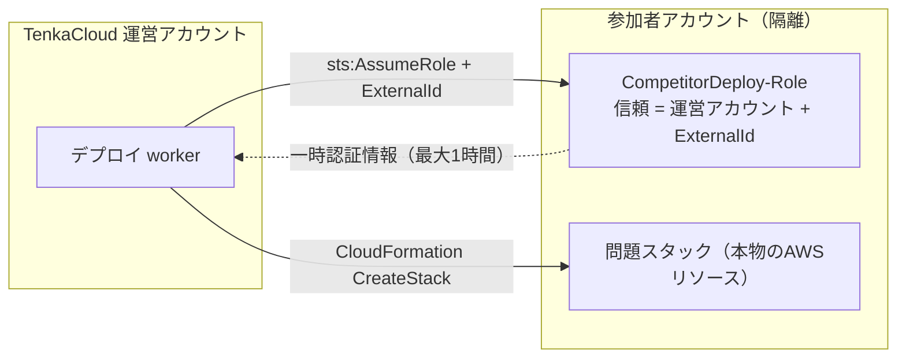
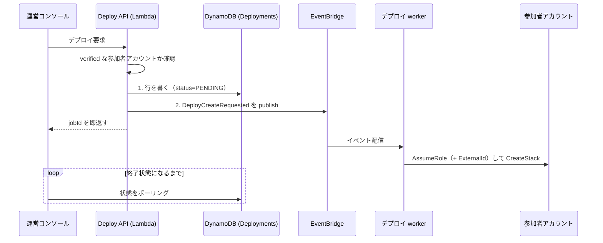
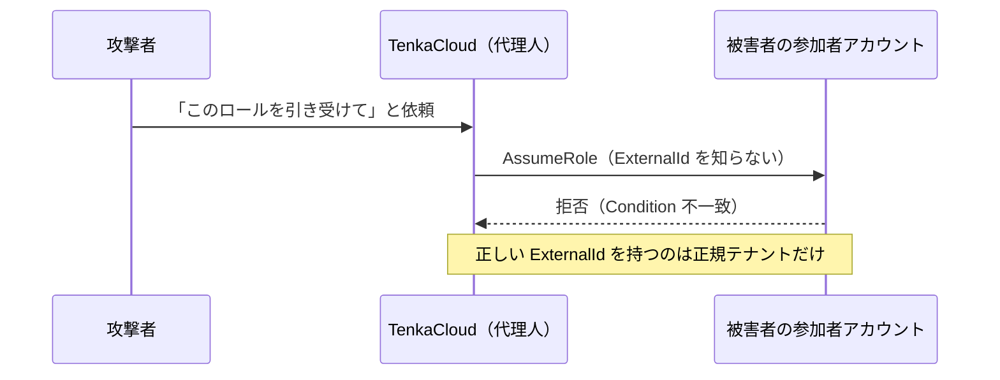
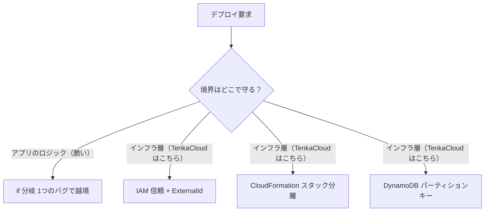

[TenkaCloud](https://www.tenkacloud.com/?lang=ja)という、実際のAWSアカウント上でクラウド競技を開催するOSSを作っています（[susumutomita/TenkaCloud](https://github.com/susumutomita/TenkaCloud)、Apache-2.0）。参加者は運営が用意した共有環境ではなく、自分たちの隔離されたAWSアカウントで本物のAWSシナリオを解きます。

この「参加者ごとの自前アカウントに問題環境を配る」部分は、実装していて一番神経を使ったところです。他人のAWSアカウントを自分たちのシステムから操作するので、設計を一歩間違えると事故になります。この記事では、そこをどう組んだかをコードに沿って書きます。

## 共有環境ではなく、参加者のアカウントに配る

競技プラットフォームの多くは、運営が1つ用意した環境を参加者全員で共有します。TenkaCloudはそうしていません。チームごとに隔離されたAWSアカウントへ、本物のリソースを含む問題スタックをデプロイします。

この方式には避けられない前提があります。運営のシステムが、参加者のAWSアカウントに対してCloudFormationスタックを作る、という操作です。ここで2つの問いが出てきます。

- 他人のアカウントを操作する権限を、どうやって渡してもらうのか
- 渡された権限を、意図しない相手に使われないようにどう防ぐのか

先に全体像を出します。運営アカウントのデプロイworkerが、参加者アカウント側のロールを引き受けて、そのアカウントの中でCloudFormationを動かします。



## デプロイはAPIが受けて、workerがあとで実行する

コンソールで運営がデプロイを押したとき、その場でCloudFormationを叩くわけではありません。スタック作成は数分から数十分かかるので、リクエストを受けたAPIが同期で待つ設計にはできません。APIは「受け付けて記録して、イベントを流す」ところまでをやり、実際のデプロイは非同期のworkerに渡します。

`startDeployment`のコードを追うと、順序に意味を持たせているのがわかります。DynamoDBに行を書いてから、EventBridgeにイベントを流します。この2つを`Promise.all`でまとめていません。

```ts
// infrastructure/lib/problem-deploy/handlers/deploy-handler/deploy.ts
// DDB Put → EventBridge Publish の順序は失敗セマンティクスが要求する:
// PutEvents が先にいくと、subscriber が DDB から読めない行を見にいく可能性がある。
await ctx.ddb.send(new PutCommand({ TableName: ctx.tableName, Item: item }));
// ...このあとで DeployCreateRequested を publish する
```

イベントを先に流すと、購読側のworkerがまだ存在しないDynamoDBの行を読みにいってしまう。だから必ず記録が先、通知が後です。地味ですが、非同期のつなぎ目でよく事故る部分なので順序を固定しています。

配信全体を並べると次のようになります。



進捗はWebSocketではなくポーリングで取っています。常時接続を持たないほうがLambda中心の運用と相性がよく、待ち受けのコストも減らせるからです。

デプロイ先にも制限をかけています。`resolveVerifiedCompetitorAccount`が`verified=true`のアカウントを見つけられなければ、そこで止めます。かつては同一アカウントへのフォールバックがありましたが、それは廃止しました。事前に検証を通ったアカウントにしか配らない、という一方向の閉じ方（fail-closed）にしています。

## 権限は参加者側に作ってもらう

他人のアカウントを操作する権限は、相手側に用意してもらいます。参加者は`competitor-bootstrap.yaml`というCloudFormationテンプレートを、自分のアカウントに一度だけデプロイします。これがTenkaCloudを信頼するIAMロールを作ります。

信頼ポリシーの中身はこれだけです。

```yaml
# infrastructure/templates/competitor-bootstrap.yaml
AssumeRolePolicyDocument:
  Version: "2012-10-17"
  Statement:
    - Effect: Allow
      Principal:
        AWS: !Sub "arn:aws:iam::${TenkaCloudAccountId}:root"
      Action: sts:AssumeRole
      Condition:
        StringEquals:
          sts:ExternalId: !Ref ExternalId
MaxSessionDuration: 3600
```

TenkaCloudは`sts:AssumeRole`でこのロールを引き受け、返ってきた一時認証情報でCloudFormationを操作します。参加者のアカウントに常設のアクセスキーを預けてもらう必要はありません。手に入るのは有効期限つきの認証情報で、`MaxSessionDuration`は3600秒に絞ってあります。参加者がこのスタックを削除すれば、ロールごと消えてTenkaCloudのアクセスは一括で失効します。

このロールに`AdministratorAccess`を付けているのは、正直に言うと妥協です。最初は最小権限で絞っていたのですが、新しい問題を足すたびに権限が足りずにデプロイが`ROLLBACK_COMPLETE`で落ちる、という不足のもぐら叩きが続きました。hello-worldでは`ssm:PutParameter`、あるバトルでは`scheduler:*`、といった具合に、テンプレートごとに必要な権限が変わるからです。

そこで判断を変えました。参加者はこのブートストラップをデプロイする時点でTenkaCloudの操作に同意していて、信頼はアカウントIDとExternalIdの2要素で閉じています。ならば権限のもぐら叩きをやめて広く許可し、そのぶん信頼の入り口と有効期間で守る。残している多層防御はこうです。

- 信頼ポリシーは運営アカウントID＋ExternalIdで固定
- 運営側で使う閲覧ロールは`tc-*`のリソースにスコープ
- セッションは最大1時間
- スタック削除でアクセスを即失効

## ExternalIdをなぜ必須にするのか

ここがこの設計の核心です。TenkaCloudはすべての参加者アカウントで`ExternalId`を必須にしています。省略や空文字は認めません。実際、認証情報を交換する層では、ExternalIdが渡っていなければその場で処理を落とします。

```ts
// packages/trust-bridge/src/aws-assume-role.ts
if (!awsContext.externalId || awsContext.externalId.length === 0) {
  throw new ExchangeError(
    "context-missing",
    "AwsExchangeContext.externalId is required (= ADR-002 で必須化)",
  );
}
```

理由は「混乱した代理人（confused deputy）」問題を塞ぐためです。AWSがIAMのドキュメントで注意喚起している、クロスアカウントで代理操作をするときの典型的な落とし穴です（[AWS公式ドキュメント](https://docs.aws.amazon.com/IAM/latest/UserGuide/confused-deputy.html)）。

TenkaCloudは多数の参加者アカウントのロールを引き受ける、共通の代理人です。参加者が作るロールの信頼ポリシーには運営のアカウントIDが書いてありますが、アカウントIDは秘密ではありません。ここに穴が生まれます。たとえば攻撃者が、正規の参加者になりすまして偽の依頼を送れたとします。すると代理人は、自分が今どのテナントのために動いているかを取り違え、他人のアカウントへ入り込んでしまいます。

ExternalIdはその取り違えを止める合言葉です。参加者のロールは、正しいExternalIdが添えられたときだけ`AssumeRole`を許します。攻撃者は正しいExternalIdを持っていないので、代理人を騙して侵入させることはできません。



合言葉そのものの置き場所にも気を使っています。ExternalIdはSSM Parameter StoreのSecureStringへ保存し、行データが持つのは参照名（`externalIdParameterName`）だけです。workerはデプロイ直前にSSMから値を読み、それを添えて`AssumeRole`します。Secrets Managerは使いません。テンプレート側でも`NoEcho`と最低16文字の制約をかけ、値がログや画面へ出ないよう伏せています。

## 境界はアプリのコードではなく、インフラに置く

最後に設計思想をひとつ。テナントの境界を、アプリケーションのif分岐で守らないことです。

「このリクエストはテナントAだから、AのデータだけをDynamoDBから読む」という判定をアプリ層に書くと、その一行にバグが入った瞬間に境界が崩れます。TenkaCloudは境界をAWSの認可の仕組みそのものに担わせています。ExternalId必須のIAM信頼関係、CloudFormationのスタック分離、DynamoDBのパーティションキー。越境を防ぐ責任をロジックではなくインフラに移す、という考え方です。



フロントエンドも同じ発想で、3つのSPAは同一の`dist/`を配り、テナントごとの差分は`runtime-config.json`だけで吸収します。ビルド時にテナント別の分岐を持ち込みません。

## おわりに

「他人のAWSアカウントにデプロイする」は強力ですが、そのぶん壊れたときの影響が大きい操作です。TenkaCloudでは、次の組み方に落ち着きました。

- APIとworkerを分け、記録を先に確定させる
- クロスアカウントの`AssumeRole`は一時認証と短いセッションで扱う
- confused deputyはExternalId必須で塞ぐ
- 境界はインフラ層へ寄せる

ExternalIdの必須化や、境界をアプリから引き剥がす発想は、AWSでマルチテナントのSaaSを作るなら持ち帰れるはずです。

なお、この記事で書いたのは「運営が参加者アカウントのロールを引き受けて配る」いわば古典的なやり方です。TenkaCloudでは今、クレデンシャルそのものを越境させず、署名した「操作の意図」だけを越境させて検証側で短命の権限に交換する`trust-bridge`という仕組みへ移しつつあります。そちらは別の記事で書きます。
