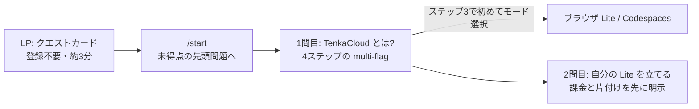

[TenkaCloud](https://www.tenkacloud.com/?lang=ja)という、実際のAWSアカウント上でクラウド競技を開催するOSSを作っています（[susumutomita/TenkaCloud](https://github.com/susumutomita/TenkaCloud)、Apache-2.0）。

競技プラットフォームには、機能の前に立ちはだかる壁があります。そもそも触ってもらえない、という壁です。「本物のAWSで競技する」と説明すると、面白そうだと言ってもらえます。ただ、いざ試す段になると疑問が並びます。AWSアカウントは要るのか、課金はされるのか、セットアップに何分かかるのか。ここで大半の人は離脱します。

実際に初見の人に触ってもらう機会が増えると、この入り口の問題が次々に見つかりました。この記事では、フィードバックを受けて作り直した「LPに着地してから、実際にTenkaCloudが動くまで」の導線を、実装に沿って書きます。



## LPには、機能説明ではなく「最初の1問」を置いた

いまのLPのヒーローに、機能一覧はありません。置いてあるのは問題カードが1枚です。

> 最初の 1 問 · 登録不要 · 約 3 分
> `TenkaCloud とは?` を、触って知る。
> 説明を読むのではなく、1 問解く。
> [この問題で始める →]

「30秒でわかる」動画や主催者向けのリンクは脇に下げました。訪問者にやってほしいことは1つだけ、最初の1問を解くことです。競技プラットフォームなのだから、プラットフォームの説明も競技で伝えるのが筋だろう、という発想です。

ボタンの先は`/portal-demo/?demo=1&goto=start`で、デモポータルの`/start`に着地します。`/start`の実装は素朴で、「表示順で最初の、まだ得点していない問題」へ遷移するだけです。

```ts
// apps/participant-portal/src/pages/Start.tsx
const target = view.problems.find((p) => p.score === 0) ?? view.problems[0];
```

デモポータルは、オンボーディング用のドリルを表示順の先頭に固定しています。だから初訪問者は、必ず`TenkaCloud とは?`という問題に着地します。2回目以降は、解き終えた続きから再開されます。

LPからこの1問目までの実際の流れは、動画でも見られます（[英語版はこちら](https://youtube.com/shorts/GAdV_fZMzk0)）。

@[youtube](5_ZEa_hLFzw)

## チュートリアルを、読み物ではなく問題にした

1問目の`what-is-tenkacloud`は、4ステップのmulti-flag問題です。「TenkaCloudとは何か」を、flagを提出しながら学びます。

- ステップ1: TenkaCloudは何の上で競技するか（答え: 本物のクラウド）
- ステップ2: リアルタイム対戦のカテゴリ名は（答え: Battle）
- ステップ3: どこで動かすかを選んで、選んだモードを提出
- ステップ4: 練習用flag `TENKA{HELLO-TENKACLOUD}` をそのまま提出して+100点

各ステップにペナルティなしのヒントを付けてあり、詰まっても先へ進めます。ステップ4は一見ふざけているようですが、「flagをコピーして提出欄に貼ると得点になる」という競技の基本動作を、リスクゼロで一度体験してもらうためのものです。

狙いは、TenkaCloudの操作そのものに慣れてもらうことです。問題を開く、ヒントを見る、flagを提出する。本番の競技でやる操作を、チュートリアルの時点でそのまま使います。だから説明を読み終えたときには、操作も覚えています。

問題形式には、ほかにも利点があります。読むだけのチュートリアルと違って手を動かし続けるので、飽きにくい。細部はヒントへ逃がせるので、本文を短く保てる。そして、読んでほしい順番をそのまま問題の並びで示せるので、どこから読めばいいか迷わせません。

ここまでで、登録なし・約3分。クリアすると次の問題`deploy-tenkacloud-lite`が開きます。

## 選択肢は、ステップ3まで出さない

最初の設計では、入り口に「A. まず遊ぶ（AWS不要・約5分）/ B. 自分のイベントを開く（AWSアカウント・課金あり・約30分）」という2択を置いていました。この2択はいまREADMEのトップにだけ残して、LPからは消しました。

理由は順序です。TenkaCloudが何かを知る前に「ブラウザで動かすか、Codespacesか」と聞かれても、判断のしようがありません。だからモードの選択は、チュートリアルのステップ3で初めて出します。

- ブラウザ（Lite）: 登録不要・インストール不要。このタブでいますぐ動く（推奨）
- Codespaces: GitHubアカウントで約5分。AWS不要

docker composeで動かす`deploy-local`と、本番イベント用の`deploy-saas`という上級者向けのモードは、この時点では見せず、クリア後に出現します。選択肢を減らすのではなく、選べるようになった時点で見せる、という整理です。

## 本物のAWSに立てる前に、課金を言う

2問目の`deploy-tenkacloud-lite`は、デモの外に出て、自分のAWSアカウントに本物のTenkaCloud Liteを立てる問題です。Launcherスタックの作成からLiteのデプロイ、アカウント検証、初回イベント作成まで、実際の画面に現れる`TENKA{...}`を提出しながら進めます。

この問題文の冒頭で、先に言うことを決めています。

- デフォルト構成では約$7/月の継続費用が発生する（遊び終えたら必ず片付ける）
- Launcherは広い権限のIAMロールを作成する（CloudFormationのIAM承認で明示的に同意する）

CloudFormationテンプレート側のDescriptionにも、同じ内容を書いています。

```yaml
# infrastructure/templates/lite-pipeline.yaml（Descriptionより要旨）
# Cost note: build minutes for a handful of Lite deploys cost under a dollar.
# Separately, once deployed, the default DynamoDB profile is a standing cost
# of about $7.06 per month until you run `make destroy`.
```

あわせて、15個あるパラメータのうち必須は`TenantAdminEmail`の1つだけにして、残り14個は「Advanced」の3グループへ整理しました。さらに、片付け（destroy）の手順も問題文に含めています。デプロイして終わりではなく、消すところまでがドリルです。触る前に費用と権限を正直に言うのは、信頼のためでもありますが、離脱を減らすためでもあります。課金への不安は、金額が書いていないときに一番大きくなるからです。

## 手元で動かす経路は「同意」と「ゼロタイプ」

ローカルで動かす経路は2つ用意しました。方向性は正反対です。

自分のマシンで動かす`make local-onboard`は、同意なしには何もインストールしません。

```bash
# scripts/onboard/onboard-bootstrap.sh の方針（ヘッダコメントより）
# never install software without consent;
# if the user declines, print the manual command and exit non-zero
```

Bunが無ければ「インストールしてよいか」を聞き、断られたら手動コマンドを表示して終了します。他人のマシンに勝手にツールを入れない、という一線です。

逆にGitHub Codespacesは、全部を事前承認済みとして扱い、一文字も打たせません。`postCreateCommand`がセットアップを済ませます。起動時は`postStartCommand`が`make local`をバックグラウンドで動かし、Participant Portalの応答を確認してから、ポート5175のプレビューを自動で開きます。ブラウザでボタンを1回押すと、あとはポータルが開くのを待つだけです。開いたポータルには、固定の導入ドリルとして`hello-world`が最初に表示されます。

もう1つ、地味ですが効いたのが非対応プラットフォームの扱いです。WSL2なしのWindowsなどでは、以前はLinux用のコマンドが表示されて、実行しても動きませんでした。いまは非対応と判定したら、コマンドを一切見せません。代わりにCodespacesか、WSL2を入れてから、という誘導だけを返します。動かないコマンドを見せることが、一番の離脱要因だったからです。

## AIエージェントにも、入り口を作った

最後に、人間以外の入り口です。LPに「AIエージェントで始める」というブロックを置き、Claude CodeやCodexに貼るためのプロンプトをコピーできるようにしました。プロンプトが指すのは`llms-full.txt`という、AIエージェント向けの正規ブリーフィングです。

プロンプト自体に、誘導の設計を埋め込んであります。TenkaCloudを5文程度で説明したら、PLAY（AWS不要）かHOST（自分のイベントを開く）かを聞き、実際のAWSアカウントへ触れる前に費用と片付けを必ず伝えること。ここまで指定しています。人間向けの導線で決めたこと（選択肢は分かってから、課金は触る前に）を、エージェント経由でも崩さないためです。

## おわりに

オンボーディングを、資料ではなく機能として作りました。やったことを並べると、こうなります。

- LPに置くのは機能説明ではなく、登録不要・約3分の最初の1問
- チュートリアルは読ませずに、flagを提出させながら伝える
- モードの選択肢は、判断できるようになった時点で初めて見せる
- 本物のAWSへ触れる前に、金額と権限と片付けを先に言う
- ローカルへのインストールは同意制、Codespacesはゼロタイプ
- AIエージェント経由でも同じ誘導が守られるよう、ブリーフィングを正本にする

一貫させたのは、オンボーディングと競技の間に切れ目を作らないことです。チュートリアルも、Liteの構築も、ローカルモードも、すべて「問題を解く」という同じ操作で進みます。導線のどこにいても、やっていることがそのままTenkaCloudの操作の練習になっています。

どれも、実際に触ってくれた初見の人のフィードバックが起点です。オンボーディングの穴は、作った本人には見えません。外から触ってもらい、詰まった場所を1つずつ導線に変換していく。その繰り返しでここまで来ました。TenkaCloudはまだ発展途上なので、この導線も、次のフィードバックで変わっていくはずです。
