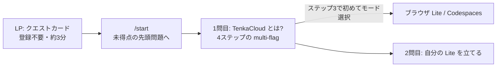

[TenkaCloud](https://www.tenkacloud.com/?lang=ja)という、実際のAWSアカウント上でクラウド競技を開催するOSSを作っています（[susumutomita/TenkaCloud](https://github.com/susumutomita/TenkaCloud)、Apache-2.0）。

仕組みを簡単に説明すると、問題環境は参加者それぞれのAWSアカウントに配られます。参加者はそこで課題を解き、`TENKA{...}`という形式のflagを提出して得点を競います。カテゴリは2つで、リアルタイム対戦のBattleと、自分のペースで進めるChallengeがあります。

競技プラットフォームには、機能の前に立ちはだかる壁があります。そもそも触ってもらえない、という壁です。「本物のAWSで競技する」と説明すると、面白そうだと言ってもらえます。ただ、いざ試す段になると疑問が並びます。AWSアカウントは要るのか、課金はされるのか、セットアップに何分かかるのか。ここで大半の人は離脱します。

実際に初見の人に触ってもらう機会が増えると、この入り口の問題が次々に見つかりました。開発者ドキュメントを整えたり、動画を用意したり、という手も考えました。ただ、資料が増えるほど、初見の人はどこから始めるか迷います。必要だったのは、迷わせない導線の設計でした。

そこでひらめいたのが、プロダクトを知ってもらうことと、操作に慣れてもらうことの融合です。LPにはすでに、フロントエンドだけで動くデモモードがありました。これにチュートリアルをくっつけたらどうか。この記事では、そうして作り直した「LPに着地してから、実際にTenkaCloudが動くまで」の導線を、実装に沿って書きます。



## LPには、機能説明ではなく「最初の1問」を置いた

いまのLPのヒーローに、機能一覧はありません。置いてあるのは問題カードが1枚です。

> 最初の 1 問 · 登録不要 · 約 3 分
> `TenkaCloud とは?` を、触って知る。
> 説明を読むのではなく、1 問解く。
> [この問題で始める →]

「30秒でわかる」動画や主催者向けのリンクは脇に下げました。訪問者にやってほしいことは1つだけ、最初の1問を解くことです。競技プラットフォームなのだから、プラットフォームの説明も競技で伝えるのが筋だろう、という発想です。

ボタンの先は`/portal-demo/?demo=1&goto=start`で、デモポータルの`/start`に着地します。`/start`の実装は素朴で、「表示順で最初の、まだ得点していない問題」へ遷移するだけです。

```ts
// apps/participant-portal/src/pages/Start.tsx
const target = view.problems.find((p) => p.score === 0) ?? view.problems[0];
```

デモポータルは、オンボーディング用のドリルを表示順の先頭に固定しています。だから初訪問者は、必ず`TenkaCloud とは?`という問題に着地します。2回目以降は、解き終えた続きから再開されます。

このデモポータルが、冒頭に書いたデモモードの正体です。もともとサンプル問題を見せるために作った、フロントエンドだけで動くページです。バックエンドを持たないので、誰でもその場で開けます。ここにチュートリアルをくっつけて、オンボーディングの舞台にしました。オンボーディングのドリルは、すべてこのデモポータルの上で動きます。

LPからこの1問目までの実際の流れは、動画でも見られます（[英語版はこちら](https://youtube.com/shorts/GAdV_fZMzk0)）。

@[youtube](5_ZEa_hLFzw)

## チュートリアルを、読み物ではなく問題にした

1問目の`what-is-tenkacloud`は、4ステップのmulti-flag問題です。「TenkaCloudとは何か」を、flagを提出しながら学びます。

- ステップ1: TenkaCloudは何の上で競技するかを答える
- ステップ2: リアルタイム対戦のカテゴリ名を答える
- ステップ3: どこで動かすかを選んで、選んだモードを提出する
- ステップ4: 問題文にある練習用flagをそのまま提出して+100点

各ステップにペナルティなしのヒントを付けてあり、詰まっても先へ進めます。ステップ4は一見ふざけているようですが、「flagをコピーして提出欄に貼ると得点になる」という競技の基本動作を、リスクゼロで一度体験してもらうためのものです。

狙いは、TenkaCloudの操作そのものに慣れてもらうことです。問題を開く、ヒントを見る、flagを提出する。本番の競技でやる操作を、チュートリアルの時点でそのまま使います。だから説明を読み終えたときには、操作も覚えています。

問題形式には、ほかにも利点があります。読むだけのチュートリアルと違って手を動かし続けるので、飽きにくい。細部はヒントへ逃がせるので、本文を短く保てる。読んでほしい順番をそのまま問題の並びで示せるので、どこから読めばいいか迷わせません。

何より、正解を入力すると得点が入り、画面に演出が返ってきます。ドキュメントは読み終えても何も起きませんが、問題は解くたびに手応えがあります。結果として、読むだけよりも楽しいチュートリアルになりました。

ここまでで、登録なし・約3分。クリアすると次の問題`deploy-tenkacloud-lite`が開きます。

## 選択肢は、ステップ3まで出さない

最初の設計では、入り口に「A. まず遊ぶ（AWS不要・約5分）/ B. 自分のイベントを開く（AWSアカウント・課金あり・約30分）」という2択を置いていました。この2択はいまREADMEのトップにだけ残して、LPからは消しました。

理由は順序です。TenkaCloudが何かを知る前に「ブラウザで動かすか、Codespacesか」と聞かれても、判断のしようがありません。だからモードの選択は、チュートリアルのステップ3で初めて出します。

- ブラウザ（Lite）: 登録不要・インストール不要。このタブでいますぐ動く（推奨）
- Codespaces: GitHubアカウントで約5分。AWS不要

docker composeで動かす`deploy-local`と、本番イベント用の`deploy-saas`という上級者向けのモードは、この時点では見せず、クリア後に出現します。選択肢を減らすのではなく、選べるようになった時点で見せる、という整理です。

## おわりに

オンボーディングを、資料ではなく機能として作りました。やったことを並べると、こうなります。

- LPに置くのは機能説明ではなく、登録不要・約3分の最初の1問
- チュートリアルは読ませずに、flagを提出させながら伝える
- モードの選択肢は、判断できるようになった時点で初めて見せる

一貫させたのは、オンボーディングと競技の間に切れ目を作らないことです。チュートリアルも、その先のドリルも、すべて「問題を解く」という同じ操作で進みます。導線のどこにいても、やっていることがそのままTenkaCloudの操作の練習になっています。

どれも、実際に触ってくれた初見の人のフィードバックが起点です。オンボーディングの穴は、作った本人には見えません。外から触ってもらい、詰まった場所を1つずつ導線に変換していく。その繰り返しでここまで来ました。TenkaCloudはまだ発展途上なので、この導線も、次のフィードバックで変わっていくはずです。
