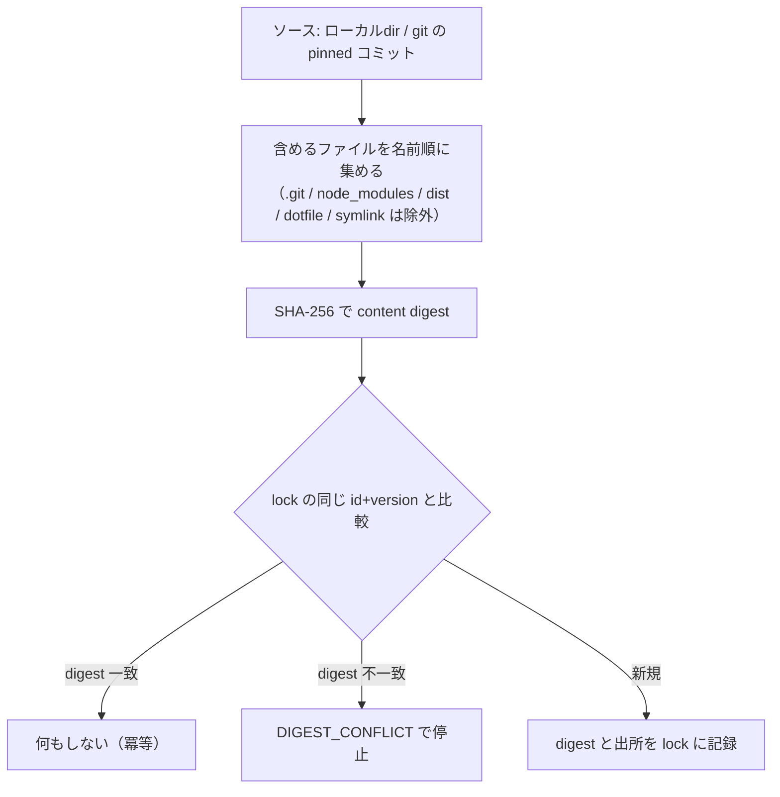
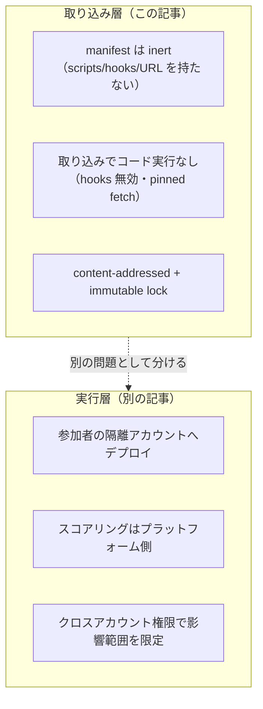

[TenkaCloud](https://www.tenkacloud.com/?lang=ja)という、実際のAWSアカウント上でクラウド競技を開催するOSSを作っています（[susumutomita/TenkaCloud](https://github.com/susumutomita/TenkaCloud)、Apache-2.0）。競技の問題は「パック」という単位で、外部の人が投稿できる形にしています。

1つの問題は3つのファイルでできています。

- `metadata.json`: カタログ表示とスコアリングを書く
- `template.yaml`: 参加者のアカウントにデプロイされるCloudFormation
- `portal/`（任意）: 参加者ポータル用のReactコンポーネント

他人が書いたパックを取り込むのは、供給の安全性にかかわる問題です。取り込む時点で任意のコードが走ったり、一度ピン留めしたはずの中身が後からすり替わっていたりすると、事故になります。この記事では、パックの取り込み層をinert（不活性）かつcontent-addressedにして、その2つを防いでいる話をコードに沿って書きます。

## 取り込みで怖いこと

怖さは2つあります。

1つは、取り込みそのものが任意のコードを実行することです。npmの`postinstall`のように、取得やインストールの過程でスクリプトやフックが走ると、それだけで踏まれます。

もう1つは、ピン留めした中身が変わることです。「この問題のこのバージョン」を指したはずが、後から別物にすり替わっていると、レビューした内容と実際に動く内容がずれます。

先にひとつ断っておきます。パックの`template.yaml`は、参加者のアカウントへデプロイされる本物のCloudFormationです。「取り込み層がinert」というのは、この本物のIaCまで無害という意味ではありません。IaCの影響範囲は別の層で抑えています（後述）。ここで扱うのは、あくまで取り込みの入り口です。

## マニフェストに実行できるものを持たせない

パックのマニフェスト`tenkacloud-pack.json`は、実行できるものを何も持ちません。スキーマをzodの`.strict()`にしてあり、決めたフィールド以外は弾きます。

```ts
// packages/problem-sdk/src/manifest.ts
// v1 は意図的に inert: author credentials / remote URL / scripts / 実行フックを持たない。
// .strict() が未知のトップレベルフィールドを1つ残らず拒否する。
export const PackManifestSchema = z
  .object({
    schemaVersion: z.literal(PACK_SCHEMA_VERSION),
    id: z.string().regex(PACK_ID_PATTERN, "id must be reverse-DNS style"),
    // version / title / description / license / requiredRuntimes / dependencies ...
  })
  .strict();
```

許しているのは、IDやバージョン、タイトル、必要なランタイムといった宣言的な項目だけです。スクリプトを書く場所も、外部URLを指す場所も、認証情報を置く場所も、スキーマの上に存在しません。未知のフィールドが1つでも混ざれば、その場で弾きます。ネストした定義も同じく`.strict()`です。

## 取り込みでコードを実行しない

Gitのパックを取り込むときも、コードは走りません。ピン留めした1つのコミットを、フックを無効にした浅いfetchで取ってきて、ファイルを置くだけです。

```ts
// infrastructure/lib/problem-pack/git-fetcher.ts
git(["-c", "core.hooksPath=/dev/null", /* ... */]); // Git hook を全部無効化
git(["init", "--quiet"]);
git(["remote", "add", "origin", request.repositoryUrl]);
git(["fetch", "--depth", "1", "--no-tags", "origin", request.commit]); // 浅い・pinned commit のみ
git(["checkout", "--quiet", "FETCH_HEAD"]);
```

取れるソースはHTTPSのURLだけです。URLに認証情報を埋め込むことも、クエリやフラグメントを付けることも許しません。コミットの指定は40桁のハッシュに限ります。ブランチ名、タグ、HEAD、短縮ハッシュは、どれも拒否です。「今のmain」のような動く参照を許すと、同じ指定でも中身が変わりうるからです。fetchはhooksを切り、パッケージマネージャのライフサイクルも走らせず、ただファイルを移すだけに徹しています。

## 同じID＋バージョンは、同じ中身しか許さない

取り込んだパックは、中身そのものからハッシュを取ります。含めるファイルを名前順に並べ、パスとバイト列をSHA-256へ流し込みます。

```ts
// infrastructure/lib/problem-pack/snapshot.ts
export function computeContentDigest(dir: string): string {
  const files = collectFiles(root, root).sort(/* relPath 昇順 */);
  const hash = createHash("sha256");
  for (const file of files) {
    hash.update(`${pathBytes.length}:`); // パスを長さ付きで
    hash.update(pathBytes);
    hash.update(`${content.length}:`);   // バイト列を長さ付きで
    hash.update(content);
  }
  return hash.digest("hex");
}
```

対象は「含めるファイル」だけです。`.git`や`node_modules`、`dist`、ドット始まりのファイル、シンボリックリンクは外します。ディレクトリ全体をそのままハッシュにするわけではありません。

このダイジェストをロックファイルに記録します。同じIDとバージョンをもう一度入れようとしたとき、ダイジェストが前と同じなら何もしません（冪等）。違っていたら、そこで止めます。

```ts
if (existing.contentDigest === contentDigest) {
  return { ok: true, alreadyInstalled: true }; // 同じ中身なので no-op
}
return { ok: false, reason: "DIGEST_CONFLICT" }; // すり替えは fail closed
```

一度入れたリビジョンは変えられない、という一方向の約束です。だから「アップデート」コマンドがありません。新しい版は、別のインストールとして入ります。



## 「どこから来たか」も記録する

ロックには、ダイジェストに加えてソースの種類（`local`または`git`）も記録します。Gitのソースなら、認証情報を除いたHTTPSのURL、解決した40桁のコミット、subdirも残します。ソースの種類は`local`と`git`の2つに限られます。動くリモート参照や、取り込み時にコードを実行する経路はありません。この区別は型でも保証していて、Gitのときだけ出所の記録を必須にします。

## inertなのは「取り込み層」だと、はっきり分ける

最後に、正直な線引きをしておきます。ここまでは全部「取り込みの入り口」の話でした。パックの`template.yaml`は参加者のアカウントにデプロイされる本物のCloudFormationで、そこには任意のリソースを書けます。だから「マニフェストがinertだから安全」とは言えません。

IaC本体の影響範囲は、別の層で抑えています。デプロイ先は参加者自身の隔離されたアカウントです。スコアリングは問題に同梱せず、プラットフォーム側で回します。参加者がアカウントを握る以上、問題に同梱したスコアリングは改竄できるからです。取り込み層のinert性と、実行層の権限設計は、別々の問題として分けて考えています。



実行層のクロスアカウント設計は[別の記事](https://github.com/susumutomita/TenkaCloud)に書きました。

## おわりに

他人のコンテンツを取り込むためにやったことは、3つです。

- マニフェストに実行できるものを持たせない（inert）
- 取り込みでコードを実行しない（hooks無効・pinnedコミットの浅いfetch）
- 同じID＋バージョンは同じ中身しか許さない（SHA-256のcontent-addressed＋変更できないロック）

そのうえで、「取り込みが安全か」と「そのIaCを動かして安全か」を、別の層として分けて持ちました。前者はこの記事、後者はクロスアカウント設計の記事です。なお、ここで書いたのは実装済みの取り込みモデルで、CLIとライブラリから駆動します。Webからアップロードして自動で取り込む運用が本番で回っているか、という話とは別の粒度です。
