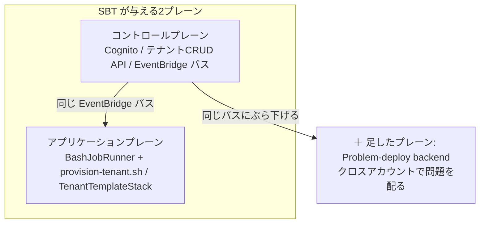
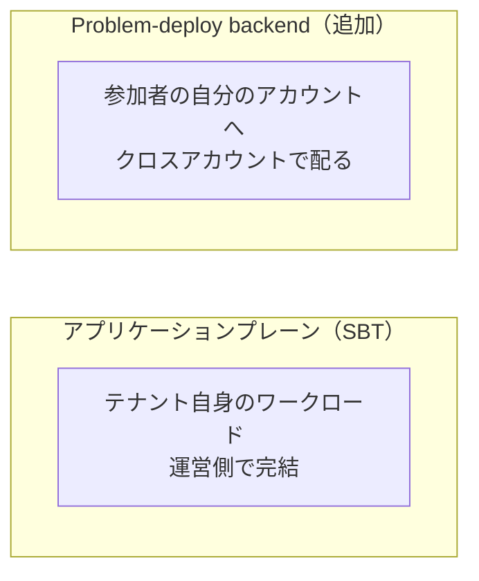
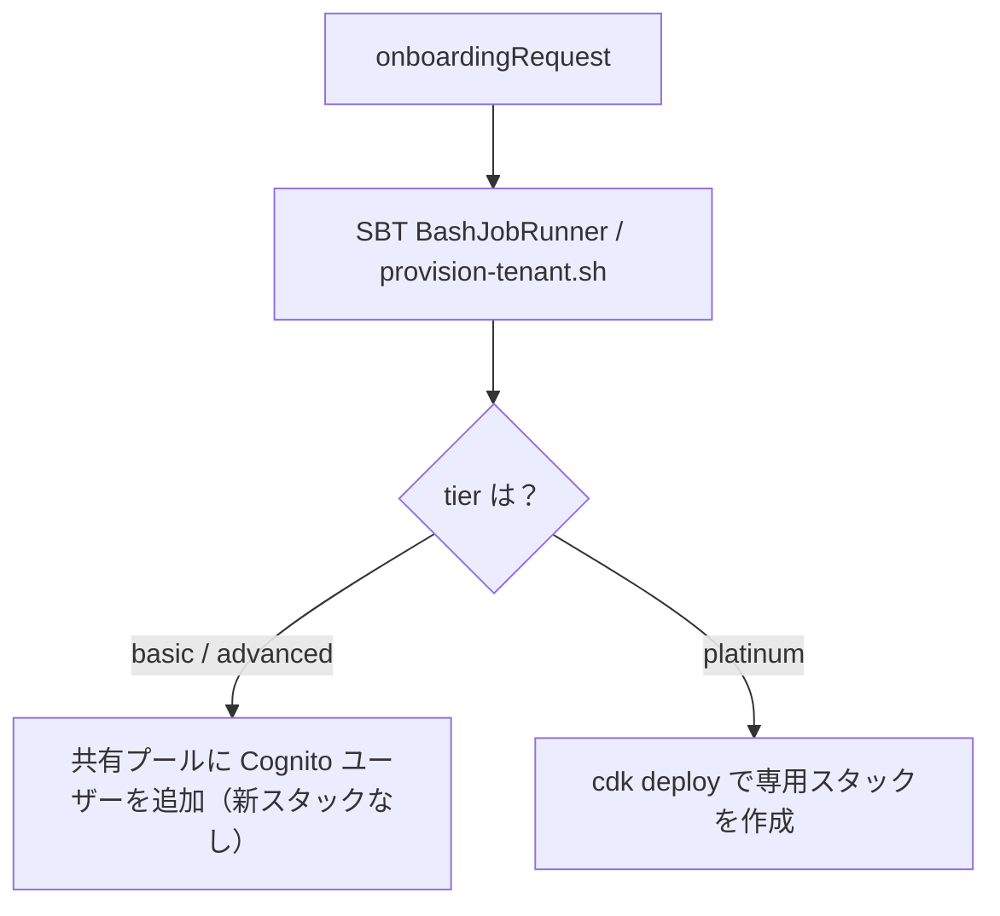

[TenkaCloud](https://www.tenkacloud.com/?lang=ja)という、実際のAWSアカウント上でクラウド競技を開催するOSSを作っています（[susumutomita/TenkaCloud](https://github.com/susumutomita/TenkaCloud)、Apache-2.0）。これはマルチテナントのSaaSで、土台に`@cdklabs/sbt-aws`（SaaS Builder Toolkit、以下SBT、バージョン0.3.9）を使っています。

SBTを土台に選んだとき、素のままでは足りない部分がありました。TenkaCloudの中核は「参加者それぞれの自分のAWSアカウントへ問題環境を配る」ことで、これは普通のSaaSのテナント運用と形が違います。この記事では、SBTを実際にどう使い、そこへ問題デプロイ用のプレーンをどう足し、なぜそうしたかを書きます。SBTの紹介ではなく、使い方の記録です。

## SBTは2つのプレーンでできている

まず前提から。SBTが与えてくれるのは、大きく2つのプレーンです。

- コントロールプレーン: テナントを管理する側です。Cognitoのユーザープール、System AdminがテナントをCRUDするAPI、テナント間をつなぐEventBridgeのバスを持ちます。
- アプリケーションプレーン: テナントのワークロードそのものです。テナントを作るときのプロビジョニングを回すジョブランナーも、ここに含まれます。

TenkaCloudはこの2つを、それぞれSBTのconstructで受け取ります。順に、実際の使い方を見ます。

### コントロールプレーンはそのまま使う

```ts
// infrastructure/lib/control-plane-stack.ts
import { CognitoAuth, ControlPlane } from "@cdklabs/sbt-aws";

const cognitoAuth = new CognitoAuth(this, "CognitoAuth", { setAPIGWScopes: false });
const controlPlane = new ControlPlane(this, "ControlPlane", {
  auth: cognitoAuth,
  systemAdminEmail: props.systemAdminEmail,
});
this.eventBusArn = controlPlane.eventManager.busArn; // このバスを他のスタックへ配る
```

認証、テナント管理API、イベントバスのどれも、SBTの`ControlPlane`がそのまま提供します。ここは素直に使います。

### アプリケーションプレーンは、SBTの部品に自分のスクリプトを流し込む

テナントを作るプロビジョニングは、SBTの`CoreApplicationPlane`と`BashJobRunner`に、TenkaCloudのシェルスクリプトを渡して組みます。

```ts
// infrastructure/lib/bootstrap-template/bootstrap-template-stack.ts
import { BashJobRunner, CoreApplicationPlane, DetailType } from "@cdklabs/sbt-aws";

const props: BashJobRunnerProps = {
  eventManager,
  permissions: buildTenantJobRunnerPermissions(this.account, this.region), // ← ここが肝
  script: composeTenantScript(resolve(dir, "scripts/provision-tenant.sh")),
  environmentStringVariablesFromIncomingEvent: ["tenantId", "tier", "tenantName", "email"],
  incomingEvent: DetailType.ONBOARDING_REQUEST,  // これを受けたら走る
  outgoingEvent: DetailType.PROVISION_SUCCESS,   // 終わったら出す
};
```

`onboardingRequest`を受けたら`provision-tenant.sh`を回し、終わったら`PROVISION_SUCCESS`を出す。イベントから`tenantId`や`tier`を受け取る。ここまではSBTの流儀どおりです。

1か所だけ、素のSBTから変えているところがあります。権限です。SBTの参照実装のジョブランナーは、例として`Action:* Resource:*`を渡します。TenkaCloudはそれを使わず、`buildTenantJobRunnerPermissions`で、プロビジョニングのスクリプトが実際に必要とする最小権限まで絞ります。SBTのconstruct自体は触らず、渡す権限だけをTenkaCloud固有にする、という締め方です。

### アプリの中身は、同一クラスをpooled/siloで分ける

テナントのアプリ本体は`TenantTemplateStack`です。ここでpooledとsiloを、同じクラスの`isPooledDeploy`フラグで分けます。共有なら`tenantId`が`"pooled"`の1スタックをBASICとADVANCEDで共有し、PLATINUMだけ専用のsiloスタックを立てます。スタックIDの末尾が`-pooled`か`-<tenantId>`かで変わるだけです。

## 素のSBTでは足りなかったところ

ここからが本題です。TenkaCloudの中核の操作は、問題環境を「参加者それぞれの自分のAWSアカウント」へデプロイすることです。これはSBTのアプリケーションプレーンが想定するものと、形が違います。

- SBTのアプリケーションプレーンは、テナント自身のワークロードを、運営側で用意した領域にプロビジョニングします。
- TenkaCloudの問題デプロイは、運営のアカウントから他人（参加者）のアカウントへ、クロスアカウントで配ります。

信頼境界が違います。他人のアカウントを触るからです。ライフサイクルも違います。テナントのオンボーディングではなく、デプロイ要求ごと、チームごと、自動teardownつきだからです。持つデータも違います。誰にどの問題をいつ配ったか、という`Deployments`や`CompetitorAccounts`の台帳が要るからです。

これをアプリケーションプレーンに押し込むと、テナント運用と混ざって見通しが悪くなります。そこで、問題デプロイ専用のプレーンを1枚足しました。



## 足した3枚目: Problem-deploy backend

`ProblemDeployBackendStack`が、その追加したプレーンです。`Deployments`テーブル、認証つきのデプロイAPI、参加者アカウントへ`AssumeRole`してCloudFormationを回すworker、参加者ポータルを持ちます。

大事なのは、独立させつつSBTのイベント網からは切り離さないことです。このスタックは、SBTの`ControlPlane`が作ったEventBusのARNを受け取ります。

```ts
// infrastructure/lib/app-wiring/wire.ts
new ProblemDeployBackendStack(app, /* ... */, {
  eventBusArn: controlPlaneStack.eventBusArn, // SBT のバスにぶら下げる
});
```

つまりSBTの2プレーンと同じEventBridgeのバスを共有し、その上で`DeployCreateRequested`や`DeployDeleteRequested`をやり取りします。プレーンは分けるが、通信の土台は共通にする、という置き方です。

Lite modeでは`ControlPlane`を立てないので、渡すバスがありません。そのときはこのスタックが自前でlocal EventBusを作り、自己完結します。SBTに乗るときも、SBTを外した最小構成のときも、同じスタックが動くようにしてあります。

## なぜプレーンとして分けたのか

理由を一度まとめます。分けた根拠は3つです。

- 信頼境界が違う: テナント運用は運営側で完結しますが、問題デプロイは他人のアカウントへ越境します。混ぜると危険です。
- ライフサイクルが違う: テナントはオンボード／オフボード、問題はデプロイ要求ごと、そして時間で自動teardownします。回す単位と頻度が別です。
- データが違う: テナント台帳（SBTの`TenantMappingTable`）と、デプロイ台帳（`Deployments`／`CompetitorAccounts`）は別の関心事です。

プレーンを分けると、この3つの「別物さ」を、コードとスタックの境界にそのまま落とせます。テナント分離の考え方、つまり境界をアプリのif文ではなくインフラに置く方針を、プレーンの分け方にも効かせています。



## テナント作成の流れ

ここまでを踏まえて、テナントを作る流れを並べます。System Adminがテナントを作ると`onboardingRequest`が流れ、SBTの`BashJobRunner`が`provision-tenant.sh`を回します。tierがPLATINUMのときだけ、専用のsiloスタックをその場でデプロイします。



問題のデプロイは、これとは別の経路です。運営がコンソールで問題を配ると、`DeployCreateRequested`がバスに流れます。それをProblem-deploy backendのworkerが受け、参加者アカウントへ`AssumeRole`してCloudFormationを回します。テナントを作る経路と、問題を配る経路は、走る単位とタイミングが別です。

## フロントは同じdistのまま、差分はruntime-config.jsonだけ

テナントごとにフロントを作り直すのは避けたいところです。TenkaCloudの各SPAは、テナント別にビルドし直しません。同じdistを配り、テナントやCognitoの設定、機能フラグの差分だけを実行時に`runtime-config.json`から読みます。

```ts
// apps/application-admin-console/src/config.ts
const res = await fetch("/runtime-config.json", { cache: "no-store" });
// ここから tenantId / isolation("pooled" | "silo") / features を注入する
```

ビルド時にテナント別の分岐を持ち込まない、という一線を引いておきます。するとテナントが増えてもビルドは1回のままで、差分はデプロイ時に置かれる`runtime-config.json`へ閉じ込められます。

## テナント分離はインフラ層に置く

最後に背骨をひとつ。テナントの境界を、アプリのロジックではなくインフラに担わせています。

siloのテナントは、スタックまるごと分かれています。pooledのテナントは1つのスタックを共有しますが、データはDynamoDBのパーティションキーで分かれます。どのテーブルも、パーティションキーにテナントIDを埋め込みます。

```ts
// infrastructure/lib/problem-deploy/control-data/dynamodb-deployments-repository.ts
item.GSI1PK = `TENANT#${record.tenantId}`;
```

キーの空間そのものがテナントで分かれていて、別テナントのデータは物理的に別のキーにあります。越境を防ぐ責任を、コードのif文ではなく、キー設計とスタック分離へ持たせています。

## おわりに

TenkaCloudのマルチテナント構成は、こう組みました。

- コントロールプレーンはSBTの`ControlPlane`をそのまま使う
- アプリケーションプレーンはSBTの`BashJobRunner`に自分のprovisionスクリプトを流し込み、渡す権限だけを最小に締める
- そのうえで、SBTには無い「問題デプロイ」のプレーンを1枚足し、同じEventBridgeのバスにぶら下げる

足した理由は、中核の操作である「他人のアカウントへ配る」が、SBTのアプリケーションプレーンに収まらないからでした。信頼境界、ライフサイクル、データのどれも別物なので、プレーンとして切り出すのが素直だと判断しました。

この問題デプロイのプレーンの中身、つまりクロスアカウントで配る仕組みは[別の記事](https://zenn.dev/bull/articles/tenkacloud-cross-account-deploy)に書きました。そのデプロイ権限を、署名した「操作の意図」の交換に置き換える`trust-bridge`は[こちらの記事](https://zenn.dev/bull/articles/tenkacloud-trust-bridge)に書いています。
