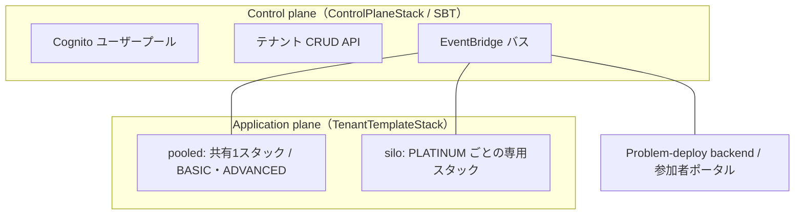
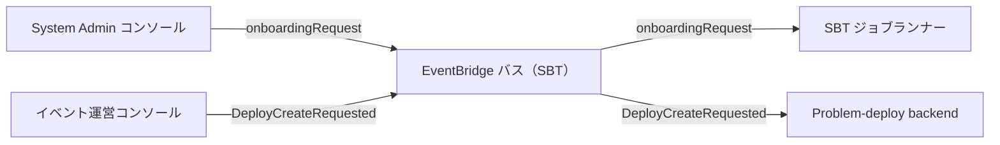
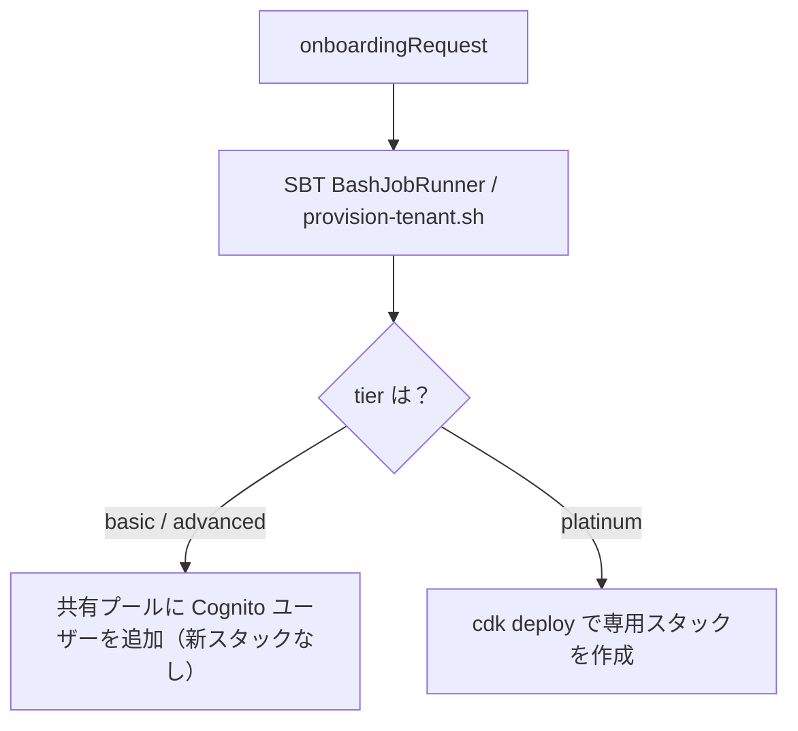
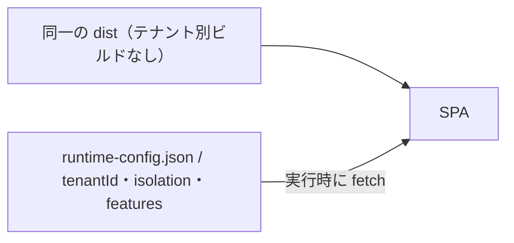

[TenkaCloud](https://www.tenkacloud.com/?lang=ja)という、実際のAWSアカウント上でクラウド競技を開催するOSSを作っています（[susumutomita/TenkaCloud](https://github.com/susumutomita/TenkaCloud)、Apache-2.0）。これはマルチテナントのSaaSで、運営（テナント）ごとにイベントやチーム、スコアを管理します。

マルチテナントSaaSでいちばん気を使うのはテナントの分離です。あるテナントのデータや操作が別のテナントへ漏れない、という保証をどう作るか。これをアプリのロジックで守ろうとすると、1つのバグで崩れます。TenkaCloudは分離をインフラ側に寄せていて、その土台に`@cdklabs/sbt-aws`（SaaS Builder Toolkit、バージョン0.3.9）を使っています。この記事では、システムを4つのプレーンに分けた構成をコードに沿って書きます。

## SBTが用意してくれるもの

SBT（SaaS Builder Toolkit）は、マルチテナントSaaSの制御プレーンを組み立てるCDKのライブラリです。TenkaCloudは3つの土台をSBTから受け取っています。Cognitoのユーザープール、テナント管理API、そしてテナント間をつなぐEventBridgeのバスです。

```ts
// infrastructure/lib/control-plane-stack.ts
import { CognitoAuth, ControlPlane } from "@cdklabs/sbt-aws";

const cognitoAuth = new CognitoAuth(this, "CognitoAuth", { setAPIGWScopes: false });
const controlPlane = new ControlPlane(this, "ControlPlane", {
  auth: cognitoAuth,
  systemAdminEmail: props.systemAdminEmail,
});
// バスの ARN を他のスタックへ渡すために公開する
this.eventBusArn = controlPlane.eventManager.busArn;
```

認証、テナント管理API、イベントバスのどれも自前では書いていません。定型はSBTに任せて、TenkaCloud固有の部分に集中します。

## 4つのプレーン

TenkaCloudは、責務の境界をはっきり分けた4つのプレーンでできています。

- Control plane（`ControlPlaneStack`）は、SBTの`ControlPlane`そのものです。Cognitoユーザープール、System Adminがテナントを作るCRUD API、EventBridgeのバスを持ちます。ここはテナントのランタイムを載せません。
- Application plane（pooled）は、共有の`tenkacloud-tenant-template-pooled`スタック1つです。BASICとADVANCEDのテナントが、1つのアプリ管理コンソールをCloudFrontの背後で共有します。
- Application plane（silo）は、PLATINUMテナント専用に立てる`tenkacloud-tenant-template-<tenantId>`スタックです。
- Problem-deploy backend（`ProblemDeployBackendStack`）は、Deploymentsテーブルと認証つきのAPIを持ちます。参加者アカウントへ`AssumeRole`してCloudFormationを回すworkerと、参加者ポータルもここです。

ここで面白いのは、pooledとsiloが別物のスタックではないことです。どちらも同じ`TenantTemplateStack`というクラスで、`isPooledDeploy`というフラグだけが違います。共有なら`tenantId`は`"pooled"`に、専用ならテナントIDそのものになります。スタックIDの末尾が`-pooled`か`-<tenantId>`かで変わるだけです。



## プレーンをつなぐのはEventBridge

4つのプレーンは、SBTが用意したEventBridgeのバス1本でつながっています。このバスのARNを各スタックへ配っているのは`bin/infrastructure.ts`ではなく、そこから呼ばれる`wire.ts`です。`bin`側は設定を解決してビルド関数を呼ぶだけの入り口になっています。

```ts
// infrastructure/lib/app-wiring/wire.ts
const problemDeployBackendStack = new ProblemDeployBackendStack(app, /* ... */, {
  eventBusArn: controlPlaneStack.eventBusArn, // SBT のバスを渡す
});
```

プレーンをまたぐ約束事は、壊してはいけないイベントの型で表されます。TenkaCloudでは3つが要です。

- `onboardingRequest`: テナントの作成。SBTのジョブランナーが拾います。
- `DeployCreateRequested`: 問題のデプロイ。
- `DeployDeleteRequested`: デプロイした問題の撤去。

デプロイ系のイベント名は1か所に定義してあります。

```ts
// infrastructure/lib/problem-deploy/handlers/shared/events.ts
export const EVENT_DETAIL_TYPE_DEPLOY_CREATE_REQUESTED = "DeployCreateRequested" as const;
export const EVENT_DETAIL_TYPE_DEPLOY_DELETE_REQUESTED = "DeployDeleteRequested" as const;
```

`onboardingRequest`はSBT側が発するイベントで、TenkaCloudはそれを購読する立場です。プレーン同士は直接呼び合わず、このバスの上でイベントをやり取りします。呼び出し関係で密結合にしないための、意図的な分離です。



## テナントを作ると何が起きるか

System Adminがテナントを作ると、`onboardingRequest`がバスに流れます。これをSBTの`BashJobRunner`が拾い、`provision-tenant.sh`を実行します。ここでpooledとsiloの分岐が起きます。

デフォルトはpooledです。共有スタックはすでに立っているので、新しいスタックは作りません。共有のCognitoユーザープールへ、そのテナントのユーザーとグループを足すだけで済みます。

PLATINUMのときだけ、専用のスタックをその場でデプロイします。

```bash
# scripts/provision-tenant.sh
if [[ $TIER == "PLATINUM" ]]; then
  STACK_NAME="tenkacloud-tenant-template-$CDK_PARAM_TENANT_ID"
  bun cdk deploy "$STACK_NAME" --require-approval never
fi
```

テナントの階層はbasic / advanced / platinumの3段です。basicとadvancedはpooledを共有し、platinumだけがsiloを持ちます。「テナントを1つ作る」ことと「専用スタックを立てる」ことは、別の経路です。前者は毎回走り、後者が走るのはPLATINUMのときだけです。



## フロントは同じdistのまま、差分はruntime-config.jsonだけ

テナントごとにフロントを作り直すのは避けたいところです。TenkaCloudの各SPAは、テナント別にビルドし直しません。同じdistを配り、テナントやCognitoの設定、機能フラグの差分だけを実行時に`runtime-config.json`から読みます。

```ts
// apps/application-admin-console/src/config.ts
const res = await fetch("/runtime-config.json", { cache: "no-store" });
// ここから tenantId / isolation("pooled" | "silo") / features を注入する
```

ビルド時にテナント別の分岐を持ち込まない、という一線を引いておきます。するとテナントが増えてもビルドは1回のままで、差分はデプロイ時に置かれる`runtime-config.json`へ閉じ込められます。



## テナント分離はインフラ層に置く

最後に、この設計の背骨です。テナントの境界を、アプリのロジックではなくインフラに担わせています。

siloのテナントは、スタックまるごと分かれています。pooledのテナントは1つのスタックを共有しますが、データはDynamoDBのパーティションキーで分かれます。どのテーブルも、パーティションキーにテナントIDを埋め込みます。

```ts
// infrastructure/lib/problem-deploy/control-data/dynamodb-deployments-repository.ts
item.GSI1PK = `TENANT#${record.tenantId}`;
```

「このリクエストはテナントAだから、Aのデータだけを読む」という判定をアプリに書くのではありません。キーの空間そのものがテナントで分かれていて、別テナントのデータは物理的に別のキーにあります。越境を防ぐ責任を、コードのif文ではなく、キー設計とスタック分離へ持たせています。

## おわりに

TenkaCloudのマルチテナント構成は、次の3つに落ち着きました。

- 認証・テナント管理・イベントバスといった制御プレーンの定型はSBTに任せる
- pooledとsiloを、別クラスではなく1つのスタックとフラグで両立させる
- プレーン同士はEventBridgeの契約でつなぎ、テナントの境界はインフラ層に置く

この記事で「Problem-deploy backend」と呼んだプレーンの中身は、別の記事で詳しく書きました。参加者の自前AWSアカウントへ問題を配る、クロスアカウント配信の話です（コードは[TenkaCloudのリポジトリ](https://github.com/susumutomita/TenkaCloud)にあります）。そのデプロイ時の権限の渡し方を署名した「操作の意図」の交換に置き換える`trust-bridge`については、これから書きます。
