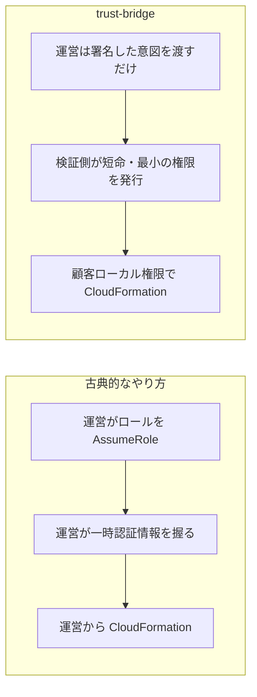
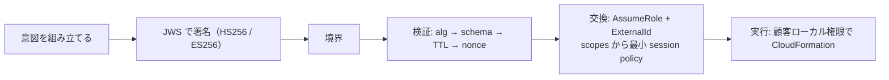

[TenkaCloud](https://www.tenkacloud.com/?lang=ja)という、実際のAWSアカウント上でクラウド競技を開催するOSSを作っています（[susumutomita/TenkaCloud](https://github.com/susumutomita/TenkaCloud)、Apache-2.0）。

別の記事で、参加者の自前AWSアカウントへ問題を配る「古典的なやり方」を書きました。運営のシステムが、参加者アカウントのロールを`AssumeRole`で引き受け、その一時認証情報でCloudFormationを動かす、という形です。動くのですが、消したい性質が1つあります。運営側が、短い時間とはいえ参加者アカウントで動ける認証情報を握ることです。もし運営側が侵害されたら、その握りが被害の経路になります。

`trust-bridge`は、この握りをなくすための設計です。クレデンシャルを境界の向こうへ渡すのではなく、署名した「操作の意図」を渡し、検証した側で短命かつ最小の権限に交換する。この記事では、その仕組みと、いまどこまで動いているかを正直に書きます。

先に立ち位置をはっきりさせます。`trust-bridge`はライブラリとテストとしては存在し、一部は本番にもデプロイ済みです。ただし「意図を短命の権限に交換する」フル経路は、まだ本番のデプロイ経路には載っていません。現状は観測だけのshadowモードで段階導入している最中です。この記事は「稼働中の仕組み」ではなく「設計と、その段階導入」として読んでください。

## 何を越境させるか

渡すのはクレデンシャルではなく、署名した`CloudActionIntent`です。zodの`.strict()`で定義した、宣言的なデータです。

```ts
// packages/trust-bridge/src/schema.ts
export const INTENT_VERSION = "tenkacloud.cloud-action-intent.v1";

// constraints（抜粋）: ttl は 1〜3600 秒、期限・有効化前・見積りコスト上限も持てる
const ConstraintsSchema = z.object({
  ttlSeconds: z.number().int().min(1).max(3600),
  expiresAt: z.string().datetime(),
  notBefore: z.string().datetime().optional(),
  maxEstimatedCostUsd: z.number().nonnegative().optional(),
  allowPrivilegeEscalation: z.boolean(),
}).strict();
```

意図には、宣言的な項目だけが入ります。

- 誰が: `source.tenantId` など
- どのプロバイダの何に対してか: `target.provider`（aws / azure / gcp）
- 何をするか: `action.type`（deploy / destroyなど）
- どこまでの権限を求めるか: `action.requestedScopes`
- 何をデプロイするか: テンプレートのダイジェスト（`sha256:...`）

実行できるものは何も入りません。あくまで「これをしたい」という宣言です。

署名の対象を安定させるため、正規化したJSONを使います。キーを辞書順に並べ、`undefined`を落とし、配列の順序は保つ、という決め方です。

## 署名と検証

意図はJWSで署名します。HS256（共有鍵）とES256（P-256の公開鍵）の両方に対応しています。検証側は、まずアルゴリズムを見て、スキーマを通し、期限とnonceを確かめます。

```ts
// packages/trust-bridge/src/verify.ts（順序の抜粋）
if (expiresAt.getTime() <= now.getTime()) return { ok: false, reason: "expired" };
if (now.getTime() < nbf.getTime()) return { ok: false, reason: "not-yet-valid" };
const outcome = await options.nonceStore.recordNonce(intent); // 使い回しを弾く
```

nonceの記録はDynamoDBの条件付き書き込みです。`attribute_not_exists`で、同じ意図の使い回し（リプレイ）を弾きます。1つ細かい点として、検証は送信側が作ったバイト列そのものに対して署名を確かめます。検証側で作り直さないので、途中で1バイトでも変わっていれば通りません。

## 意図を短命の権限に交換する

検証を通った意図を、AWSの短命な権限に変えるのが`AwsAssumeRoleExchange`です。ここで`AssumeRole`しますが、渡すのは意図が求めた範囲だけです。

```ts
// packages/trust-bridge/src/aws-assume-role.ts
// ExternalId は必須。無ければ交換しない
if (!awsContext.externalId) throw new ExchangeError("context-missing", "externalId is required");

// session policy を requestedScopes から最小生成する
const policy = JSON.stringify({
  Version: "2012-10-17",
  Statement: [{ Effect: "Allow", Action: [...intent.action.requestedScopes], Resource: "*" }],
});
```

ここが古典的なやり方との違いです。あちらでは広い権限のロールをそのまま引き受けていました。こちらでは、同じロールを引き受けても、意図が求めた操作だけに絞ったセッションポリシーを重ねます。有効期間は意図の`ttlSeconds`をそのまま使い、STSの下限（900秒）を割るなら、黙って延ばさずにその場で失敗させます。テナントやリクエストIDはセッションタグに載せて、監査とABACに使います。

なお`AwsAssumeRoleExchange`は、STSのクライアントを外から注入します。`@aws-sdk/client-sts`を直接の依存にしないので、`trust-bridge`自体はプロバイダのSDKから独立を保てます。

## 配置は「顧客ローカルの権限」で

もう1つの肝が`CloudFormationExecutor`です。CloudFormationを動かす権限は、注入された顧客ローカルのものを使います。ホストする側（運営）が信頼するロールを、ここで改めて`AssumeRole`し直すことはしません。

```ts
// packages/trust-bridge/src/cloudformation-executor.ts
// hosted control plane が trust する role を AssumeRole し直さない。
// つまり control plane を侵害しても、この executor が握る配置権限には到達できない。
```

意図は「何をしてよいか」の宣言、権限は「使う場所で」発行する。この2つを分けると、運営側を踏まれても、そこから配置の権限には手が届きません。



## 意図のライフサイクル

ここまでを1本の線にすると、こうなります。



## いまどこまで動いているか

ここは特に正直に書きます。上の絵のフル経路は、まだ本番のデプロイに載っていません。

いまのメインの問題デプロイは、shadowモードで動きます。既存の配信経路は変えず、そのわきで`CloudActionIntent`を組み立てて監査ログに出すだけです。失敗しても既存経路には影響しない、fail-openの観測です。opt-inの`enforce`モードもありますが、効くのは「稼働中のスタックを置き換える」高リスクなデプロイを承認待ちに保留するところまでで、権限の交換まではまだ行いません。

デプロイ済みで実際に検証まで走るのは、意図の受け口（IntentIngress）です。ここは本物の署名検証とnonceを通しますが、その後は既存のEventBridge配管へ渡すだけで、自分では権限交換をしません。`AwsAssumeRoleExchange`を呼ぶデプロイ済みのコードは、まだありません。顧客ローカル権限で実行する本命のスタックも、実装はあるものの、どのCDKエントリにも登録していない段階です。

マルチクラウドも同じ温度感です。抽象（`ProviderTokenExchange`）があり、AzureとGCPのアダプタも書いてあります。中身はAzureのフェデレーション資格情報とGCPのWorkload Identityですが、どちらも自らprototypeと名乗る段階です。実クラウドでの通しは別の作業になります。

補足として、コード内で参照している「ADR-017」「ADR-039」は、公開された設計文書としては存在しません。コードのコメント上の参照で、方針を指す番号です。この記事も、公開ADRの引用ではなく、コードから読み取れる設計として書いています。

## おわりに

`trust-bridge`が狙っているのは、2つのものを分けることです。

- 何をしてよいか: 署名され、期限があり、リプレイを弾ける「意図」
- それを実行する力: 使う場所で発行する、短命でプロバイダ固有の権限

クレデンシャルは境界を越えません。越えるのは、署名した宣言だけです。そして権限を使う場所で発行するので、運営側を踏まれても配置の権限には届きません。形のうえではマルチクラウドで、交換はプロバイダごとのアダプタに差し替えられます。

とはいえ、稼働中のデプロイ経路で認証のモデルを切り替えるのは、急いでやることではありません。だからいまはshadowで観測しながら、段階的に寄せている最中です。この記事は、その設計図と現在地の記録です。
