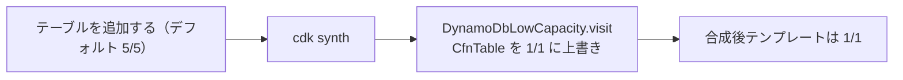
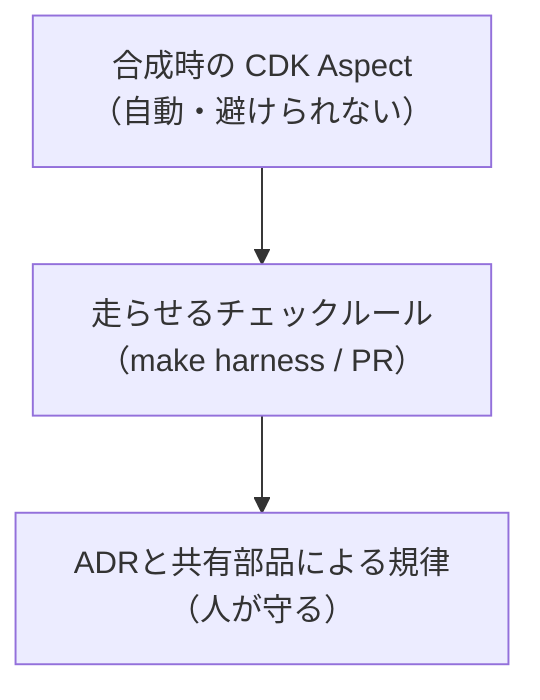

[TenkaCloud](https://www.tenkacloud.com/?lang=ja)という、実際のAWSアカウント上でクラウド競技を開催するOSSを作っています（[susumutomita/TenkaCloud](https://github.com/susumutomita/TenkaCloud)、Apache-2.0）。個人でも動かせるように、常設コストをできるだけAWSの無料枠に収める、という方針で作っています。

問題は、この方針を人の記憶で守れないことです。誰かがDynamoDBのテーブルをオンデマンドで足す、Secrets Managerでシークレットを1つ作る。そのたびに、常設コストが静かに増えます。レビューで毎回気づける保証はありません。だからTenkaCloudでは、コストの制約を機械に守らせています。この記事では、その仕組みと、強制の強さが制約ごとに違うところを正直に書きます。

## CDK Aspectで合成結果を書き換える

いちばん強く効いているのはCDK Aspectです。Aspectは、CDKがテンプレートを合成するときに、構築ツリーの全ノードを一巡して手を入れられる仕組みです。ここに「DynamoDBのテーブルはすべて最小容量にする」というルールを置きます。

```ts
// infrastructure/lib/cdk-aspect/dynamodb-low-capacity.ts
export class DynamoDbLowCapacity implements IAspect {
  constructor(private readonly readCapacity: number, private readonly writeCapacity: number) {}
  public visit(node: IConstruct): void {
    if (!(node instanceof CfnTable)) return;
    if (node.billingMode === "PAY_PER_REQUEST") return; // オンデマンドは容量を持たないので触らない
    node.provisionedThroughput = {
      readCapacityUnits: this.readCapacity,   // デフォルト 1
      writeCapacityUnits: this.writeCapacity, // デフォルト 1
    };
  }
}
```

CDKのプロビジョンドテーブルは、指定しなければ5/5で作られます。このAspectは、それを1RCU/1WCUに上書きします。GSIも同じ値にそろえます。TenkaCloudはこのAspectをスタック単位で付けているので、誰が新しいテーブルを足しても、合成の時点で1/1に倒れます。人が忘れても、テンプレートのほうが直ります。

1つ正直に書いておくと、このAspectはオンデマンド（`PAY_PER_REQUEST`）のテーブルを拒否はしません。容量の概念がないので、触らずに素通りします。つまり「全テーブルをプロビジョンドで持ち、CDKのデフォルト5/5を1/1へ上書きする」設計であって、オンデマンドを積極的に禁止する仕組みではありません。



## KMSの常設コストを消す

もう1つ、静かに効いてくる常設コストがKMSのカスタマー管理キーです。1キーあたり月1ドルが、使っていても使っていなくてもかかります。SBTはCodeBuildの成果物を暗号化するためにこのキーを作るので、TenkaCloudではAspectでそれを外し、AWS管理キーのデフォルトに倒します。

```ts
// infrastructure/lib/cdk-aspect/codebuild-use-aws-managed-kms.ts
// EncryptionKey プロパティを丸ごと削除して、CodeBuild の AWS 管理キーデフォルトに倒す
node.addPropertyDeletionOverride("EncryptionKey");
```

もう1本のAspectは、残ったKMSキーの削除待機期間を短くします。削除予定のキーが待機中も課金されるからです。シークレットの置き場もSSM Parameter StoreのSecureStringにしていて、暗号化はAWS管理キー（`alias/aws/ssm`）です。ここも追加コストはかかりません。

## Secrets Managerを禁じる（ただし強制は別ルート）

Secrets Managerはシークレット1件ごとに課金されます。そこでTenkaCloudは、そもそもimportさせないルールを持っています。

```ts
// .claude/harness/src/rules/secrets-manager-forbidden.ts
const SECRETS_MANAGER_IMPORT_RE =
  /["'](@aws-sdk\/client-secrets-manager|aws-cdk-lib\/aws-secretsmanager)["']/;
// 見つけたら error。推奨は SSM Parameter Store の SecureString（standard tier は無料）。
```

ただし、ここは強制の強さが前節までと違います。DynamoDBの1/1やKMSの削減は、合成のたびにAspectが必ず適用する自動の仕組みです。一方このルールは、行を走査する別のチェッカー（`make harness`）で見ます。そして現時点では、pre-commitやCIの自動ブロックに組み込んでいません。チェックルールは用意しています。ただし走らせる場所が、コミットのゲートではなくPRのチェック項目という位置づけです。ここを混ぜて「全部が自動でブロックされる」と書くと不正確です。

## SSE/WebSocketを持たず、ポーリングにする

常時接続もコストになります。TenkaCloudはSSEやWebSocketを持たず、フロントは共有のポーリングフックだけで状態を取りにいきます。時間で進む処理は、サーバー側でEventBridgeのスケジュール（1分間隔）から動くreconcilerが持ちます。この方針はADR-014として明文化してあります。

これも正直に書くと、「SSE/WebSocketを使わない」の担保は、ADRと共有フックへの集約という規律です。行走査のharnessに、SSEやWebSocketを検知するルールがあるわけではありません。

## で、いくらなのか

正直な数字を出します。READMEに実測（単一アカウント、デフォルトプロファイル）が載っています。

| 項目 | 月額 | 状態 |
|---|---|---|
| DynamoDB（プロビジョンドテーブル） | 約$7.06 | デフォルトプロファイルの常設コスト。別バックエンドで消せる |
| CodeBuild（問題デプロイ） | 実質$0 | Lambda CreateStackがデフォルトで、Lite modeにCodeBuildなし |
| KMSカスタマー管理キー | $0 | AspectでAWS管理キーに倒して解消 |

つまり現状のデフォルトでは、DynamoDBの常設コストが最後に残ります。これを消すためのバックエンド差し替えは実装とテストは済んでいますが、本番の実測はこれからです。加えて、2025年7月以降の新しい無料枠はクレジット制で、25RCU/WCUの常時無料枠がありません。だから「$0」は、バックエンドの選択と口座の条件がそろったときの話です。誇張せずに言うと、「無料枠に収まるよう設計してあり、最後の常設コストを消す途中」が正確です。

## おわりに

コストの制約を、人の記憶に頼らず、機械へ守らせる。これがこの記事の主題でした。ただし、その「機械」には強さの差があります。



いちばん強いのは、合成結果そのものを書き換えるAspectです。次に、走らせれば必ず引っかかるチェックルール。いちばん弱いのは、規約としての約束です。DynamoDBの容量とKMSは一番強い層に置き、Secrets Manager禁止やポーリング方針はその外側にあります。どの制約がどの強さで守られているかを、自分でも取り違えないようにしておくのが、この設計でいちばん大事なところだと思っています。
