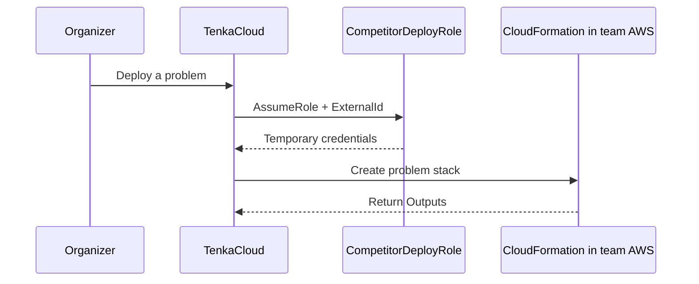
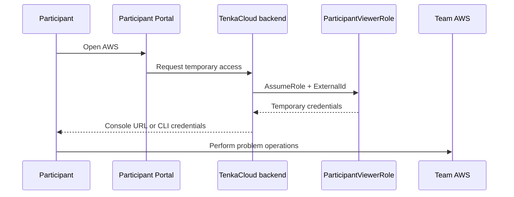
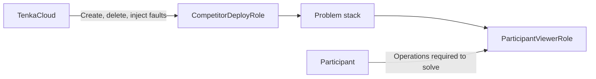

Before implementing an AWS problem, understand how TenkaCloud and participants enter a team AWS account. This explains the roles of `TenkaCloudAccountId`, `ExternalId`, and `ParticipantViewerRole` in the later `template.yaml`.

When teams use separate AWS accounts, the permission to deploy a problem and the permission to solve it belong to different IAM roles.

| IAM role | Used by | Responsibility |
| --- | --- | --- |
| `TenkaCloud-CompetitorDeploy-Role` | TenkaCloud deployment process | Create and delete problem stacks; execute Battle faults |
| `ParticipantViewerRole` | Participants on that team | Perform the AWS operations required by the problem |

Prepare the first role once in the team AWS account. Each problem's `template.yaml` creates the second role as part of its CloudFormation stack.

If TenkaCloud Lite and the problem environment share one AWS account, the deployment process can run in that same account and omit the cross-account role. This chapter describes the cross-account configuration used to isolate multiple teams.

## The Problem Deployment Path

Use `competitor-bootstrap.yaml` to create `TenkaCloud-CompetitorDeploy-Role` in a team AWS account. The role permits `sts:AssumeRole` from TenkaCloud only when two values match:

- The AWS account ID that runs TenkaCloud
- The event-specific `ExternalId`

TenkaCloud does not need to store a team's access keys. It uses temporary, expiring credentials issued when it assumes the role.

`ExternalId` is an additional condition that prevents TenkaCloud from confusing one team's request with another. Access requires both the AWS account ID and the `ExternalId` assigned to the target team.

The API receiving a request from the Application Admin Console does not wait synchronously for CloudFormation to finish. It records the request and state, then a worker assumes the role and creates the stack. This separates multi-team delivery from one browser HTTP request.

The implementation is described in more detail in this Japanese-language article:

[Cross-account design for delivering problem environments to participant AWS accounts](https://zenn.dev/bull/articles/tenkacloud-cross-account-deploy)

## The Participant Access Path

The problem stack creates `ParticipantViewerRole` and returns its ARN to TenkaCloud through a CloudFormation Output named `ParticipantViewerRoleArn`.

When a participant opens AWS from the Participant Portal, the TenkaCloud backend assumes the `ParticipantViewerRole` for that problem. It uses the resulting temporary credentials to issue either an AWS Console sign-in URL or temporary CLI credentials.

`ParticipantViewerRole` permissions vary by problem.

For `hello-world`, the role can only read SSM Parameters under the team's own prefix. For `hello-world-battle`, it can also inspect the team's EC2 instance and connect through AWS Systems Manager Session Manager.

Participants do not receive administrator access. Put only the operations required by the problem in the role.

## Do Not Confuse the Two Roles

`TenkaCloud-CompetitorDeploy-Role` is the organizer-side role that creates the problem environment. `ParticipantViewerRole` is the role participants use to operate the completed environment.

We can now separate deployment permissions from participant permissions. The next chapter converts the `hello-world` win condition into TenkaCloud flag scoring. Then we define the problem-specific AWS resources and `ParticipantViewerRole` in `template.yaml`.
