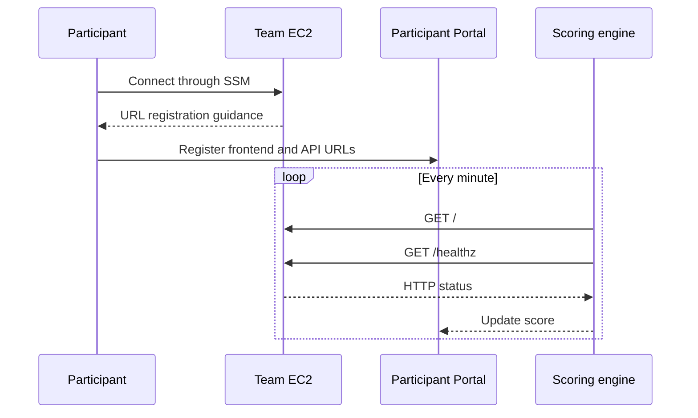
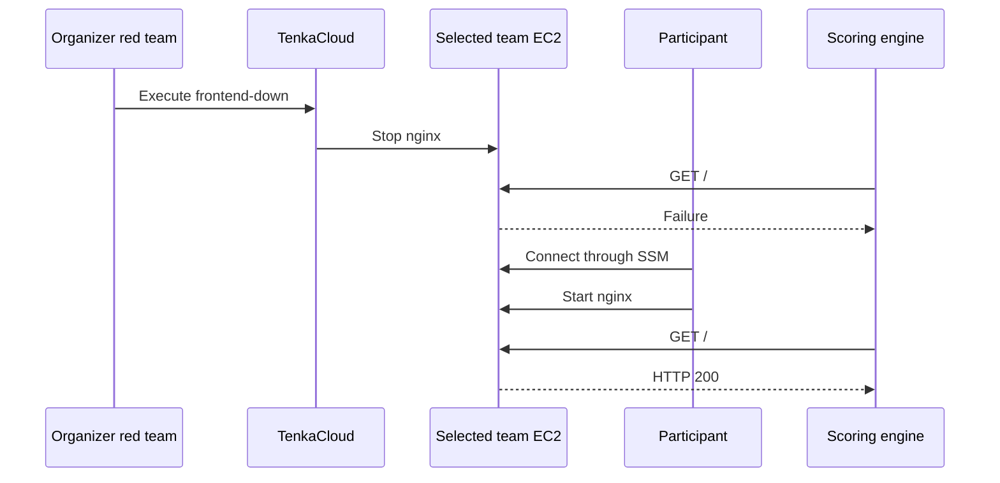

In a Challenge, submitting a value completes the problem. A Battle repeatedly scores the state of the system participants operate.

The goal of this Battle is to cover the essential TenkaCloud Battle operations in the smallest useful environment:

- Connect to a server through AWS Systems Manager Session Manager
- Register service URLs for scoring in the Participant Portal
- Observe that points begin changing after registration
- Recover a fault introduced by the red team

To create that experience, run two services on one EC2 instance:

- Port 80: nginx frontend
- Port 8080: Python API

## Connect to the Server

The participant's first action is connecting to the server.

The problem stack returns a connection command containing the EC2 instance ID as a CloudFormation Output.

```text
aws ssm start-session --target <InstanceId>
```

Do not use an SSH port or private key. Move from the Participant Portal to AWS and run the command shown in the Output.

The shell displays the URLs to register next. This prevents a first-time Battle participant from getting stuck after successfully entering the server.

## Register Service URLs

TenkaCloud sends HTTP requests to participant-registered URLs to determine whether a service is healthy. A URL used for scoring is called an endpoint.

The Participant Portal presents one input for each endpoint defined by the problem. Register:

```text
frontend: http://<EC2-public-DNS-name>
api:      http://<EC2-public-DNS-name>:8080
```

Every minute, TenkaCloud checks `/` on the frontend and `/healthz` on the API.



## Define Continuous Scoring

TenkaCloud calls this independent scoring of multiple URLs `uptime-flat`.

- Add 100 points when frontend `/` returns HTTP 200
- Add 100 points when API `/healthz` returns HTTP 200
- Deduct 100 points for each URL that fails its check
- Repeat the same checks every minute

The scoring result tells participants which service is healthy and which one needs recovery.

## Do Not Award Points for Deployment Alone

If CloudFormation creates healthy services and automatically passes their URLs to scoring, participants earn points without doing anything. They never learn the basic Battle operation of URL registration.

Set the initial `FrontendUrl` and `ApiUrl` scoring values to empty strings.

```yaml
Outputs:
  FrontendUrl:
    Value: ""
  ApiUrl:
    Value: ""
```

Expose the EC2 public DNS name separately through `Ec2HostHint`. Scoring begins only after participants construct the URLs and register them in the Participant Portal.

The empty values are not a trick. They are a game rule that connects a participant action with an observable result: the score begins to move.

## Let the Red Team Introduce a Fault

During a Battle, TenkaCloud's red-team feature lets an organizer select a team and execute a fault already defined by the problem.

In `hello-world-battle`, another participant team is not attacking. When an organizer executes `frontend-down` from the Application Admin Console, TenkaCloud stops nginx on the selected team's EC2 instance.

```text
systemctl stop nginx
```

The frontend stops returning HTTP 200, so its scoring result changes. Participants reconnect to EC2 and start nginx.

```bash
sudo systemctl start nginx
```

In case participants cannot recover it, TenkaCloud also schedules nginx to start automatically after ten minutes. Always pair a red-team fault with a revert operation.



## Battle Completion Criteria

This introductory Battle is not about complex ranking algorithms. Its success condition is that the entire flow works:

1. A participant can connect to the server
2. They can register both URLs
3. Continuous scoring begins after registration
4. The red team can introduce a fault for a selected team
5. The participant can recover and return scoring to healthy
6. Automatic reversion prevents the fault from remaining indefinitely

The next chapters convert these game rules into `template.yaml` and `metadata.json`.
