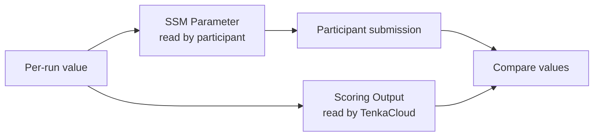

The local Challenge covered the fundamentals of participant text, an environment, submission, and scoring. The second problem extends the same Challenge format to AWS.

This chapter designs `hello-world`. Do not write CloudFormation yet. First decide the participant takeaway, story, win condition, and safety boundary.

## Define the Participant Takeaway

`hello-world` is the smallest problem that moves a participant from TenkaCloud into a team-specific AWS environment to inspect a named AWS resource.

The intended takeaway is:

> Enter the team's AWS environment with temporary permissions, read a known SSM Parameter through the Console or CLI, and submit its value through the Participant Portal.

Participants follow this sequence:

1. Open the problem in the Participant Portal
2. Enter their team's AWS environment
3. Inspect the specified SSM Parameter
4. Submit the discovered value
5. Confirm the score

Do not add a VPC, EC2 instance, or database. Keep the central action limited to reading one SSM Parameter.

## Create the Story

"Open an SSM Parameter and submit its value" gives no reason for the operation. Add a participant role and a reason to investigate the Parameter.

- Role: an SRE on their first day
- Current situation: only a handover note from the previous engineer remains
- Clue: "Check hello in SSM"
- First action: enter the team AWS environment and open Parameter Store

Those decisions produce this story:

> It is your first day as an SRE. The handover note from your predecessor says only, "Check hello in SSM." Enter your team's AWS environment and find the message they left behind.

Participants now understand why they are entering AWS and what to inspect first. The Parameter value is not in the problem statement, preserving the experience of discovery.

## Define the Win Condition

Convert "found the message" into a condition a machine can evaluate.

Generate a different flag every time the environment is created. Pass the same value to the SSM Parameter and to a scoring Output that participants cannot see.

Success occurs when the participant submits the flag from Parameter Store and it matches the scoring Output.



In the local Challenge, `/verify` in the problem container evaluated the answer. In this AWS Challenge, TenkaCloud stores a CloudFormation Output and compares the participant's submission with it.

## Define the Safety Boundary

Participants should be able to read only SSM Parameters under their team's prefix.

- TenkaCloud can create the problem stack in the team AWS account
- A participant can use only the IAM role for their problem
- A participant can read only SSM Parameters under their own prefix
- The scoring CloudFormation Output is hidden from participants
- A participant cannot read another team's Parameter
- The CloudFormation stack is deleted when the problem ends

Do not give participants AWS administrator access. Allow only the read operations required to solve the problem.

## Specification Before Implementation

Summarize the design:

```text
hello-world

Learning experience:
  Enter the team AWS environment, read an SSM Parameter, and submit the flag

Story:
  An SRE on their first day searches for a message left by their predecessor

Win condition:
  The submitted value matches the SSM Parameter value

Safety boundary:
  Read only SSM Parameters under the team's own prefix
  Do not expose the scoring Output or another team's values
```

The next chapter explains how TenkaCloud deploys a problem to a team AWS account and how participants enter that environment.
