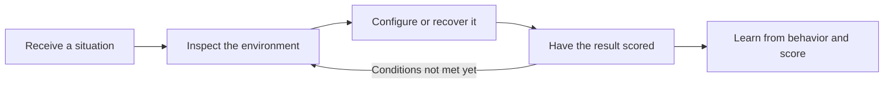
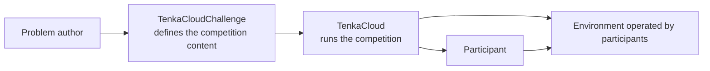
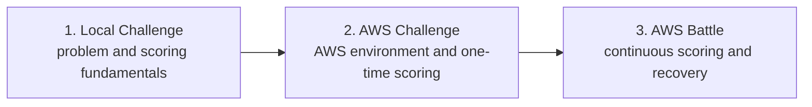

A cloud competition is a hands-on exercise in which participants enter a scenario modeled on real cloud operations. They inspect, configure, and recover an environment, then use scoring to verify the outcome of their work.

For example, a competition might begin when a team inherits a running web service. Participants connect to its servers and register the URLs that should be monitored. If the service fails during the event, they investigate the cause and restore it. A healthy service earns points; an unavailable service does not.

A conventional hands-on lab usually gives participants the correct procedure from the beginning. A cloud competition starts with a situation and a goal instead. Participants observe the current state and decide what to do next.

At minimum, a cloud competition needs four things:

- A situation and role for the participant
- An environment the participant can operate
- Conditions that can be evaluated externally
- An operations platform that delivers problems, hints, and scores

This book designs those four elements and turns them into problems that people can actually play.

## What Is TenkaCloud?

[TenkaCloud](https://www.tenkacloud.com/?lang=en) is an open-source platform for running cloud competitions. It brings together event and team management, problem delivery, the Participant Portal, scoring, hints, leaderboards, and fault injection for Battles. Its source code is available on [GitHub](https://github.com/susumutomita/TenkaCloud).

Participants use the Participant Portal to read a problem and its hints, submit an answer, or register a URL for scoring. Organizers use the Application Admin Console to manage events, teams, problem delivery, and faults introduced during a Battle.

The problem content lives in a separate open-source project called [TenkaCloudChallenge](https://github.com/susumutomita/TenkaCloudChallenge). Each problem keeps its participant-facing text, environment, scoring conditions, hints, and faults in one directory.

The responsibilities are separated like this:

TenkaCloudChallenge defines what participants experience. TenkaCloud decides who receives each problem, how it is scored, and how the event progresses.

## Challenges and Battles

TenkaCloud supports two problem formats: Challenges and Battles.

A Challenge has a clear goal that a participant can reach at their own pace. It scores a one-time achievement, such as submitting a discovered value or verifying that a configuration has been fixed.

A Battle repeatedly scores the state of a system throughout the event. It can check participant-registered service URLs on a schedule and measure whether a team restores the system after the organizer introduces a fault.

| Format | What is scored | Why the design becomes harder |
| --- | --- | --- |
| Challenge | A one-time discovery or fix | The problem ends when the goal is reached |
| Battle | System state over time | URL registration, continuous scoring, faults, and recovery must all be designed |

Challenge and Battle describe how scoring works. Separately, you can choose whether the problem environment runs on AWS or in local Docker containers.

## Build One Problem at a Time

Designing several problems in parallel makes it hard to tell whether you are currently deciding the story, environment, or scoring. In this book, we finish one problem before moving to the next.

First, we build a local Challenge that runs in Docker. Using a small web problem called `sqli-demo`, we complete the whole path: participant-facing text, a Docker environment, a scoring API, and submission through the Participant Portal. Because it works as a repeatable individual drill, we can focus on the basic building blocks without preparing an AWS account.

Next, we build `hello-world`, an AWS Challenge. Participants enter their team's AWS environment, find a value in AWS Systems Manager Parameter Store, and submit it through the Participant Portal. This adds CloudFormation, a participant IAM role, and temporary access to an AWS environment.

Finally, we build `hello-world-battle`, an AWS Battle. Participants connect to a server through AWS Systems Manager Session Manager and register frontend and API URLs in the Participant Portal. Continuous scoring begins after registration. When the organizer's red team stops the frontend, participants restore the service.

Battle comes last because it requires the most design work. In addition to the participant's first action, you must decide the scoring interval, registered URLs, fault timing, recovery method, and automatic revert behavior.

The completed problems built in this book are available in the public catalog:

- [sqli-demo](https://github.com/susumutomita/TenkaCloudChallenge/tree/main/challenges/sqli-demo)
- [Hello World Challenge](https://github.com/susumutomita/TenkaCloudChallenge/tree/main/challenges/hello-world)
- [Hello World Battle](https://github.com/susumutomita/TenkaCloudChallenge/tree/main/battles/hello-world-battle)

The goal is not merely to read completed files. We start by deciding what experience to give participants, then follow the process of turning that experience into a story, environment, and scoring model.

## What Comes Next

The next chapter distinguishes local mode from TenkaCloud Lite. We then design and implement the local Challenge, AWS Challenge, and AWS Battle in that order.

After all three problems are complete, we deploy TenkaCloud Lite to AWS and deliver the AWS Challenge and Battle to multiple teams. Finally, we run the event, inject a fault, recover the service, and clean up every resource.

This book and TenkaCloud are independent open-source projects. They are not affiliated with, endorsed by, or sponsored by Amazon Web Services, Inc. AWS and related marks are trademarks of Amazon.com, Inc. or its affiliates. This book does not reproduce an official AWS GameDay; it teaches you how to build a similar style of hands-on cloud exercise.

Next, we examine how the first local problem differs from an AWS problem.
