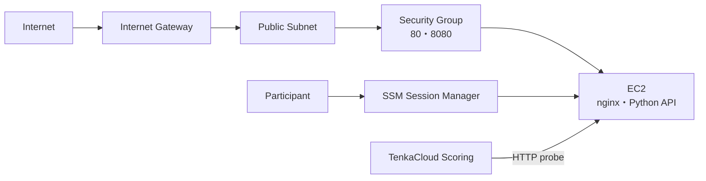

`hello-world-battle/template.yaml` creates more resources than the Challenge template. You can compare your work with the finished [template.yaml](https://github.com/susumutomita/TenkaCloudChallenge/blob/main/battles/hello-world-battle/template.yaml).

## Resources to Create



Define the resources in CloudFormation in this order:

1. Parameters
2. VPC and Internet Gateway
3. Public subnet and route table
4. Security Group
5. IAM role and instance profile for EC2
6. `ParticipantViewerRole`
7. EC2 instance and user data
8. Outputs

## Parameters

The three parameters used to connect the team account to TenkaCloud are the same as in the Challenge:

```yaml
Parameters:
  NamePrefix:
    Type: String
    MinLength: 5
    MaxLength: 80
    AllowedPattern: "^tc-[a-z0-9]+(-[a-z0-9]+)+$"

  TenkaCloudAccountId:
    Type: String
    AllowedPattern: "^[0-9]{12}$"

  ExternalId:
    Type: String
    NoEcho: true
    MinLength: 16
```

The Battle also accepts a public CIDR, an EC2 instance type, and an AMI:

```yaml
  AllowedCidr:
    Type: String
    Default: 0.0.0.0/0

  InstanceType:
    Type: String
    Default: t3.micro
    AllowedValues:
      - t3.micro
      - t3.small

  AmiId:
    Type: AWS::SSM::Parameter::Value<AWS::EC2::Image::Id>
    Default: /aws/service/ami-amazon-linux-latest/al2023-ami-kernel-6.1-x86_64
```

Review `AllowedCidr` before running a public event. The introductory problem defaults to `0.0.0.0/0`, but an internal event should usually restrict access to the participants' outbound IP range.

## Network

Use `10.99.0.0/16` for the VPC and `10.99.1.0/24` for the public subnet. Add an Internet Gateway, a route table, and a route to `0.0.0.0/0`.

Add these tags to every EC2-related resource:

```yaml
Tags:
  - Key: Name
    Value: !Sub "${NamePrefix}-vpc"
  - Key: TenkaCloud:NamePrefix
    Value: !Ref NamePrefix
```

`TenkaCloud:NamePrefix` defines the boundary that lets a participant inspect only their own resources. Add it to the VPC, subnet, Internet Gateway, route table, Security Group, and EC2 instance.

The Security Group exposes only the frontend and API:

```yaml
SecurityGroupIngress:
  - IpProtocol: tcp
    FromPort: 80
    ToPort: 80
    CidrIp: !Ref AllowedCidr
  - IpProtocol: tcp
    FromPort: 8080
    ToPort: 8080
    CidrIp: !Ref AllowedCidr
```

Do not open SSH port 22. Participants connect through AWS Systems Manager Session Manager.

## Give the EC2 Instance Access to Systems Manager

Attach an instance role with `AmazonSSMManagedInstanceCore` to the EC2 instance:

```yaml
InstanceRole:
  Type: AWS::IAM::Role
  Properties:
    AssumeRolePolicyDocument:
      Version: "2012-10-17"
      Statement:
        - Effect: Allow
          Principal:
            Service: ec2.amazonaws.com
          Action: sts:AssumeRole
    ManagedPolicyArns:
      - arn:aws:iam::aws:policy/AmazonSSMManagedInstanceCore
```

Keep the same sign-in and CloudShell permissions used by the Challenge in `ParticipantViewerRole`. Then allow the participant to call `ssm:StartSession` for their own EC2 instance:

```yaml
- Sid: StartSessionToOwnInstance
  Effect: Allow
  Action:
    - ssm:StartSession
  Resource:
    - !Sub "arn:aws:ec2:${AWS::Region}:${AWS::AccountId}:instance/${Ec2}"
    - !Sub "arn:aws:ssm:${AWS::Region}:${AWS::AccountId}:document/SSM-SessionManagerRunShell"
    - !Sub "arn:aws:ssm:${AWS::Region}::document/SSM-SessionManagerRunShell"
```

The published implementation also lets participants view their EC2 instance in the AWS Management Console and stop or resume their own sessions. Review the complete `ParticipantViewerRole` in the published template.

## Start Two Services with User Data

Install nginx and Python from the EC2 user data:

```bash
dnf update -y
dnf install -y nginx python3
systemctl enable --now nginx
```

The API returns HTTP 200 from `/healthz`:

```python
from http.server import HTTPServer, BaseHTTPRequestHandler
import json

class H(BaseHTTPRequestHandler):
    def do_GET(self):
        if self.path == "/healthz":
            self.send_response(200)
            self.send_header("Content-type", "application/json")
            self.end_headers()
            self.wfile.write(json.dumps({"ok": True}).encode())
            return
        self.send_response(404)
        self.end_headers()

HTTPServer(("0.0.0.0", 8080), H).serve_forever()
```

Register this Python program with systemd as `tenkacloud-api.service` and start it automatically. The finished service also uses `Restart=always`, so systemd restarts it after an unexpected exit.

## Outputs

Leave the scoring URLs empty:

```yaml
Outputs:
  FrontendUrl:
    Value: ""

  ApiUrl:
    Value: ""

  Ec2HostHint:
    Value: !GetAtt Ec2.PublicDnsName

  InstanceId:
    Value: !Ref Ec2

  SsmStartSessionCommand:
    Value: !Sub "aws ssm start-session --target ${Ec2}"

  NamePrefix:
    Value: !Ref NamePrefix

  ParticipantViewerRoleArn:
    Value: !GetAtt ParticipantViewerRole.Arn
```

Because `FrontendUrl` and `ApiUrl` are empty, scoring does not begin until the participant registers both URLs.

`Ec2HostHint` gives the participant the hostname to use in those URLs.

`InstanceId` identifies the target for fault injection. The participant uses `SsmStartSessionCommand` to open a session on the EC2 instance.

In the next chapter, you will connect these outputs to the endpoints, scoring rules, and disruption defined in `metadata.json`.
