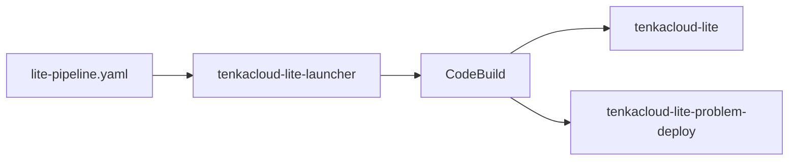

You have finished building the AWS problems. Now you will switch to the organizer's role and deliver them to participants. To deploy and score `hello-world` and `hello-world-battle` for multiple teams, you will deploy TenkaCloud Lite to AWS.

## What Is TenkaCloud Lite?

TenkaCloud Lite is the single-tenant edition of TenkaCloud. One organizer deploys it to their own AWS account, runs an event, and removes the environment afterward.

TenkaCloud also has an architecture for a persistent SaaS that serves multiple organizations. That architecture needs a control plane for onboarding organizations, tenant provisioning, and a pipeline that delivers updates to multiple tenants.

TenkaCloud Lite omits this multi-tenant management. A single fixed tenant contains everything needed for a competition:

- Application Admin Console for organizers
- Participant Portal for participants
- Event and team management
- Problem deployment
- Challenge and Battle scoring
- Red-team fault injection

“Lite” does not mean a simulated local version of the competition. It runs on real AWS resources and can deploy problems to team AWS accounts.

The platform operations are lighter, not the competition itself. By assuming one organizer and one tenant, Lite can omit the SaaS control plane and tenant-provisioning pipeline.

| Edition | Primary user | Tenants | Operation |
| --- | --- | --- | --- |
| TenkaCloud Lite | An organizer running their own event | One fixed tenant | Deploy for an event, then remove it |
| SaaS architecture | An operator serving multiple organizations | Multiple | Keep it running and manage customer organizations |

TenkaCloud Lite consists of two main stacks that include the Application Admin Console and Participant Portal. It does not create the SaaS control plane or CodePipeline.

## Review Cost and Cleanup Before Deployment

TenkaCloud Lite is open source, but it runs on real AWS infrastructure. AWS usage charges apply even though the software itself has no license fee.

Separate the cost into three areas:

| Cost area | What runs | What increases the cost |
| --- | --- | --- |
| TenkaCloud Lite | Admin UI, participant UI, authentication, scoring, and data storage | Runtime, traffic, stored data, and logs |
| Problem environments | CloudFormation stacks deployed to each team | Number of teams, number of problems, and runtime of services such as EC2 |
| Deployment process | CodeBuild started by the launcher | Time spent deploying and deleting |

The exact amount depends on the region, AWS services used by the problems, number of teams, and event duration. Monitor AWS Billing during the event, and do not leave the environment running when it is not needed.

At the end of the event, delete resources in this order:

1. Delete the problem stacks deployed to each team.
2. Run `ACTION=destroy-all` in CodeBuild to remove TenkaCloud Lite and its retained data.
3. After that succeeds, delete the launcher stack.
4. Check CloudFormation, EC2, DynamoDB, and logs for leftover resources.

The launcher is also the entry point for removing TenkaCloud Lite. Deleting it before `destroy-all` succeeds makes recovery more complicated.

For a guided cleanup, open [Clean Up TenkaCloud Lite](https://www.tenkacloud.com/portal-demo/?demo=1&goto=%2Fproblems%2F01HZX0M0CLEANUPTENKA0001) on the TenkaCloud landing page. This book also walks through deletion and the final resource check after the event.

## Start with the Deployment Tutorial

The TenkaCloud landing page provides an interactive tutorial for deploying TenkaCloud Lite to AWS:

[Open Deploy TenkaCloud Lite](https://www.tenkacloud.com/portal-demo/?demo=1&goto=%2Fproblems%2F01HZX0KZZ3DR0PW9M4Q7XV2C5D)

This tutorial guides you through creating TenkaCloud Lite in your AWS account. It is separate from local mode, which runs the earlier Docker problem on one computer.

It consists of four stages:

1. Create the CloudFormation launcher.
2. Deploy TenkaCloud Lite from CodeBuild.
3. Connect a team AWS account.
4. Create the first event.

This chapter explains what each step creates and why. Follow the landing-page tutorial for the current screen-by-screen instructions and input values.

## Distinguish the Launcher from TenkaCloud Lite

The first stack, `tenkacloud-lite-launcher`, is not TenkaCloud itself. It creates a CodeBuild project that fetches the TenkaCloud source and problem catalog, then performs the deployment.

Open CodeBuild from the launcher's `StartBuildConsoleUrl` output and choose `Start build`. CodeBuild then creates the two TenkaCloud Lite stacks.

This manual action makes the start of the billable deployment explicit. Creating the launcher alone does not start TenkaCloud.

## Use a Custom Problem Catalog

Keep the default values when using the official TenkaCloudChallenge catalog.

To use problems from your own fork or branch, set `ProblemsRepoUrl` and `ProblemsRepoRef` on the launcher:

| Parameter | Meaning |
| --- | --- |
| `ProblemsRepoUrl` | Git URL of the problem catalog |
| `ProblemsRepoRef` | Branch, tag, or commit SHA |

A branch is convenient during rehearsal. For the real event, pin a reviewed tag or commit SHA. If the reference changes during deployment, teams may receive different versions of a problem.

The two AWS problems built in this book already exist in the official catalog, so they work without a custom URL.

## Confirm the Deployment

At the end of the CodeBuild run, the logs display the URLs for the Application Admin Console and Participant Portal. The same URLs are available in the outputs of these CloudFormation stacks:

- `tenkacloud-lite`
- `tenkacloud-lite-problem-deploy`

Use the invitation sent to `TenantAdminEmail` to sign in to the Application Admin Console.

In the next chapter, you will connect team AWS accounts and add the two problems to an event.
