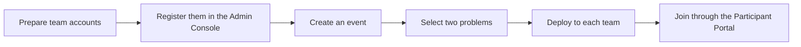

Deploying TenkaCloud Lite does not yet give participants a playable competition. You still need to connect team AWS accounts, add the two problems to an event, and deploy a problem environment to every team.

The complete flow is:

## Connect Team AWS Accounts

Each team AWS account needs a role that lets TenkaCloud create problem stacks.

Deploy `infrastructure/templates/competitor-bootstrap.yaml` from the TenkaCloud repository to every team account.

This template creates `TenkaCloud-CompetitorDeploy-Role`. Its trust policy accepts TenkaCloud only when both of these values match:

- The AWS account ID where TenkaCloud is deployed
- The `ExternalId` configured by the organizer

Register the role ARN created in the team account with the Application Admin Console.

The earlier chapter, “How TenkaCloud Accesses Team AWS Accounts,” explained why the role exists and how `ExternalId` works. For an implementation-level explanation, see the [Japanese-language article on TenkaCloud's cross-account design](https://zenn.dev/bull/articles/tenkacloud-cross-account-deploy).

## Create the Event

Create a new event in the Application Admin Console. For the first rehearsal, start with one team and let the organizer act as the participant.

Provide:

- Event name
- Start and end time
- Participating teams
- AWS account and region for each team
- Problems included in the event

Select these two problems from the catalog:

- `hello-world`
- `hello-world-battle`

Place the Challenge first and the Battle second. Participants then learn TenkaCloud's basic game loop in this order:

1. Open their team AWS account.
2. Read an SSM Parameter.
3. Submit a flag.
4. Connect to EC2 through SSM.
5. Register endpoints.
6. Observe continuous scoring.
7. Recover from a disruption.

## Deploy Problems to Each Team

After adding teams and problems to the event, start the deployments from the Application Admin Console.

TenkaCloud assumes each team's role with the `ExternalId` and creates a CloudFormation stack in that AWS account.

Watch the status until each deployment finishes:

| Status | Action |
| --- | --- |
| Creating | Wait for completion |
| Complete | Confirm that the problem appears in the Participant Portal |
| Failed | Inspect `failureReason` and the CloudFormation events |

If every team fails, first check the role's trusted account and the `ExternalId`. If only one team fails, inspect the CloudFormation events in that team's account.

## Join Through the Participant Portal

Creating a team issues a team-specific login key. This key is the credential used to enter the Participant Portal.

Send each login key only to the corresponding team over a secure channel. It may be shown only once, so store it when it is issued.

Give participants:

- The Participant Portal URL
- Their team's login key

Both Challenge and Battle activity starts in the Participant Portal. In the next chapter, you will rehearse with one team before running the event.
