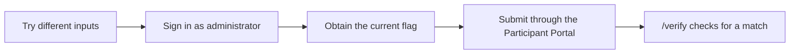

The previous chapter defined the central action and learning outcome for `sqli-demo`. This chapter fixes the story, win condition, and safety boundary for that one problem.

We will design the AWS Challenge and Battle only after the local problem is complete.

## Connect the Story to the First Action

A story is not a long document of fictional background. It explains why participants should investigate this particular screen.

For `sqli-demo`, decide three things:

- Participant role: a person asked to assess the security of a login page
- Current situation: nobody knows the administrator password
- First target: the staff-only login page

Those decisions produce this participant-facing situation:

> An internal login page is reserved for staff. Signing in as the administrator reveals a passphrase that only administrators can see, but nobody knows the administrator password. Investigate how the form handles input and sign in as the administrator without the legitimate password.

After reading the story, participants can open the web page from the Participant Portal and begin comparing how different inputs behave.

## Define the Win Condition

Do not determine that authentication was bypassed from appearance alone. Give the environment evidence of success that can be checked externally.

`sqli-demo` reveals a flag unique to the current run only after an administrator login. When a participant submits the flag through the Participant Portal, `/verify` in the problem container returns whether it is correct.



The win condition fits in one sentence:

> The participant submits the flag obtained from the administrator page, and the running problem environment accepts it as correct.

## Use Hints to Return to the Investigation

When participants get stuck, do not reveal the entire answer at once. Order hints so they can return to the investigation.

The first hint directs attention to how input characters are handled behind the screen. The second names the vulnerability and shows a concrete input example.

The problem statement omits the vulnerability name. Only participants who need more specific information reveal it in exchange for a scoring penalty.

## Define the Safety Boundary

`sqli-demo` intentionally contains an unsafe login flow. A core design condition is that nobody outside the participant's computer can reach it.

- Expose the target web page only on `127.0.0.1`
- Expose the scoring `/verify` endpoint only on `127.0.0.1`
- Use separate ports for the target and scoring API
- Do not hard-code the flag in source code
- Do not return the correct flag or comparison details after a wrong answer
- Stop both the problem and scoring environments with `make local-down`

Running locally does not guarantee safety by itself. Docker Compose port bindings must prevent external access, and the scoring API must not leak the answer.

## Specification Before Implementation

Collect the decisions into a short specification:

```text
sqli-demo

Learning experience:
  Inspect a web page and bypass authentication by observing how input changes behavior

Story:
  A security assessor investigates an administrator page whose password is unknown

Win condition:
  /verify accepts the flag obtained from the administrator page

Safety boundary:
  Expose the web page and /verify only on 127.0.0.1
  Generate a fresh flag for every run
  Use make local-down at the end
```

The next chapter prepares TenkaCloudChallenge and creates the directory that will hold this design.
