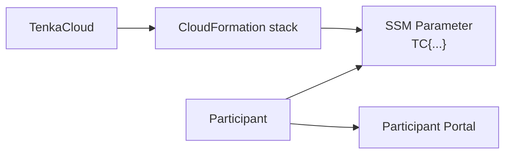

TenkaCloudChallenge requires both `README.md` and `README.ja.md` for every problem. `metadata.json` defines the display and scoring read by TenkaCloud. The README files let problem authors, reviewers, and event organizers verify the design.

## What to Put in the README

Write the `hello-world` README in this order:

1. Problem purpose
2. Story
3. Deployed AWS resources
4. Participant solution path
5. Scoring
6. Hints
7. Cost
8. Learning goals
9. Related files

Every README statement should match facts that can be verified in `metadata.json` and `template.yaml`.

In `hello-world`, the SSM Parameter value has this form:

```text
TC{random-value-for-this-deployment}
```

Leaving an old or sample value in the README misleads participants and organizers. When the implementation changes, update Output names, points, hint penalties, and AWS resources in the README as well.

See the completed [Japanese README](https://github.com/susumutomita/TenkaCloudChallenge/blob/main/challenges/hello-world/README.ja.md) and [English README](https://github.com/susumutomita/TenkaCloudChallenge/blob/main/challenges/hello-world/README.md).

## Keep Both Languages Equivalent

Use `README.md` for English and `README.ja.md` for Japanese. They do not need to be literal translations, but these facts must agree:

- Created AWS resources
- Participant's first action
- Submitted value
- Points and penalties
- Hint progression
- Deletion procedure
- Cost

Updating only one file makes the problem appear different depending on language. Review both in the same pull request.

## Show the Flow in diagram.svg

`diagram.svg` appears on the problem detail page in the Participant Portal. For `hello-world`, showing the information flow is enough.



Do not put the correct value or information participants must discover in the diagram. Show only the resource relationships and operation flow.

The next chapter reviews the Challenge in the order a participant experiences it.
