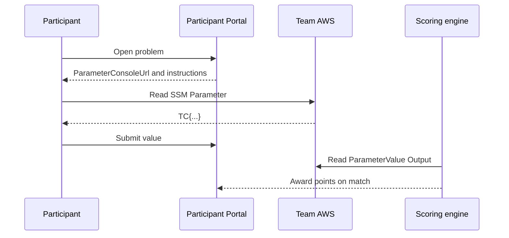

Collect the files built so far under `challenges/hello-world/`.

```text
challenges/hello-world/
├── metadata.json
├── template.yaml
├── README.md
├── README.ja.md
└── diagram.svg
```

## Verify the Connections Between Files

First verify every value that must match.

| Source | Destination | Matching value |
| --- | --- | --- |
| Directory name | `metadata.json` | `hello-world` |
| `metadata.json.cfnTemplate` | File name | `template.yaml` |
| `metadata.json.cfnParameters.FlagSeed` | `template.yaml.Parameters` | `FlagSeed` |
| `metadata.json.scoring.flagOutputKey` | `template.yaml.Outputs` | `ParameterValue` |
| Japanese hints | English hints | `hint-1`, `hint-2` |

## Read the Problem as a Participant

After opening the problem, a participant reads `shortDescription` and `instructions`.

They then open `ParameterConsoleUrl` or run `aws ssm get-parameter` in the CLI. `ParticipantViewerRole` can read only Parameters under that team's `NamePrefix`.

The participant submits the discovered `TC{...}` value through the Participant Portal. TenkaCloud compares it with the `ParameterValue` Output and records points when they match.



## Review the Completed Implementation

The result designed and implemented in this book is available in the public catalog.

- [Complete problem directory](https://github.com/susumutomita/TenkaCloudChallenge/tree/main/challenges/hello-world)
- [metadata.json](https://github.com/susumutomita/TenkaCloudChallenge/blob/main/challenges/hello-world/metadata.json)
- [template.yaml](https://github.com/susumutomita/TenkaCloudChallenge/blob/main/challenges/hello-world/template.yaml)

The public implementation also includes permissions required by the AWS Console and constraints on input values. Do not assemble a final file from excerpts alone; review the completed implementation and `AGENT.md`.

The next chapter validates the problem with the repository's required command.
