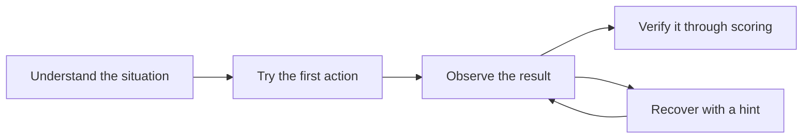

When building a cloud competition, it is easy to focus on implementation details such as Docker, AWS services, and scoring features. Participants, however, experience the exercise—not its implementation.

A technically correct problem is still unusable if participants do not know how to begin. Even after solving it, they cannot take away a lesson if they do not understand what was evaluated.

Design the problem so participants can move through this sequence without getting lost:

## Make the First Action Clear

Immediately after opening a problem, participants should have one thing they can try. Give them an entry point for investigation, not the answer.

In `sqli-demo`, the Participant Portal links to the target web page. Participants investigate how its login flow handles input. The entry point does not reveal how to sign in as the administrator or disclose the answer.

## Return the Result of Each Action

When an action and its result are far apart, participants cannot tell whether their reasoning was correct.

In `sqli-demo`, signing in as the administrator reveals a flag. Submitting that flag to the Participant Portal returns the scoring result immediately. Participants can connect their action in the web interface to the score.

## Make Success Observable

Vague conditions such as "the service works" or "the investigation is complete" prevent both participants and authors from explaining what success means.

`sqli-demo` compares the submitted flag with the flag held by the running problem environment. Success is externally verifiable; it does not depend on an ambiguous observation such as "the participant appears to be signed in as the administrator."

## Provide a Way Back When Participants Get Stuck

Hints are not decoration intended to hide an answer. Their purpose is to return a stuck participant to a point where they can continue independently.

The first hint should identify an area to inspect or a way to think about the problem. A later hint can move closer to a concrete operation. Participants choose only the level they need.

For `sqli-demo`, the first hint draws attention to input handling. The next hint moves toward the vulnerability class and a concrete input.

## Clean Up Safely

Avoid designs that leave manually created, billable resources behind after the competition.

`sqli-demo` runs an intentionally vulnerable web application. It is not exposed to an external network and accepts connections only from the participant's computer. At the end, TenkaCloud's shutdown command removes the Docker environment.

## Turn Experience into Design Decisions

Convert these principles into questions for the problem author:

- What will a participant do in the first minute?
- Where will the result of that action appear?
- How can success and failure be evaluated externally?
- Which hint lets a stuck participant continue?
- How will the environment be removed afterward?

The next chapter decides what participants should take away from the first local Challenge.
