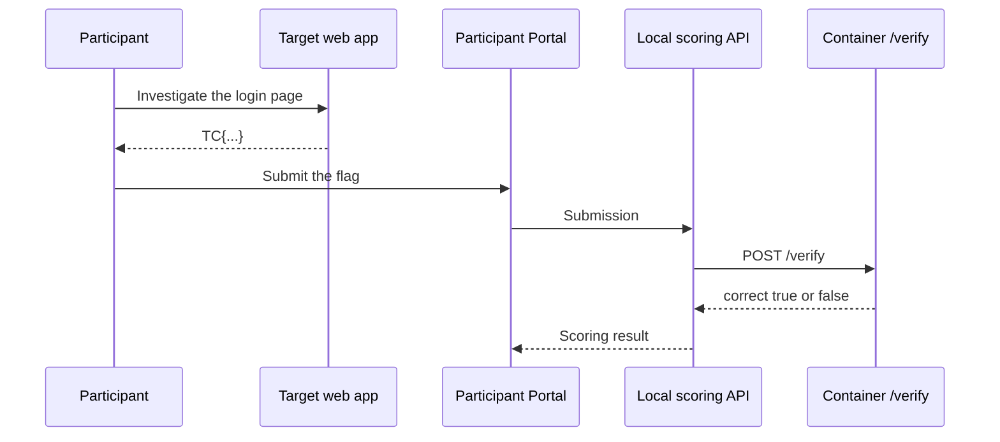

We have defined the story, win condition, and safety boundary for `sqli-demo`. This chapter converts that design into a `metadata.json` file that TenkaCloud can read.

`metadata.json` tells TenkaCloud what participants see, how to start the Docker environment, how scoring works, and which hints are available.

## Define the Runtime

Start with the basic problem information:

```json
{
  "$schema": "../../SCHEMA.json",
  "id": "sqli-demo",
  "name": "Staff-Only Login",
  "category": "Challenge",
  "difficulty": 2,
  "estimatedDuration": "30 minutes",
  "tags": [
    "web-security",
    "sql-injection",
    "local-play",
    "container"
  ]
}
```

A local problem defines `runtime` instead of `cfnTemplate`.

```json
{
  "runtime": {
    "provider": "docker",
    "engine": "compose",
    "entry": "local/docker-compose.yml",
    "challengeEndpoints": {
      "Web": "http://127.0.0.1:18080"
    },
    "verifyUrl": "http://127.0.0.1:18081/verify",
    "secretEnv": ["FLAG_SEED"]
  }
}
```

Each field has a specific meaning.

| Field | Meaning |
| --- | --- |
| `provider` | Run the environment in Docker |
| `engine` | Use Docker Compose |
| `entry` | Compose file used to start the problem |
| `challengeEndpoints.Web` | Target URL shown in the Participant Portal |
| `verifyUrl` | Local API that evaluates a submission |
| `secretEnv` | Per-run secret generated by TenkaCloud and passed to the container |

`challengeEndpoints` is the participant's entry point. `verifyUrl` is used only by TenkaCloud's scoring flow. Keep them on separate ports because they have separate responsibilities.

## Define Verify Scoring

For a local problem, TenkaCloud does not hold the answer. It forwards the participant's submission to `/verify` in the problem container.

```json
{
  "scoring": {
    "kind": "verify",
    "points": 100,
    "wrongAnswerPenalty": 5,
    "hints": [
      {
        "id": "hint-1",
        "content": "Investigate how the characters you enter are handled behind the screen.",
        "penalty": 20
      },
      {
        "id": "hint-2",
        "content": "Your input is concatenated into SQL. Try an input that uses a comment marker.",
        "penalty": 30
      }
    ]
  }
}
```

The scoring flow looks like this:



`/verify` never returns the correct answer. It returns `correct` and a short result that is safe to show the participant.

## Provide Learning After the Solution

Hiding the vulnerability in the problem statement is not enough. After solving the problem, participants still need to understand what happened. The `writeup` should explain that input was concatenated into SQL, why this bypassed authentication, and how a parameterized query fixes the issue.

The participant experience becomes:

1. Begin investigating from the story
2. Use progressively more specific hints if needed
3. Observe the behavior and obtain the flag
4. Learn the cause and remediation after solving the problem

The next chapter implements the Docker environment and `/verify` endpoint referenced by this `metadata.json`, then runs the result in TenkaCloud local mode.
