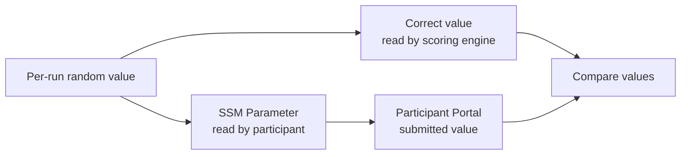

Scoring verifies that a participant completed the intended action. This chapter considers only `hello-world` and decides how to score a value discovered in SSM Parameter Store.

We will design continuous Battle scoring only after the AWS Challenge is complete.

## Score a Discovered Value

Every `hello-world` deployment stores a different random value in an SSM Parameter.

```text
TC{random-value-for-this-deployment}
```

The problem environment also returns the correct value to TenkaCloud for scoring without exposing it to participants.

Participants can read only the SSM Parameter. They cannot read the scoring value directly. This permission model forces them to perform the intended AWS operation to obtain the answer.



TenkaCloud calls this one-time submission of a discovered value `flag` scoring. Because this is a difficulty-one Challenge, a correct answer earns 100 points and a wrong answer deducts 5. The two hints deduct 20 and 30 points. Even after opening both, a participant can still earn 50 points and continue the exercise.

The scoring condition is:

> Record 100 points when the participant's submission matches the problem stack's `ParameterValue` Output.

The next chapter implements the SSM Parameter, random value, participant IAM role, and CloudFormation Outputs required by this scoring model.
