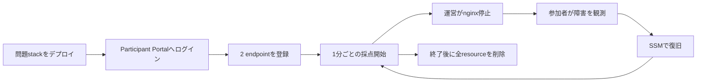

この付録では、TenkaCloudChallengeに既に存在する`hello-world-battle`を使い、最小のBattleを一度リハーサルします。

新しい問題を作る前に、プラットフォームのデプロイ、チーム用AWS account、endpoint登録、1分ごとの採点、障害注入、削除までを通してください。既存サンプルで通らない状態では、独自問題の不具合とプラットフォーム側の不具合を切り分けられません。

## このリハーサルで確認すること

`hello-world-battle`は、EC2上で次の2サービスを動かす最小Battleです。

- nginxのfrontend
- Pythonのhealth API

参加者は自分のstackのURLをParticipant Portalへ登録します。登録後、TenkaCloudが1分ごとにendpointをprobeします。運営側はnginx停止のdisruptionを実行できます。参加者はSSM Session ManagerでEC2へ接続し、サービスを復旧します。



## 前提

この手順には実AWS環境が必要です。

- TenkaCloudを置くoperator account
- 各チームのproblem stackを置くcompetitor account
- CloudFormationとIAMを操作できる運営者権限
- 参加者が利用するブラウザー
- AWS CLIまたはブラウザー上のCloudShell

Codespacesのローカルプレイでは、Dockerだけで完結する問題を試せます。`hello-world-battle`の実AWS resource、cross-account deploy、SSM、公開endpointの確認には実AWSを使います。

## 利用するversionを記録する

開始時に、利用するcommitを記録します。

```text
TenkaCloud commit:          <SHA>
TenkaCloudChallenge commit: <SHA>
AWS region:                 <region>
Rehearsal date:             <YYYY-MM-DD>
```

最初の試行では`main`を使っても構いません。通し確認が終わったら、再実行時はtagまたはcommit SHAへ固定します。

## 1. 問題カタログを検証する

TenkaCloudChallengeを取得します。

```bash
git clone https://github.com/susumutomita/TenkaCloudChallenge.git
cd TenkaCloudChallenge
bun install
bun run validate
```

`battles/hello-world-battle/`を確認します。

```text
battles/hello-world-battle/
├── metadata.json
├── template.yaml
├── README.md
├── README.ja.md
└── OPERATOR.md
```

利用時点でファイル構成が変わっている場合は、repositoryの現行構成を優先してください。

`metadata.json`では、少なくとも次を確認します。

- `category`が`Battle`
- frontendとAPIのendpoint slot
- `uptime-flat`の採点
- nginx停止のdisruption
- disruptionの自動revert
- CloudFormation Outputとslotの対応

## 2. 運用モードを選ぶ

1人の主催者が1回のイベントを開く場合は、Lite modeが最小です。

TenkaCloudの現行Runbookでは、主な運用モードを次のように分けています。

| モード | 向く用途 |
| --- | --- |
| Lite | 1主催者、1イベント |
| SaaS | 複数tenant、常設運用 |
| Always-On | イベント間のAWS常時稼働を抑えたい場合 |

この付録ではLite modeを使います。

## 3. competitor accountをbootstrapする

operator accountからcompetitor accountへ問題stackをデプロイするため、competitor account側にbootstrap roleを作ります。

TenkaCloud repositoryの`infrastructure/templates/competitor-bootstrap.yaml`を使用します。

bootstrap時には、次を一致させます。

- TenkaCloud operator account ID
- ExternalId
- 利用region

作成される`TenkaCloud-CompetitorDeploy-Role`のtrust policyでは、operator accountからの`sts:AssumeRole`をExternalId一致の条件付きで許可します。

ExternalIdはsecretとして扱います。

- 公開Gitへ書かない
- 問題文へ書かない
- screenshotへ写さない
- chatやイベント資料へ貼らない
- SSM SecureStringなど、運用で定めた場所に保存する

本番参加者を登録する前に、test account一つでAssumeRoleと問題deployを確認します。

## 4. Lite launcherを作る

TenkaCloud repositoryから`infrastructure/templates/lite-pipeline.yaml`を取得します。

AWS ConsoleのCloudFormationで、新しいstackを作ります。

```text
Stack name: tenkacloud-lite-launcher
Template:   lite-pipeline.yamlをupload
Region:     開催region
```

主なparameterを確認します。

- `TenantAdminEmail`
- `RepoRef`
- `ProblemsRepoUrl`
- `ProblemsRepoRef`
- control data backend
- DynamoDB capacity

独自forkではなく公式カタログを使う場合も、リハーサル後は`ProblemsRepoRef`を検証済みcommitへ固定します。

launcher stackを作っただけでは、TenkaCloud本体はデプロイされません。launcherはCodeBuildの起動口を作るだけです。

## 5. TenkaCloudをデプロイする

launcher stackのOutputからCodeBuild projectを開き、**Start build**を実行します。

この操作が、AWS課金を伴うTenkaCloud本体のデプロイ開始点です。

build logで次を確認します。

- TenkaCloud repositoryのclone
- problem repositoryのclone
- 利用ref
- CDK synth
- CloudFormation deploy
- Participant Portal URL
- Application Admin Console URL

Lite modeでは、TenkaCloud本体とproblem deploy backendのstackが作成されます。Runbookに記載された対象stackが`CREATE_COMPLETE`または`UPDATE_COMPLETE`であることを確認します。

## 6. test eventとtest teamを作る

Application Admin Consoleへ入り、リハーサル用eventを作ります。

```text
Event: Hello World Battle Rehearsal
Mode:  Battle
Team:  rehearsal-team
```

teamへ、bootstrap済みcompetitor accountを関連付けます。

登録値を二人で確認します。

- competitor account ID
- deploy role
- ExternalIdの配線
- team名

account IDの一桁違いは、別accountへの操作または一括deploy失敗につながります。

## 7. 問題stackをデプロイする

`hello-world-battle`をeventへ追加し、test team向けにデプロイします。

状態を追跡します。

```text
queued
  ↓
deploying
  ↓
complete
```

失敗した場合は、最初にdeployment recordの`status`と`failureReason`を確認します。

よくある原因です。

- competitor bootstrap未実施
- operator account IDの不一致
- ExternalIdの不一致
- service quota
- CloudFormation template error
- resource名の衝突
- UserDataの失敗

competitor account側のCloudFormation eventsも確認します。

## 8. Participant Portalへログインする

TenkaCloudの現行Lite運用では、参加者はチームごとのログイン鍵を使ってParticipant Portalへ入ります。

ログイン鍵は、そのteamの認証情報です。

- 必要な参加者だけへ配る
- 共有screenへ表示し続けない
- screenshotへ残さない
- コピー時の空白と改行に注意する
- 終了後はdeployment削除などで無効化する

リハーサルでは、test teamの鍵で実際にログインし、そのteamの問題だけが見えることを確認します。

## 9. AWS環境へ接続する

CloudFormation Outputから、対象EC2のinstance IDとSSM接続方法を確認します。

CLIを使う場合の形です。

```bash
aws ssm start-session --target <InstanceId>
```

接続できない場合は次を確認します。

- participantが正しいteam accountへ入っているか
- instanceがrunningか
- SSM managed nodeとしてonlineか
- instance profileが正しいか
- participant roleに必要なSSM権限があるか
- AWS CLIとSession Manager pluginの利用環境があるか

ブラウザーだけで進める場合は、AWS ConsoleまたはCloudShellの導線を確認します。

## 10. endpointを登録する

BattleのURL系Outputは、参加者が登録するまで空になっている場合があります。これは、デプロイしただけで得点が始まらないようにするparticipant-action gateです。

`Ec2HostHint`などのOutputから公開DNS名を確認し、Participant Portalへ登録します。

```text
Frontend slot: http://<public-dns>
API slot:      http://<public-dns>:8080
```

問題metadataが指定するpathは、frontendが`/`、APIが`/healthz`です。利用時点の`metadata.json`を正とします。

登録前の0点は正常です。登録後、次の採点tickで結果が更新されることを確認します。

## 11. 正常時の採点を確認する

participant側とoperator側の両方からendpointを確認します。

```bash
curl -fsS "http://<public-dns>/"
curl -fsS "http://<public-dns>:8080/healthz"
```

次を記録します。

```text
Endpoint registration time: <time>
First successful probe:     <time>
First score update:         <time>
Frontend result:            success
API result:                 success
```

pollingは1分単位のため、登録直後に画面が更新されなくても、次のtickまで待ってから障害と判断します。

## 12. nginx停止を発火する

運営画面から、`hello-world-battle`が宣言するnginx停止のdisruptionをtest teamへ実行します。

発火前に確認します。

- event
- team
- problem
- disruption ID
- target instance
- revert予定時刻

発火後は、次を確認します。

- disruptionの実行結果
- frontend probeの失敗
- API probeの状態
- scoreへの影響
- revertが予約されたこと

障害を発火した時刻を記録します。

## 13. 参加者として復旧する

参加者はSSMで対象EC2へ接続し、状態を観察します。

```bash
systemctl --failed
systemctl status nginx
journalctl -u nginx --no-pager -n 50
```

設定自体が壊れていないか確認します。

```bash
sudo nginx -t
```

停止しているだけなら、復旧します。

```bash
sudo systemctl start nginx
```

instance内部と外部の両方から確認します。

```bash
curl -fsS http://127.0.0.1/
curl -fsS "http://<public-dns>/"
```

Participant Portalの次のpollで、frontendがsuccessへ戻り、加点が再開することを確認します。

## 14. 自動revertを確認する

手動復旧済みでも、予約されたrevertが安全に実行されることを確認します。

revertは冪等である必要があります。既にnginxが起動していても、serviceを壊してはいけません。

記録します。

```text
Disruption fired: <time>
Manual recovery:  <time>
Revert executed:  <time>
Revert result:    success
Final endpoint:   healthy
```

## 15. 採点停止時の切り分けを試す

リハーサルでは、意図的に一つの失敗を作り、運営の切り分けを練習します。

### endpoint未登録

登録値を一度削除し、そのteamだけ0点のままになることを確認します。

### probe失敗

nginx停止中に、登録済みだがfrontendだけ失敗する状態を確認します。

### event時刻

event開始前または終了後は、採点tickが意図的にskipされることを確認します。

本番で全teamのscoreが同時に止まった場合は、個別問題ではなく、event状態やcapacityを先に疑います。

## 16. 問題stackを削除する

リハーサル終了後、competitor accountの問題stackを削除します。

```bash
aws cloudformation delete-stack \
  --stack-name <problem-stack-name>

aws cloudformation wait stack-delete-complete \
  --stack-name <problem-stack-name>
```

次を確認します。

- EC2
- EBS
- VPC
- subnet
- Internet Gateway
- Security Group
- IAM role
- instance profile
- SSM関連resource
- CloudFormation stack

参加者がCloudFormation管理外のresourceを作っていないかも確認します。

## 17. TenkaCloudを完全撤去する

Lite launcherのCodeBuild projectで、**Start build with overrides**を選びます。

```text
ACTION=destroy-all
```

利用するlauncherが`destroy-all`に対応したversionであることを確認してください。

build logを最後まで確認し、TenkaCloud本体のstackが削除されたことを確認します。その後、launcher stackを削除します。

launcher stackを削除すると、launcher専用のCodeBuild project、IAM role、log groupも削除対象になります。

## 18. 費用を後日確認する

請求情報には反映の遅れがあります。終了直後だけでなく、翌日以降に確認します。

- Cost Explorer
- AWS Budgets
- operator account
- competitor account
- 利用region
- 想定外region
- 残存resource

見積もりと実績の差を、次回のチーム数と開催時間へ反映します。

## リハーサル記録

最後に、次を一つのMarkdownへ残します。

```markdown
# hello-world-battle rehearsal

## Versions
- TenkaCloud: <SHA>
- TenkaCloudChallenge: <SHA>
- Region: <region>

## Deploy
- Launcher: success / failure
- TenkaCloud: success / failure
- Problem stack: success / failure
- Duration: <minutes>

## Participant
- Portal login: success / failure
- Console federation: success / failure
- SSM: success / failure

## Scoring
- Before endpoint registration: 0 / unexpected
- Healthy frontend: success / failure
- Healthy API: success / failure
- Score update: success / failure

## Disruption
- nginx stop: success / failure
- Participant recovery: success / failure
- Automatic revert: success / failure

## Teardown
- Problem stack: DELETE_COMPLETE / failure
- TenkaCloud destroy-all: success / failure
- Launcher deletion: success / failure
- Remaining billable resources: none / list

## Improvements
- <Issue>
```

この最小Battleを通せたら、同じ経路を使って独自問題の`metadata.json`と`template.yaml`を差し替えます。
