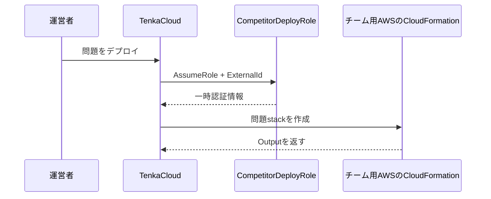
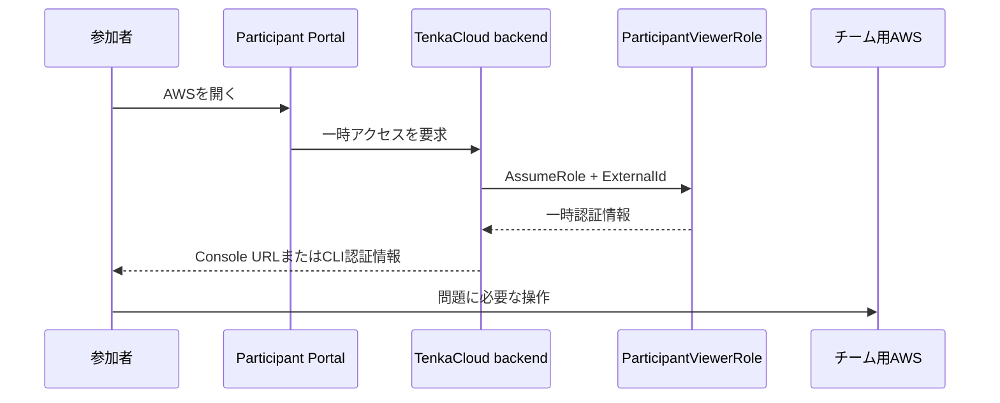
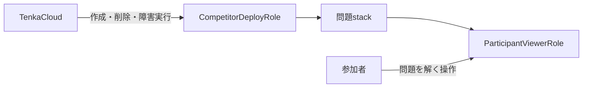

AWS問題を実装する前に、TenkaCloudと参加者がチーム用AWSアカウントへ入る仕組みを整理します。ここを理解すると、後の`template.yaml`に登場する`TenkaCloudAccountId`、`ExternalId`、`ParticipantViewerRole`の役割が分かります。

複数チームを別々のAWSアカウントへ分ける構成では、問題をデプロイする権限と、参加者が問題を解く権限を別のIAM Roleに分けます。

| IAM Role | 利用者 | 役割 |
| --- | --- | --- |
| `TenkaCloud-CompetitorDeploy-Role` | TenkaCloudのデプロイ処理 | 問題stackの作成、削除、Battleの障害実行 |
| `ParticipantViewerRole` | そのチームの参加者 | 問題を解くために必要なAWS操作 |

前者はチーム用AWSアカウントへ一度だけ準備します。後者は問題の`template.yaml`が、問題stackの一部として作ります。

TenkaCloud Liteと問題環境を同じAWSアカウントへ置く場合は、問題デプロイ処理が同じアカウント内で動くため、クロスアカウント用Roleを省略できます。本章では、複数チームを分離できるクロスアカウント構成を説明します。

## 問題をデプロイする経路

チーム用AWSアカウントには、`competitor-bootstrap.yaml`を使って`TenkaCloud-CompetitorDeploy-Role`を作ります。このRoleは、次の2つが一致した場合だけTenkaCloudからの`sts:AssumeRole`を許可します。

- TenkaCloudを動かしているAWSアカウントID
- イベントごとに設定する`ExternalId`

TenkaCloudへチームのアクセスキーを保存する必要はありません。Roleを引き受けたときに発行される、有効期限付きの一時認証情報を使います。

`ExternalId`は、TenkaCloudが別のチームからの依頼を取り違えてRoleを引き受けることを防ぐ追加条件です。AWSアカウントIDだけではなく、対象チームに対応する`ExternalId`も一致しなければアクセスできません。

デプロイ処理では、Application Admin Consoleからの要求を受けたAPIが、すぐにCloudFormationの完了を待つわけではありません。要求と状態を記録し、後続のworkerがRoleを引き受けてstackを作ります。複数チームへ配る処理を、画面の1回のHTTP要求から切り離すためです。

このクロスアカウント設計は、次の記事で実装コードとともに詳しく説明しています。

[参加者それぞれのAWSアカウントに問題環境を配るクロスアカウント設計](https://zenn.dev/bull/articles/tenkacloud-cross-account-deploy)

## 参加者が問題環境へ入る経路

問題stackは、`ParticipantViewerRole`を作ります。そのARNは、`ParticipantViewerRoleArn`というCloudFormation OutputでTenkaCloudへ返します。

参加者がParticipant PortalからAWSを開くと、TenkaCloudのbackendは、その問題に対応する`ParticipantViewerRole`を引き受けます。取得した一時認証情報から、AWS ConsoleのサインインURLまたはCLI用の一時認証情報を発行します。

`ParticipantViewerRole`の権限は、問題ごとに変わります。

`hello-world`では、自分のprefix配下にあるSSM Parameterの読み取りだけを許可します。`hello-world-battle`では、自分のEC2を確認し、AWS Systems Managerのセッション機能で接続できる権限を加えます。

参加者へ管理者権限を配るのではなく、問題で必要な操作だけをRoleへ記述します。

## 2つのRoleを混同しない

`TenkaCloud-CompetitorDeploy-Role`は、問題環境を作る運営側のRoleです。`ParticipantViewerRole`は、完成した問題環境を参加者が操作するRoleです。

次章から作る`template.yaml`には、問題固有のAWSリソースと`ParticipantViewerRole`を定義します。チーム用AWSアカウントに置く`CompetitorDeployRole`は、イベントを開催する章で準備します。
