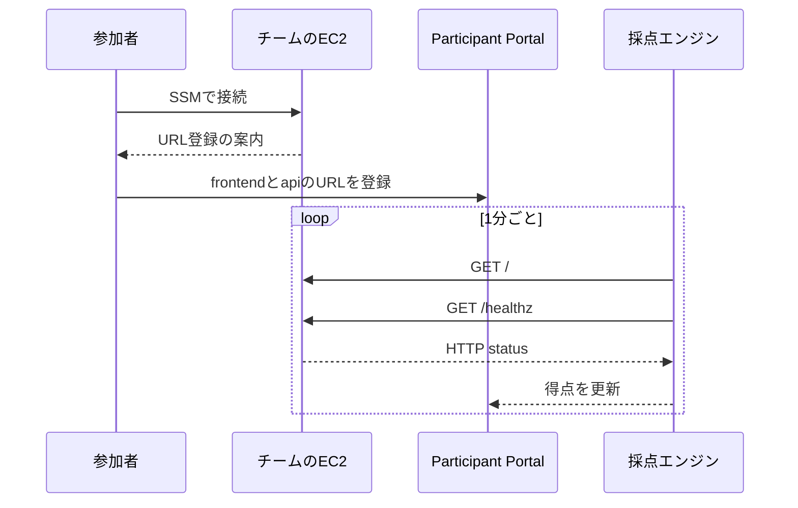
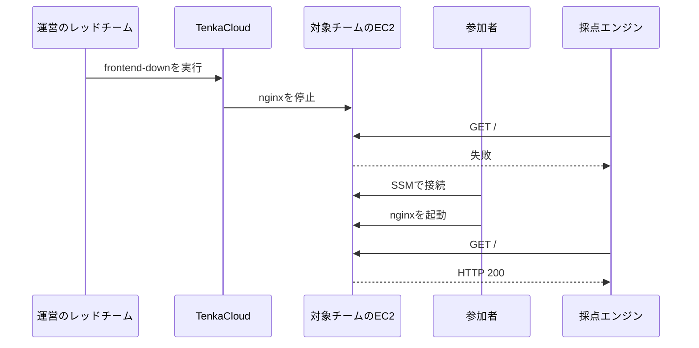

Challengeでは、参加者が値を提出すると1問が完了しました。Battleでは、参加者が動かしているシステムの状態を競技中に繰り返し採点します。

本書で作るBattleの狙いは、TenkaCloudのBattleを遊ぶために必要な操作を、最小の構成で一周することです。

- AWS Systems Managerのセッション機能でサーバーへ接続する
- 採点対象となるサービスURLをParticipant Portalへ登録する
- URL登録後に得点が動き始めることを確認する
- レッドチームが起こした障害を復旧する

この体験を実現するため、EC2を1台だけ用意し、その上で2つのサービスを動かします。

- port 80: nginxのfrontend
- port 8080: Pythonで作るAPI

## サーバーへ接続する

参加者が最初に行うのは、サーバーへの接続です。

問題stackは、EC2のinstance IDを使った接続コマンドをCloudFormation Outputへ返します。

```text
aws ssm start-session --target <InstanceId>
```

SSH portや秘密鍵は使いません。Participant PortalからAWSへ移動し、Outputに示されたコマンドを実行します。

接続後のシェルには、次に登録するURLを案内します。初めてBattleへ参加する人が「サーバーには入れたが、この後に何をすればよいか」で止まらないためです。

## サービスURLを登録する

TenkaCloudは、参加者が登録したURLへHTTP要求を送り、サービスが正常かどうかを判断します。この採点対象URLをendpointと呼びます。

Participant Portalには、問題が定義したendpointの入力欄があります。本書では、次の2つを登録します。

```text
frontend: http://<EC2の公開DNS名>
api:      http://<EC2の公開DNS名>:8080
```

TenkaCloudは1分ごとに、frontendの`/`とAPIの`/healthz`を確認します。



## 継続採点を決める

2つのURLを個別に確認する採点方式を`uptime-flat`と呼びます。

- frontendの`/`がHTTP 200なら100点を加える
- APIの`/healthz`がHTTP 200なら100点を加える
- 確認に失敗したURLは100点を引く
- 1分ごとに同じ確認を繰り返す

参加者は、どちらのサービスが正常で、どちらを復旧する必要があるのかを採点結果から判断できます。

## デプロイしただけでは得点させない

CloudFormationが正常なWebサービスとURLを作り、そのURLを採点へ自動で渡すと、参加者が何もしなくても得点します。それでは、URL登録というBattleの基本操作を学べません。

そこで、採点へ渡す`FrontendUrl`と`ApiUrl`の初期値は空にします。

```yaml
Outputs:
  FrontendUrl:
    Value: ""
  ApiUrl:
    Value: ""
```

EC2の公開DNS名は、採点URLとは別の`Ec2HostHint`で参加者へ示します。参加者がその値からURLを組み立て、Participant Portalへ登録した時点で採点が始まります。

これは意地悪のための空欄ではありません。参加者の操作と「得点が動き始めた」という結果を結び付けるためのゲームルールです。

## レッドチームが障害を起こす

TenkaCloudには、Battle中に運営者が対象チームを選び、問題へ定義済みの障害を実行するレッドチーム機能があります。

`hello-world-battle`では、他チームの参加者が攻撃するわけではありません。運営者がApplication Admin Consoleから`frontend-down`を実行すると、TenkaCloudが対象チームのEC2でnginxを停止します。

```text
systemctl stop nginx
```

frontendがHTTP 200を返さなくなるため、採点結果が変化します。参加者は再びEC2へ接続し、nginxを起動します。

```bash
sudo systemctl start nginx
```

参加者が復旧できない場合に備え、TenkaCloudは10分後にnginxを起動する処理も予約します。レッドチーム機能は、障害を起こす処理と、元へ戻す処理を対にして使います。



## Battleの完成条件

この入門Battleで確認したいのは、複雑な順位計算ではありません。次の一連の流れが動くことです。

1. 参加者がサーバーへ接続できる
2. 2つのURLを登録できる
3. 登録後に継続採点が始まる
4. レッドチームが対象チームへ障害を起こせる
5. 参加者が復旧し、正常な採点へ戻せる
6. 自動復旧によって障害が残り続けない

このゲームルールを、次章から`template.yaml`と`metadata.json`へ変換します。
