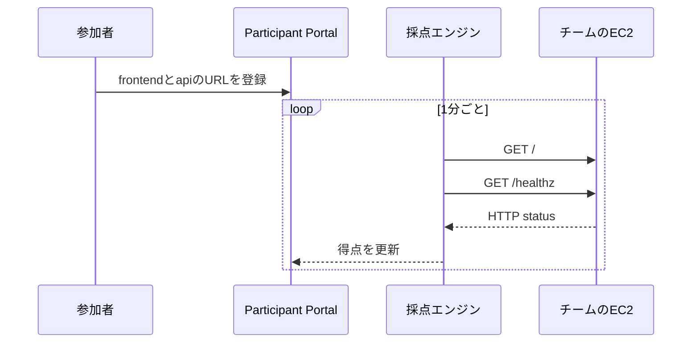

Challengeでは、参加者が値を提出した時点で問題が終わりました。Battleでは、システムの状態を繰り返し採点します。参加者は一度直して終わりではなく、正常な状態を維持します。

本書では、2問目として`hello-world-battle`を一から作ります。

## 参加者の体験

`hello-world-battle`では、1台のEC2上に次の2つのサービスを作ります。

- nginxのfrontend: port 80
- Python HTTP serverのAPI: port 8080

参加者は、CloudFormation Outputの`Ec2HostHint`からEC2の公開DNS名を確認します。その後、Participant Portalへ次のURLを登録します。

```text
frontend: http://<Ec2HostHint>
api:      http://<Ec2HostHint>:8080
```

TenkaCloudは1分ごとに`/`と`/healthz`を確認します。

運営がnginxを停止すると、frontendの確認が失敗します。参加者はAWS Systems Managerのセッション機能でEC2へ接続し、nginxを起動します。

```bash
sudo systemctl start nginx
```

## デプロイだけでは得点させない

CloudFormationで正常なWebサービスを作り、そのURLをそのまま採点へ渡すと、参加者が何もしなくても得点が増えます。

そこで、`FrontendUrl`と`ApiUrl`のOutputは空文字にします。

```yaml
Outputs:
  FrontendUrl:
    Value: ""
  ApiUrl:
    Value: ""
```

参加者がParticipant PortalへURLを登録した後に、初めて採点が始まります。



## 障害は運営が実行する

`hello-world-battle`で他チームの参加者がEC2を攻撃するわけではありません。TenkaCloudの運営者が、対象チームを選んで障害を実行します。

障害定義は、対象EC2で次のコマンドを実行します。

```bash
systemctl stop nginx
```

10分後には、TenkaCloudが次の復旧コマンドを実行します。

```bash
systemctl start nginx
```

自動復旧は、参加者が解けなかった場合に環境が停止したまま残ることを防ぐ安全網です。参加者が自分で復旧すれば、それより早く正常状態へ戻ります。

## Battleの勝利条件

この入門Battleでは、複雑な順位規則を作りません。

- 2つのendpointを登録する
- frontendとAPIを正常に保つ
- 障害が入ったら復旧する
- 正常だった時間を得点へ反映する

次章では、この体験を作る`template.yaml`を組み立てます。
