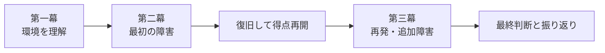

Battleは、Challengeへ制限時間と順位表を付けただけの形式ではありません。

Challengeでは、参加者が1つの問題を理解して完了することを重視します。Battleでは、複数チームが同じ時間軸で状態を維持し、再発へ対応します。運営側は、障害注入、全体アナウンス、公平性、観客への見せ方も設計します。

Battleを面白くするのは、障害の数ではありません。参加者が状況を理解し、対策を立てた直後に新しい判断を迫られる流れです。

## Battleは三幕で設計する

最初から大きな障害を入れると、参加者は環境を理解する前に混乱します。

そこで、競技を3つの段階へ分けます。

### 第一幕: 環境を理解する

参加者は、自分のAWSアカウントへ入り、対象リソースと採点対象を確認します。

Cloud Rescueでは、次を行います。

- Participant Portalへログインする
- frontendとAPIのURLを確認する
- endpointを登録する
- 正常時のprobeと得点を確認する
- SSMセッションマネージャーの接続経路を確認する

この段階では、参加者が競技の操作方法を学びます。競技外の摩擦をここで解消します。

### 第二幕: 最初の障害へ対応する

全チームが採点を開始した後、最初の障害を入れます。

Cloud Rescueでは、nginxを停止します。参加者はfrontendの失敗を観測し、APIが動いていることから原因範囲を狭めます。その後、SSMで接続し、service状態を確認して復旧します。

最初の障害は、学習目標の中心をそのまま体験できるものにします。

### 第三幕: 再発と判断の変化

一度復旧した後、別serviceの停止や再発を入れます。

参加者は、最初に作った調査手順を再利用できます。ここで、単なる正解コマンドの記憶から、運用手順の再現へ学びが変わります。

## 障害をランダムに増やさない

予測不能な障害は、Battleらしさを作ります。しかし、原因と学習目標に関係がない障害を増やすと、運の要素が強くなります。

良い障害注入には、次の条件があります。

- 参加者が症状を観測できる
- 環境内の証拠から原因を絞れる
- 参加者権限で復旧できる
- 他チームへ影響しない
- 実行結果を運営が確認できる
- 一定時間後に自動revertできる
- 複数回実行しても状態が壊れない

Battleは、運営が参加者を罠にかける場ではありません。運用判断を繰り返し練習する場です。

## 全チームへ同じ障害を入れるか

公平性には複数の考え方があります。

### 同じ時刻に一斉発火する

全チームが同じ条件で競えます。会場イベントでは分かりやすい方式です。

ただし、endpoint登録が遅れたチームは準備不足のまま障害を受けます。運営は、全チームが採点を開始したことを確認してから発火します。

### デプロイ後の経過時間で発火する

各チームが同じ準備時間を持てます。セルフペースに近いBattleで使いやすい方式です。

チームごとの競技時刻がずれるため、同じスコアボードで比較しにくくなります。

### 一定得点へ到達した後に発火する

基本操作を理解したチームから次の段階へ進めます。習熟度別の演習に向きます。

一方で、上位チームほど早く障害を受けるため、順位の意味が変わります。

Cloud Rescueの初回開催では、一斉発火を使います。全チームの採点開始を確認してから、同じ障害を同時に入れます。

## 逆転できる構造を残す

序盤の差だけで勝敗が決まると、後半の緊張が失われます。

逆転可能性を残す方法があります。

- 後半の正常状態へ高い点数を付ける
- 障害復旧ごとにbonusを設ける
- 前半は部分点、後半は全条件の得点へ変える
- 一定時間ごとに新しいフェーズへ移る
- 大きな負の点数を避ける
- 最終フェーズで全チームに同じ機会を与える

ただし、演出のためだけに点数を操作しません。後半ほど難しい判断を要求する場合に、得点も高くします。

## チーム内の役割を作る

Battleでは、複数人が同じ画面を見ているだけになりやすい問題があります。

参加者へ固定役職を強制する必要はありませんが、作業を分担できる構成にします。

Cloud Rescueでは、次の役割を自然に分けられます。

| 役割 | 主な行動 |
| --- | --- |
| Observer | Portalとendpointの状態を監視する |
| Investigator | AWS Console、systemd、logを調査する |
| Operator | 修正を実行し、復旧を確認する |
| Recorder | 仮説、実行内容、復旧時間を記録する |

小規模チームでは、一人が複数役を担当します。役割があると、復旧後の振り返りで判断の流れを再現しやすくなります。

## 観客へ何を見せるか

Battleは、参加者だけでなく観客も楽しめる形式です。

ただし、全ての情報を公開すると答えが漏れます。スコアボードには、次のような情報を表示できます。

- チームごとの現在得点
- 得点の推移
- 正常なendpoint数
- 現在のフェーズ
- 公開済みの障害情報
- 残り時間

次は公開しません。

- 原因となるservice名
- 未公開の障害予定
- flagやsecret
- participant credential
- 他チームの内部log

観客には状況を見せ、原因の調査は参加者へ残します。

## 運営が競技を止められるようにする

障害注入や採点が自動化されていても、運営は介入できる必要があります。

- 次の障害を延期する
- 一部チームへの発火を止める
- 全体hintを公開する
- 採点障害中に競技時計を止める
- 誤ったdisruptionをrevertする
- 危険な状態ならイベントを終了する

完全自動化を優先し、運営が状況を制御できない構成にしてはいけません。

## Cloud Rescueの90分構成

初回Battleの例です。

| 時刻 | 状況 | 参加者の主な行動 |
| --- | --- | --- |
| 0〜15分 | 環境確認 | ログイン、endpoint登録、SSM接続確認 |
| 15〜30分 | 正常運用 | scoreの仕組みと対象serviceを理解する |
| 30分 | nginx停止 | frontend障害を検知し、復旧する |
| 45分 | 全体hint判断 | 入口で止まるチームだけを支援する |
| 55分 | API停止 | 複数serviceを切り分けて復旧する |
| 70分 | 再発 | runbookを使い、より短時間で対応する |
| 85分 | 最終局面 | 全endpointを正常に保つ |
| 90分 | 終了 | score確定と振り返り |

最初の開催では、障害を二種類までに絞ります。運営と採点が安定してから、フェーズや攻撃検知を追加します。

## Battle設計の確認項目

実装前に確認します。

1. 参加者が競技開始前に環境を理解する時間があるか
2. 最初の障害は学習目標の中心になっているか
3. 後半に同じ判断を再利用する場面があるか
4. 全チームへ公平に障害を入れられるか
5. 序盤の差だけで勝敗が決まらないか
6. 障害には手動復旧と自動revertがあるか
7. 運営が障害の延期や停止を判断できるか
8. 観客へ見せる情報と隠す情報を分けたか
9. 採点障害時の扱いを決めたか
10. 競技終了後に全リソースを削除できるか

設計が固まったら、次章でTenkaCloudの継続採点を設定します。
