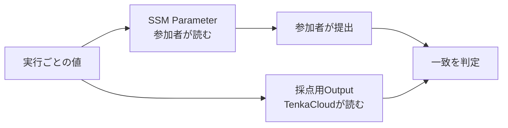

ローカルChallengeでは、問題文、環境、提出、採点の基本を一周しました。2問目では同じChallenge形式をAWSへ広げます。

本章で設計するのは`hello-world`です。まだCloudFormationは書きません。参加者に持ち帰ってほしい学び、ストーリー、勝利条件、安全境界を先に決めます。

## 参加者に持ち帰ってほしい学び

`hello-world`は、TenkaCloudからチーム専用のAWS環境へ移動し、指定されたAWSリソースを調べる最小問題です。

参加者に持ち帰ってほしいことは、次のように書けます。

> 自分のチーム用AWS環境へ一時的な権限で入り、名前の分かっているSSM ParameterをConsoleまたはCLIから読み、その値をParticipant Portalへ提出できる。

この問題で参加者が体験する順番は次のとおりです。

1. Participant Portalで問題を開く
2. 自分のチーム用AWS環境へ移動する
3. 指定されたSSM Parameterを調べる
4. 発見した値を提出する
5. 得点を確認する

VPC、EC2、データベースは作りません。中心となる操作を、SSM Parameterの読み取りに限定します。

## ストーリーを作る

問題文に「SSM Parameterを開いて値を提出してください」とだけ書くと、操作に理由がありません。そこで、参加者の役割と、Parameterを調べる理由を加えます。

- 役割: 入社初日のSRE
- 現在の状況: 前任者の引き継ぎメモだけが残っている
- 手がかり: SSMのhelloを見て
- 最初の行動: 自分のAWS環境へ移動し、Parameter Storeを開く

この設計から、次のストーリーができます。

> あなたは入社初日のSREです。前任者が残した引き継ぎには、「SSMのhelloを見て」とだけ書かれています。自分のチーム用AWS環境へ移動し、残されたメッセージを見つけてください。

参加者は、「なぜAWSへ移動するのか」「最初に何を調べるのか」を理解できます。Parameterの値は問題文へ書かないため、発見する体験も残ります。

## 勝利条件を決める

ストーリーの「残されたメッセージを見つけた」を、機械で判定できる条件へ変換します。

問題環境を作るたびに、異なるflagを生成します。同じ値をSSM Parameterと、参加者には見せない採点用Outputへ渡します。

参加者がSSM Parameterから取得したflagをParticipant Portalへ提出し、採点用Outputの値と一致すれば成功です。



ローカルChallengeでは、問題コンテナの`/verify`が正誤を判定しました。AWS Challengeでは、CloudFormation OutputをTenkaCloudが保持し、参加者の提出と比較します。

## 安全境界を決める

参加者は、自分のチーム用prefixに含まれるSSM Parameterだけを読めるようにします。

- TenkaCloudはチーム用AWSアカウントへ問題stackを作成できる
- 参加者は自分の問題に対応するIAM Roleだけを利用できる
- 参加者は自分のprefix配下にあるSSM Parameterだけを読める
- 採点用のCloudFormation Outputを参加者へ見せない
- 他チームのParameterを読めない
- 問題終了時はCloudFormation stackを削除する

参加者へAWS管理者権限を渡しません。問題を解くために必要な読み取り操作だけを許可します。

## 実装前の仕様

ここまでの判断を、実装前の仕様としてまとめます。

```text
hello-world

学習体験:
  チーム用AWSへ移動し、SSM Parameterを読み、flagを提出する

ストーリー:
  入社初日のSREが、前任者の残したメッセージを探す

勝利条件:
  SSM Parameterの値と提出値が一致する

安全境界:
  自分のprefix配下にあるSSM Parameterだけを読める
  採点用Outputと他チームの値は読めない
```

次章では、TenkaCloudがチーム用AWSアカウントへ問題をデプロイし、参加者がその環境へ入る仕組みを確認します。
