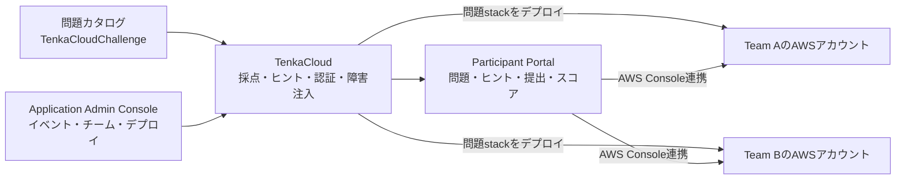
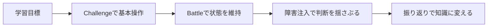

AWSの障害対応やセキュリティは、説明を読んだだけでは身につきません。実際の環境では、症状から原因を絞り込みます。その後、権限や設定を確認して復旧し、再発防止まで考える必要があります。

本書では、この一連の体験を**クラウド競技**として自作します。

ここでいうクラウド競技とは、参加者ごとに用意されたクラウド環境で問題を解き、回答やシステムの状態に応じて得点する実践型の演習です。競技形式にすることで、座学では見えにくい判断力、調査力、復旧力を観察できます。

本書では、学習目標と採点基準を決め、その設計をAWS上の問題として実装します。さらに、問題を複数チームへ配布し、競技として開催して、終了後の改善まで行います。目指すのは、特定のツールの操作を覚えることではありません。クラウド競技を一から作り、繰り返し開催できるようになることです。

実装と運営には、筆者が開発しているOSSのTenkaCloudを使います。初めて名前を聞く読者に向けて、まずTenkaCloudが競技のどの部分を担うのかを説明します。

## TenkaCloudとは

本書で使う[TenkaCloud](https://www.tenkacloud.com/?lang=ja)は、クラウド競技を開催するためのオープンソースプラットフォームです。ソースコードは[GitHub](https://github.com/susumutomita/TenkaCloud)でApache-2.0ライセンスの下に公開しています。利用者は、自分のAWS環境へデプロイして利用できます。

クラウド競技には、**問題定義**と**競技運営**という2つの層があります。

問題定義には、参加者へ用意するAWS環境、問題文、採点条件、ヒントなどを記述します。本書では、これらの定義を問題カタログの[TenkaCloudChallenge](https://github.com/susumutomita/TenkaCloudChallenge)で管理します。1つの問題定義があれば、1チーム分の演習環境と解答条件を再現できます。

一方、複数チームで同じ問題を競技として遊ぶには、問題定義だけでは足りません。イベントやチームを登録し、チームごとに環境を作成して、競技中の採点やヒント配布を管理する運営基盤が必要です。TenkaCloudは問題カタログを読み込み、次の処理をまとめて担います。

- イベントと開催時間を管理する
- 参加チームとAWSアカウントを対応付ける
- チームごとのAWSアカウントへ問題をデプロイする
- 参加者へ問題文とヒントを配る
- flagやサービス状態を採点する
- スコアを継続的に更新する
- 参加者を自分のAWS環境へ安全に案内する
- 運営側から障害を注入し、復旧状況を確認する
- 終了後に問題環境と運営基盤を削除する

TenkaCloudは、これらを1つの流れとして扱います。

運営者はApplication Admin Consoleからイベントを作成し、問題とチームを登録します。TenkaCloudは、クロスアカウントの`AssumeRole`と必須の`ExternalId`を使い、各チームの隔離されたAWSアカウントへ問題stackをデプロイします。

参加者はParticipant Portalから、問題文、ヒント、回答欄、endpoint登録、得点を確認します。必要な場合は、自分のチームの権限でAWS Consoleへ移動し、本物のAWSリソースを調査して修正します。

### TenkaCloudが解決したいこと

クラウド競技を一度だけ手作業で開くことはできます。チームごとにCloudFormationを実行し、スプレッドシートで得点を付け、チャットでヒントを配ればよいからです。

しかし、この方法では問題を増やすたびに運営手順も増えます。チーム数が増えると、誰の環境が作成済みか、どのURLを採点するか、どの障害をどのチームへ実行したかを追跡しにくくなります。また、次回開催時に同じ環境を再現することも難しくなります。

TenkaCloudでは、問題をプラットフォーム本体へ直接組み込まず、カタログ上のプラグインとして扱います。問題作者は、主に次のファイルを用意します。

- `metadata.json`: 問題文、学習目標、採点、ヒント、endpoint、障害注入を宣言する
- `template.yaml`: チームのAWSアカウントへ作る問題環境を定義する
- `README.md` / `README.ja.md`: ストーリー、解法、学習内容を説明する
- `portal/`や`services/`: 問題固有のUIや実装が必要な場合だけ追加する

プラットフォーム側は、この宣言を読み取ります。問題ごとの個別コードを増やさずにデプロイし、採点します。

### AWSアカウントなしでも最初の体験はできる

TenkaCloudには、用途の異なる2つの入口があります。

#### まず遊ぶ

AWSを使わないDocker形式の問題は、GitHub Codespacesまたはローカル環境で実行できます。Participant Portalを開き、問題を選び、回答して得点する基本体験を確認できます。

- [TenkaCloudのデモ](https://www.tenkacloud.com/portal-demo/?demo=1)
- [GitHub Codespacesで開く](https://codespaces.new/susumutomita/TenkaCloud)

#### 自分のイベントを開く

本物のAWSを使う問題では、TenkaCloudを自分のAWSアカウントへデプロイします。その後、各チームのAWSアカウントへ問題stackを作り、複数チームで競技を開催します。

本書の後半では、このイベント環境の構築、リハーサル、当日運営、完全削除まで扱います。

### TenkaCloudと問題カタログ

本書では、競技運営と問題定義を別のOSSで管理します。

- **[TenkaCloud](https://www.tenkacloud.com/?lang=ja)**は、イベント、チーム、デプロイ、採点、Participant Portal、障害注入を管理します。[ソースコードはGitHub](https://github.com/susumutomita/TenkaCloud)で公開しています。

- **[TenkaCloudChallenge](https://github.com/susumutomita/TenkaCloudChallenge)**は、公開問題のカタログです。1つの問題を1つのディレクトリで管理します。

問題を追加するとき、原則としてTenkaCloud本体は変更しません。問題カタログへ新しいディレクトリを追加し、その問題を読み込んだTenkaCloudをデプロイします。

#### AWSとの関係

本書およびTenkaCloudは独立したOSSプロジェクトであり、Amazon Web Services, Inc.との提携、承認、後援関係はありません。

AWSおよび関連する名称は、Amazon.com, Inc.またはその関連会社の商標です。

本書はAWS公式のGameDayを再現するものではなく、同種の実践型クラウド演習を自作する方法を扱います。

## ハンズオン、CTF、障害訓練との違い

似た形式を整理しておきます。

| 形式 | 主な目的 | 成功条件 | 時間の扱い |
| --- | --- | --- | --- |
| ハンズオン | 手順を学ぶ | 手順どおり完成する | 原則として競わない |
| CTF | 脆弱性や謎を解く | flagを取得する | 制限時間内に得点する |
| 障害訓練 | 復旧手順と連携を確認する | サービスを復旧する | 復旧時間を測る |
| クラウド競技 | 判断、調査、復旧、運用をまとめて体験する | flagまたは正常状態 | 継続得点や障害注入を含む |

形式の境界を厳密に分ける必要はありません。良質な競技では、CTFにある発見の楽しさ、障害訓練の現実性、ハンズオンの学びやすさを組み合わせます。

## TenkaCloudの二つの問題形式

TenkaCloudには、大きく分けて二種類の問題があります。

### Challenge

自分のペースで解く形式です。典型的には、AWS環境を調査して`TC{...}`形式のflagを見つけ、Participant Portalへ提出します。

Challengeは次の用途に向いています。

- 個人学習
- オンボーディング
- 研修の事前課題
- 1つの概念を確実に理解させる問題

### Battle

複数チームが同時に参加し、サービスの状態に応じて継続的に得点します。正常なendpointを維持すると加点され、障害を放置すると得点を失うような設計が可能です。

Battleは次の用途に向いています。

- GameDay風の社内イベント
- SRE、CCoE、セキュリティチームの合同演習
- 障害対応の速度と判断を含む評価
- 観客がスコアボードを見て楽しめるイベント

## 本書で作る競技

本書では、**Cloud Rescue — 障害中のWeb APIを復旧せよ**という題材を使います。

- Challenge: `challenges/cloud-rescue`
- Battle: `battles/cloud-rescue-battle`

Challengeでは、同じEC2上でAPIだけが正常、nginxだけが停止した状態から始めます。参加者は`SSM Session Manager`で接続し、systemdとjournalの証拠からfrontendを復旧します。復旧後にだけ`/recovery`がデプロイごとのflagを返します。

Battleでは、frontendとAPIを1分ごとに継続採点します。運営はnginxまたはAPIをチーム単位で停止でき、各障害には10分後の自動revertがあります。本文のコード断片より、これらの実ファイルを実行時の正本とします。

この進め方には利点があります。

1. 最初からschema検証を通る構成を使える
2. TenkaCloud本体の変更なしで問題だけを追加できる
3. 完成形を先に動かし、差分だけを理解できる
4. 架空のAPIや動かないコードを本文へ持ち込みにくい

## 読了時にできること

本書を最後まで進めると、次を一通り実行できるようになります。

- 学習目標から競技の仕様を作る
- 壊れたAWS環境をCloudFormationで再現する
- Challengeのflag採点を設定する
- Battleの継続採点と障害注入を設定する
- 段階的なヒントと解説を書く
- 自分の問題を読み込んだTenkaCloudをAWSへデプロイする
- 複数チームのイベントを開催する
- 終了後に課金リソースを削除する
- 問題をOSSまたは社内限定教材として再利用する

重要なのは、機能をたくさん盛ることではありません。**参加者にどの判断を体験させたいかを1つ決め、それを安全かつ繰り返し再現できること**です。

次章では、良い問題と悪い問題の違いから、競技設計の基準を作ります。
