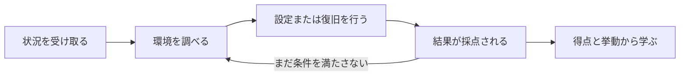
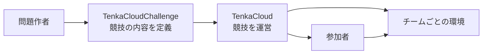

クラウド競技とは、参加者がクラウド運用を模した状況に入り、環境を実際に調査、設定、復旧し、その結果を得点として確かめる実践型の演習です。

たとえば、稼働中のWebサービスを引き継いだところから競技を始めます。参加者はサーバーへ接続し、監視対象のURLを登録します。競技中にサービスが停止したら、原因を調べて復旧します。サービスが正常なら得点し、停止中は得点できません。

一般的なハンズオンでは、正しい手順を最初から順番に実行します。クラウド競技で最初に渡すのは、手順ではなく状況とゴールです。参加者は、自分で状態を観測し、次の行動を決めます。

クラウド競技には、少なくとも次の4つが必要です。

- 参加者が置かれる状況と役割
- 参加者が操作できる環境
- 成功を外から判定できる条件
- 問題、ヒント、得点を参加者へ届ける運営基盤

本書では、この4つを設計し、実際に動く問題へ変換します。

## 本書で作る競技

最初の狙いは、TenkaCloudのゲームルールを最も小さな構成で体験できる競技を作ることです。AWSサービスを数多く使うことより、参加者が競技の基本動作を一周できることを優先します。

1問目では、参加者が自分のチーム用AWS環境へ移動します。AWS Systems Manager Parameter Storeから値を見つけ、参加者用画面のParticipant Portalへ提出します。これにより、問題の確認からAWS操作、答えの提出、得点の確認までを体験できます。

2問目では、参加者がAWS Systems Managerのセッション機能でサーバーへ接続します。次に、稼働中のfrontendとAPIのURLをParticipant Portalへ登録し、継続採点を開始します。運営のレッドチームがfrontendを停止したら、参加者はサーバー上でサービスを復旧します。

この設計から、次の2問を作ります。

- `hello-world`: SSM Parameterの値を発見して提出する
- `hello-world-battle`: サーバーへ接続し、2つのサービスURLを登録して正常状態を維持する

本書で設計した完成形は、公開問題カタログで実際に利用できます。

- [Hello World Challenge](https://github.com/susumutomita/TenkaCloudChallenge/tree/main/challenges/hello-world)
- [Hello World Battle](https://github.com/susumutomita/TenkaCloudChallenge/tree/main/battles/hello-world-battle)

完成済みファイルを読むことが本書の目的ではありません。参加者にどんな体験を届けたいかを決め、その体験をストーリー、AWS環境、採点、障害へ変換する過程を順にたどります。その結果として、上の2問と同じ構成が完成します。

## ChallengeとBattle

TenkaCloudの問題形式には、ChallengeとBattleがあります。

Challengeは、明確なゴールを自分のペースで達成する形式です。発見した値を提出する、設定を修正した結果を検証する、といった一度の到達を採点します。本書の`hello-world`では、SSM Parameterから発見した値を提出すると得点します。

Battleは、システムの状態を競技中に繰り返し採点する形式です。本書の`hello-world-battle`では、参加者が登録した2つのURLを1分ごとに確認します。運営はレッドチームとして障害を注入でき、参加者は停止したサービスを復旧します。

| 形式 | ゴール | 本書で体験すること |
| --- | --- | --- |
| Challenge | 一度の発見や修正を完了する | AWSへ移動し、値を発見して提出する |
| Battle | 正常な状態を継続して保つ | サーバー接続、URL登録、継続採点、障害復旧 |

ChallengeとBattleは、初めて読む人が覚えておくべき最初の2語です。採点方式などの細かな用語は、必要になる章で初めて説明します。

## TenkaCloudとは

[TenkaCloud](https://www.tenkacloud.com/?lang=ja)は、クラウド競技を開催するためのOSSです。イベントとチームの管理、問題の配布、Participant Portal、採点、ヒント、スコア表示、Battleの障害注入をまとめて扱います。ソースコードは[GitHub](https://github.com/susumutomita/TenkaCloud)で公開されています。

問題の中身は、[TenkaCloudChallenge](https://github.com/susumutomita/TenkaCloudChallenge)という別のOSSで管理します。問題ごとに、参加者へ見せる文章、環境、採点条件、ヒント、障害を1つのディレクトリへまとめます。

役割の違いは次のとおりです。

TenkaCloudChallengeが「何を体験する競技か」を定義し、TenkaCloudが「誰へ配り、どう採点し、どう進行するか」を担当します。

TenkaCloudの動かし方には、AWSへ基盤をデプロイするTenkaCloud Liteと、AWSを使わず手元のDockerで問題を動かすローカルモードがあります。本書では両者を混同しないよう、AWS問題を作った後に違いを整理し、ローカル問題も一から作ります。

## この後の流れ

まず、参加者に何を持ち帰ってもらうかを決めます。次に、最初の行動へつながるストーリーと、採点できる勝利条件を作ります。

設計が固まってから、ChallengeとBattleを実装します。実装中に初めて`template.yaml`や`metadata.json`を登場させ、各項目が先に決めた体験のどこを担うのかを説明します。

その後、TenkaCloudがチームのAWSアカウントへ安全にアクセスする仕組み、TenkaCloud Liteとローカルモードの違い、ローカル問題の作り方を扱います。最後に、作成した問題を複数チームへ配り、競技を開催して削除するところまで進みます。

本書とTenkaCloudは独立したOSSプロジェクトであり、Amazon Web Services, Inc.との提携、承認、後援関係はありません。AWSと関連する名称は、Amazon.com, Inc.またはその関連会社の商標です。本書はAWS公式のGameDayを再現するものではなく、同種の実践型クラウド演習を自作する方法を扱います。

次章では、参加者が時間を使って参加する価値のある競技とは何かを考えます。
