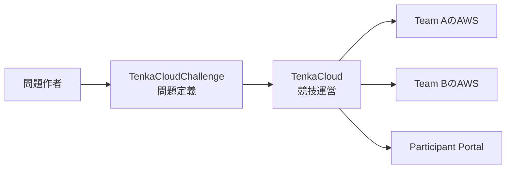

この本では、AWS上の課題を解き、結果に応じて得点するクラウド競技を作ります。完成させるのは、次の2問です。

- `hello-world`: SSM Parameter Storeから値を見つけて提出するChallenge
- `hello-world-battle`: 2つのWeb endpointを正常に保つBattle

どちらも説明のための架空コードではありません。[TenkaCloudChallenge](https://github.com/susumutomita/TenkaCloudChallenge)で公開され、現在のTenkaCloudが読み込める問題です。本書では完成済みのファイルを正本にして、同じものを一から組み立てます。

2問の作り方へ進む前に、TenkaCloudが競技の中で何を担当するのかを説明します。

## TenkaCloudとは

[TenkaCloud](https://www.tenkacloud.com/?lang=ja)は、AWSを使うクラウド競技を開催するためのOSSです。イベント、チーム、問題の配布、採点、ヒント、スコア表示、障害注入をまとめて管理します。ソースコードは[GitHub](https://github.com/susumutomita/TenkaCloud)で公開されています。

クラウド競技を作るには、問題そのものと、その問題を参加者へ届ける仕組みが必要です。

問題そのものには、次の内容が含まれます。

- 参加者のAWSアカウントへ作るリソース
- 参加者へ見せるストーリーと手順
- 正解や正常状態を判定する採点条件
- 行き詰まった参加者へ出すヒント
- Battleで運営が実行する障害

これらは[TenkaCloudChallenge](https://github.com/susumutomita/TenkaCloudChallenge)で管理します。1問につき1つのディレクトリを用意し、主に`template.yaml`と`metadata.json`へ記述します。

TenkaCloudは、その問題定義を使って競技を運営します。

- イベントとチームを登録する
- チームごとのAWSアカウントへ問題をデプロイする
- 参加者へ問題文、ヒント、AWSへの入口を表示する
- flagの提出やWeb endpointの状態を採点する
- Battle中の障害をチーム単位で実行する
- 得点をParticipant Portalへ表示する

問題定義が「何を解くか」を表し、TenkaCloudが「誰に配り、どう採点して競技を進めるか」を担当します。

問題を1問追加するたびにTenkaCloud本体を変更する必要はありません。TenkaCloudChallengeへ問題ディレクトリを追加すれば、TenkaCloudが共通の仕組みでデプロイし、採点します。

## ChallengeとBattle

TenkaCloudには、ChallengeとBattleという2つの形式があります。

Challengeは、参加者が自分のペースで解く形式です。本書の`hello-world`では、AWS上のSSM Parameterを読み、`TC{...}`形式の値をParticipant Portalへ提出します。正解した時点で得点します。

Battleは、複数チームが同時に参加し、環境の状態を継続的に採点する形式です。本書の`hello-world-battle`では、nginxのfrontendとPython APIを1分ごとに確認します。正常な時間が長いほど得点が増え、運営がnginxを停止すると、参加者はAWS Systems Managerのセッション機能から復旧します。

| 形式 | 本書で作る問題 | 参加者の行動 | 採点 |
| --- | --- | --- | --- |
| Challenge | `hello-world` | SSM Parameterの値を見つけて提出する | 正答時に加点 |
| Battle | `hello-world-battle` | Web endpointを登録し、正常に保つ | 1分ごとに状態を採点 |

## 本書の進め方

前半では、参加者に持ち帰ってほしい学び、ストーリー、勝利条件、安全境界を決めます。

次に、`challenges/hello-world`を一から作ります。`template.yaml`でSSM Parameterと参加者用IAM Roleを定義し、`metadata.json`で問題文、英語表示、flag採点、ヒントを定義します。

その後、`battles/hello-world-battle`を作ります。VPCとEC2、2つのendpoint、継続採点、nginxを停止する障害、自動復旧を順番に追加します。

最後にTenkaCloud LiteをAWSへデプロイし、2問を複数チームのイベントで動かします。

完成形は次の場所で確認できます。

- [Hello World Challenge](https://github.com/susumutomita/TenkaCloudChallenge/tree/main/challenges/hello-world)
- [Hello World Battle](https://github.com/susumutomita/TenkaCloudChallenge/tree/main/battles/hello-world-battle)

本書とTenkaCloudは独立したOSSプロジェクトであり、Amazon Web Services, Inc.との提携、承認、後援関係はありません。AWSと関連する名称は、Amazon.com, Inc.またはその関連会社の商標です。本書はAWS公式のGameDayを再現するものではなく、同種の実践型クラウド演習を自作する方法を扱います。

次章では、参加者にとって良い問題とは何かを考えます。
