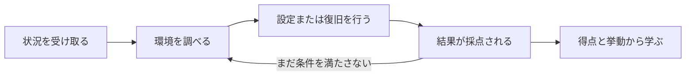
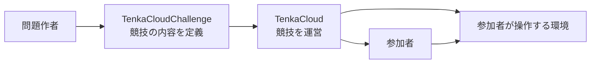
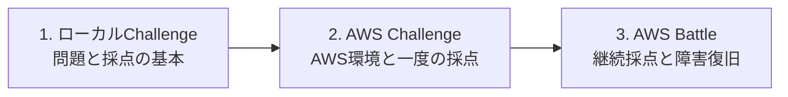

クラウド競技とは、参加者がクラウド運用を模した状況に入り、環境を実際に調査、設定、復旧し、その結果を得点として確かめる実践型の演習です。

たとえば、稼働中のWebサービスを引き継いだところから競技を始めます。参加者はサーバーへ接続し、監視対象のURLを登録します。競技中にサービスが停止したら、原因を調べて復旧します。サービスが正常なら得点し、停止中は得点できません。

一般的なハンズオンでは、正しい手順を最初から順番に実行します。クラウド競技で最初に渡すのは、手順ではなく状況とゴールです。参加者は、自分で状態を観測し、次の行動を決めます。

クラウド競技には、少なくとも次の4つが必要です。

- 参加者が置かれる状況と役割
- 参加者が操作できる環境
- 成功を外から判定できる条件
- 問題、ヒント、得点を参加者へ届ける運営基盤

本書では、この4つを設計し、実際に遊べる問題へ変換します。

## TenkaCloudとは

[TenkaCloud](https://www.tenkacloud.com/?lang=ja)は、クラウド競技を開催するためのOSSです。イベントとチームの管理、問題の配布、Participant Portal、採点、ヒント、スコア表示、Battleの障害注入をまとめて扱います。ソースコードは[GitHub](https://github.com/susumutomita/TenkaCloud)で公開されています。

参加者は、Participant Portalで問題文とヒントを読み、答えや採点対象URLを登録します。運営者は、Application Admin Consoleでイベント、チーム、問題の配布、Battle中の障害を管理します。

問題の中身は、[TenkaCloudChallenge](https://github.com/susumutomita/TenkaCloudChallenge)という別のOSSで管理します。問題ごとに、参加者へ見せる文章、操作する環境、採点条件、ヒント、障害を1つのディレクトリへまとめます。

役割の違いは次のとおりです。

TenkaCloudChallengeが「何を体験する競技か」を定義し、TenkaCloudが「誰へ配り、どう採点し、どう進行するか」を担当します。

## ChallengeとBattle

TenkaCloudの問題形式には、ChallengeとBattleがあります。

Challengeは、明確なゴールを自分のペースで達成する形式です。発見した値を提出する、設定を修正した結果を検証する、といった一度の到達を採点します。

Battleは、システムの状態を競技中に繰り返し採点する形式です。参加者が登録したサービスURLを定期的に確認し、運営が障害を起こした後も正常な状態へ戻せるかを採点できます。

| 形式 | 採点するもの | 難しさが増える理由 |
| --- | --- | --- |
| Challenge | 一度の発見や修正 | ゴールへ到達すれば完了する |
| Battle | 時間とともに変わるシステムの状態 | URL登録、継続採点、障害、復旧を設計する |

ChallengeとBattleは採点方法の違いです。問題環境をAWSと手元のDockerのどちらで動かすかは、別に選べます。

## 本書では簡単な問題から順番に作る

複数の問題を同時に設計すると、ストーリー、環境、採点のどこを考えているのか分かりにくくなります。本書では、1問を完成させてから次の問題へ進みます。

最初に、Dockerで動くローカルChallengeを作ります。`sqli-demo`という小さなWeb問題を題材に、問題文、Docker環境、採点API、Participant Portalへの提出を一周します。一人で繰り返し取り組むドリルとして使い、AWSアカウントを準備せずに問題を構成する基本要素へ集中します。

次に、AWS Challengeの`hello-world`を作ります。参加者は自分のチーム用AWS環境へ移動し、AWS Systems Manager Parameter Storeから値を見つけ、Participant Portalへ提出します。ここで、CloudFormation、参加者用IAM Role、AWS環境への一時アクセスを追加します。

最後に、AWS Battleの`hello-world-battle`を作ります。参加者はAWS Systems Managerのセッション機能でサーバーへ接続し、frontendとAPIのURLをParticipant Portalへ登録します。登録後は継続採点が始まり、運営のレッドチームがfrontendを停止したら、参加者がサービスを復旧します。

Battleを最後にするのは、3問の中で最も多くの設計が必要だからです。Battleでは、参加者の最初の行動だけでなく、採点周期、登録するURL、障害を起こす時刻、復旧方法、自動で元へ戻す処理まで決めます。

本書で作る完成形は、公開問題カタログで実際に利用できます。

- [sqli-demo](https://github.com/susumutomita/TenkaCloudChallenge/tree/main/challenges/sqli-demo)
- [Hello World Challenge](https://github.com/susumutomita/TenkaCloudChallenge/tree/main/challenges/hello-world)
- [Hello World Battle](https://github.com/susumutomita/TenkaCloudChallenge/tree/main/battles/hello-world-battle)

完成済みファイルを読むことが本書の目的ではありません。参加者にどんな体験を届けたいかを決め、その体験をストーリー、環境、採点へ変換する過程を、簡単な問題から順番にたどります。

## この後の流れ

次章では、ローカルモードとTenkaCloud Liteの違いを整理します。その後は、ローカルChallenge、AWS Challenge、AWS Battleを順番に設計して実装します。

3問が完成してから、TenkaCloud LiteをAWSへデプロイし、AWS ChallengeとBattleを複数チームへ配ります。最後に、開催、障害注入、復旧、削除までを通します。

本書とTenkaCloudは独立したOSSプロジェクトであり、Amazon Web Services, Inc.との提携、承認、後援関係はありません。AWSと関連する名称は、Amazon.com, Inc.またはその関連会社の商標です。本書はAWS公式のGameDayを再現するものではなく、同種の実践型クラウド演習を自作する方法を扱います。

次章では、最初に作るローカル問題が、AWS問題とどのように違うのかを確認します。
