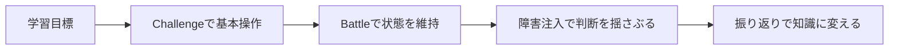

AWSの障害対応やセキュリティは、説明を読んだだけでは身につきません。実際の環境では、症状から原因を絞り込みます。その後、権限や設定を確認して復旧し、再発防止まで考える必要があります。

本書では、この一連の体験を**クラウド競技**として自作します。

ここでいうクラウド競技とは、参加者ごとに用意されたAWS環境で問題を解き、状態や回答に応じて得点する実践型の演習です。競技形式にすることで、座学では見えにくい判断力、調査力、復旧力を観察できます。

本書ではOSSの[TenkaCloud](https://github.com/susumutomita/TenkaCloud)と、問題カタログの[TenkaCloudChallenge](https://github.com/susumutomita/TenkaCloudChallenge)を使います。

> 本書およびTenkaCloudは独立したOSSプロジェクトです。Amazon Web Services, Inc.との提携、承認、後援関係はありません。AWSおよび関連する名称はAmazon.com, Inc.またはその関連会社の商標です。本書はAWS公式のGameDayを再現するものではなく、同種の実践型クラウド演習を自作する方法を扱います。

## ハンズオン、CTF、障害訓練との違い

似た形式を整理しておきます。

| 形式 | 主な目的 | 成功条件 | 時間の扱い |
| --- | --- | --- | --- |
| ハンズオン | 手順を学ぶ | 手順どおり完成する | 原則として競わない |
| CTF | 脆弱性や謎を解く | flagを取得する | 制限時間内に得点する |
| 障害訓練 | 復旧手順と連携を確認する | サービスを復旧する | 復旧時間を測る |
| クラウド競技 | 判断、調査、復旧、運用をまとめて体験する | flagまたは正常状態 | 継続得点や障害注入を含む |

境界は厳密ではありません。良質な競技では、CTFにある発見の楽しさ、障害訓練の現実性、ハンズオンの学びやすさを組み合わせます。

## TenkaCloudの2つの遊び方

TenkaCloudには大きく分けて2種類の問題があります。

### Challenge

自分のペースで解く形式です。典型的には、AWS環境を調査して`TC{...}`形式のflagを見つけ、Participant Portalへ提出します。

Challengeは次の用途に向いています。

- 個人学習
- オンボーディング
- 研修の事前課題
- 1つの概念を確実に理解させる問題

### Battle

複数チームが同時に参加し、サービスの状態に応じて継続的に得点します。正常なエンドポイントを維持すると加点され、障害を放置すると得点を失うような設計が可能です。

Battleは次の用途に向いています。

- GameDay風の社内イベント
- SRE、CCoE、セキュリティチームの合同演習
- 障害対応の速度と判断を含む評価
- 観客がスコアボードを見て楽しめるイベント

## 本書で作る競技

本書では、**Cloud Rescue — 障害中のWeb APIを復旧せよ**という題材を使います。

ただし、ゼロから巨大なテンプレートを書くのではありません。TenkaCloudChallengeに含まれる、動作する最小サンプルを複製して育てます。

- Challengeの基準: `challenges/hello-world`
- Battleの基準: `battles/hello-world-battle`

Battle側は、EC2上のnginxと小さなPython APIを監視する既存サンプルです。参加者は`SSM Session Manager`で接続し、停止したサービスを復旧します。本書ではこの構成をCloud Rescueとして読み替え、学習目標、物語、採点、ヒント、障害注入を順に設計します。

この進め方には利点があります。

1. 最初からschema検証を通る構成を使える
2. TenkaCloud本体の変更なしで問題だけを追加できる
3. 完成形を先に動かし、差分だけを理解できる
4. 架空のAPIや動かないコードを本文へ持ち込みにくい

## 3つのリポジトリ

作業中に混乱しやすいため、役割を分けます。

| リポジトリ | 役割 |
| --- | --- |
| `susumutomita/TenkaCloud` | イベント、チーム、デプロイ、採点、ポータルを提供するプラットフォーム |
| `susumutomita/TenkaCloudChallenge` | 公開問題のカタログ。1問題を1ディレクトリで管理する |
| `susumutomita/zenn-article` | 本書の原稿 |

問題を追加するとき、原則としてTenkaCloud本体は変更しません。カタログ表示とCloudFormationだけで成立する問題は、`metadata.json`と`template.yaml`で構成します。問題固有のUIまたは実装が必要な場合に限り、`portal/`や`services/`を追加します。

## 読了時にできること

本書を最後まで進めると、次を一通り実行できるようになります。

- 学習目標から競技の仕様を作る
- 壊れたAWS環境をCloudFormationで再現する
- Challengeのflag採点を設定する
- Battleの継続採点と障害注入を設定する
- 段階的なヒントと解説を書く
- 自分の問題を読み込んだTenkaCloudをAWSへデプロイする
- 複数チームのイベントを開催する
- 終了後に課金リソースを削除する
- 問題をOSSまたは社内限定教材として再利用する

重要なのは、機能をたくさん盛ることではありません。**参加者にどの判断を体験させたいかを一つ決め、それを安全かつ繰り返し再現できること**です。

次章では、最初にコードを書くのではなく、学習目標から問題を逆算します。
