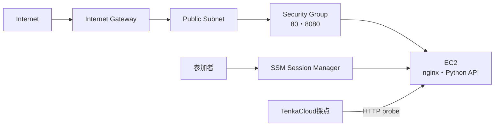

`hello-world-battle/template.yaml`は、Challengeより多くのリソースを作ります。完成形は[template.yaml](https://github.com/susumutomita/TenkaCloudChallenge/blob/main/battles/hello-world-battle/template.yaml)で確認できます。

## 作成するリソース



CloudFormationでは、次の順に定義します。

1. Parameter
2. VPCとInternet Gateway
3. public subnetとroute table
4. Security Group
5. EC2用IAM RoleとInstance Profile
6. 参加者用`ParticipantViewerRole`
7. EC2とUserData
8. Output

## Parameter

TenkaCloudとの接続に使う3項目は、Challengeと同じです。

```yaml
Parameters:
  NamePrefix:
    Type: String
    MinLength: 5
    MaxLength: 80
    AllowedPattern: "^tc-[a-z0-9]+(-[a-z0-9]+)+$"

  TenkaCloudAccountId:
    Type: String
    AllowedPattern: "^[0-9]{12}$"

  ExternalId:
    Type: String
    NoEcho: true
    MinLength: 16
```

Battle固有の設定として、公開CIDR、EC2のinstance type、AMIを受け取ります。

```yaml
  AllowedCidr:
    Type: String
    Default: 0.0.0.0/0

  InstanceType:
    Type: String
    Default: t3.micro
    AllowedValues:
      - t3.micro
      - t3.small

  AmiId:
    Type: AWS::SSM::Parameter::Value<AWS::EC2::Image::Id>
    Default: /aws/service/ami-amazon-linux-latest/al2023-ami-kernel-6.1-x86_64
```

公開イベントでは`AllowedCidr`の値を検討します。入門用の完成形は`0.0.0.0/0`をデフォルト値にしていますが、社内開催では参加者の出口IPへ絞る方が安全です。

## Network

VPCは`10.99.0.0/16`、public subnetは`10.99.1.0/24`とします。Internet Gateway、route table、`0.0.0.0/0`へのrouteを追加します。

EC2関連の各リソースへ、次のタグを付けます。

```yaml
Tags:
  - Key: Name
    Value: !Sub "${NamePrefix}-vpc"
  - Key: TenkaCloud:NamePrefix
    Value: !Ref NamePrefix
```

`TenkaCloud:NamePrefix`は、参加者が自分のリソースだけを確認するための境界です。VPC、subnet、Internet Gateway、route table、Security Group、EC2のすべてへ付けます。

Security Groupは、frontendとAPIだけを公開します。

```yaml
SecurityGroupIngress:
  - IpProtocol: tcp
    FromPort: 80
    ToPort: 80
    CidrIp: !Ref AllowedCidr
  - IpProtocol: tcp
    FromPort: 8080
    ToPort: 8080
    CidrIp: !Ref AllowedCidr
```

SSHの22番portは開けません。参加者はAWS Systems Managerのセッション機能で接続します。

## EC2からSSMへ接続する権限

EC2には`AmazonSSMManagedInstanceCore`を付けたInstance Roleを設定します。

```yaml
InstanceRole:
  Type: AWS::IAM::Role
  Properties:
    AssumeRolePolicyDocument:
      Version: "2012-10-17"
      Statement:
        - Effect: Allow
          Principal:
            Service: ec2.amazonaws.com
          Action: sts:AssumeRole
    ManagedPolicyArns:
      - arn:aws:iam::aws:policy/AmazonSSMManagedInstanceCore
```

参加者用`ParticipantViewerRole`には、Challengeと同じサインインとCloudShellの基準を残します。さらに、自分のEC2へ`ssm:StartSession`できる権限を追加します。

```yaml
- Sid: StartSessionToOwnInstance
  Effect: Allow
  Action:
    - ssm:StartSession
  Resource:
    - !Sub "arn:aws:ec2:${AWS::Region}:${AWS::AccountId}:instance/${Ec2}"
    - !Sub "arn:aws:ssm:${AWS::Region}:${AWS::AccountId}:document/SSM-SessionManagerRunShell"
    - !Sub "arn:aws:ssm:${AWS::Region}::document/SSM-SessionManagerRunShell"
```

完成形には、Consoleで自分のEC2を表示する権限と、セッションを終了・再開する権限も含まれます。権限の全文は完成形の`ParticipantViewerRole`を正本にしてください。

## UserDataで2つのサービスを起動する

EC2のUserDataでnginxとPythonを導入します。

```bash
dnf update -y
dnf install -y nginx python3
systemctl enable --now nginx
```

APIは`/healthz`へHTTP 200を返します。

```python
from http.server import HTTPServer, BaseHTTPRequestHandler
import json

class H(BaseHTTPRequestHandler):
    def do_GET(self):
        if self.path == "/healthz":
            self.send_response(200)
            self.send_header("Content-type", "application/json")
            self.end_headers()
            self.wfile.write(json.dumps({"ok": True}).encode())
            return
        self.send_response(404)
        self.end_headers()

HTTPServer(("0.0.0.0", 8080), H).serve_forever()
```

このPythonファイルを`tenkacloud-api.service`としてsystemdへ登録し、自動起動します。完成形では`Restart=always`も設定し、プロセスが異常終了した場合に再起動します。

## Output

採点用URLは空文字にします。

```yaml
Outputs:
  FrontendUrl:
    Value: ""

  ApiUrl:
    Value: ""

  Ec2HostHint:
    Value: !GetAtt Ec2.PublicDnsName

  InstanceId:
    Value: !Ref Ec2

  SsmStartSessionCommand:
    Value: !Sub "aws ssm start-session --target ${Ec2}"

  NamePrefix:
    Value: !Ref NamePrefix

  ParticipantViewerRoleArn:
    Value: !GetAtt ParticipantViewerRole.Arn
```

`FrontendUrl`と`ApiUrl`が空なので、参加者がURLを登録するまで採点されません。

`Ec2HostHint`は、登録するURLのhost名を参加者へ渡します。

`InstanceId`は障害注入の対象です。`SsmStartSessionCommand`は参加者がEC2へ入るために使います。

次章では、これらのOutputを`metadata.json`のendpoint、採点、障害へ接続します。
