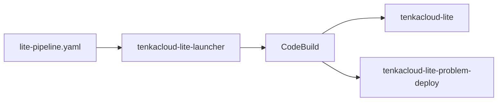

ここからは、作成したAWS問題を参加者へ届ける運営側の作業です。`hello-world`と`hello-world-battle`をチームへ配り、採点するため、TenkaCloud LiteをAWSへデプロイします。

## TenkaCloud Liteとは

TenkaCloud Liteは、1人の運営者が自分のAWSアカウントへ構築する、単一テナント版のTenkaCloudです。1つのイベントを開催し、終了後に環境を撤去する使い方を基本とします。

TenkaCloudには、複数の利用組織を管理する常設SaaS向けの構成もあります。SaaS構成では、利用組織を追加する管理基盤、テナントを作成する処理、複数テナントへ更新を配るパイプラインが必要です。

TenkaCloud Liteは、これらのマルチテナント管理を持ちません。固定された1つのテナントで、次の機能を自己完結させます。

- 運営者が使うApplication Admin Console
- 参加者が使うParticipant Portal
- イベントとチームの管理
- 問題のデプロイ
- ChallengeとBattleの採点
- レッドチームによる障害注入

「Lite」は、競技機能を模擬したローカル版という意味ではありません。実際のAWSリソースを使い、チーム用AWSアカウントにも問題をデプロイできます。

軽くしているのは、競技ではなく運営基盤です。1人の運営者が1つのテナントを使う前提にすることで、SaaS向けの管理基盤とテナント作成パイプラインを省いています。

| 構成 | 主な利用者 | テナント | 運用 |
| --- | --- | --- | --- |
| TenkaCloud Lite | 自分でイベントを開く運営者 | 固定された1つ | イベントごとにデプロイして撤去する |
| SaaS構成 | 複数組織へサービスを提供する運営者 | 複数 | 常設し、利用組織を追加して管理する |

TenkaCloud Liteは、Application Admin ConsoleとParticipant Portalを含む2つの本体stackで構成します。SaaS向けのControl PlaneやCodePipelineは作りません。この設計判断は、[Lite modeのADR](https://github.com/susumutomita/TenkaCloud/blob/main/docs/architecture/adr-016-lite-mode-single-tenant.html)で確認できます。

## デプロイ前に費用と終了方法を確認する

TenkaCloud LiteはOSSですが、実行場所は実際のAWSです。ソフトウェアの利用料とは別に、AWSリソースの利用料が発生します。

競技を開くときは、次の3つを分けて考えます。

| 費用の対象 | 何を動かすか | 費用が増える要因 |
| --- | --- | --- |
| TenkaCloud Lite | 管理画面、参加者画面、認証、採点、データ保存 | 運用期間、アクセス数、保存するデータとlog |
| 問題環境 | 各チームへ配るCloudFormation stack | チーム数、問題数、EC2などの利用時間 |
| デプロイ処理 | launcherが起動するCodeBuild | デプロイと削除の実行時間 |

具体的な金額は、リージョン、問題で使うAWSサービス、チーム数、開催時間によって変わります。開催中はAWS Billingで利用額を確認し、使わない期間は環境を残さない運用にします。

終了時は、次の順番で削除します。

1. 各チームへデプロイした問題stackを削除する
2. CodeBuildで`ACTION=destroy-all`を実行し、TenkaCloud Lite本体と保持データを削除する
3. 削除が完了したことを確認してからlauncher stackを削除する
4. CloudFormation、EC2、DynamoDB、logを確認し、残存リソースがないことを確かめる

launcherは、TenkaCloud Liteを削除する入口です。`destroy-all`が成功する前にlauncherを削除すると、削除をやり直す手順が増えます。

画面に沿って片付ける手順は、ランディングページの[TenkaCloud Liteを片付ける](https://www.tenkacloud.com/portal-demo/?demo=1&goto=%2Fproblems%2F01HZX0M0CLEANUPTENKA0001)で確認できます。本書でも、競技終了後の章で削除と残存確認を実施します。

## LPのデプロイ問題から始める

TenkaCloudのランディングページには、AWS上へTenkaCloud Liteをデプロイする手順を問題形式で用意しています。

[deploy-tenkacloud-liteを開く](https://www.tenkacloud.com/portal-demo/?demo=1&goto=%2Fproblems%2F01HZX0KZZ3DR0PW9M4Q7XV2C5D)

この問題は、自分のAWSアカウントへTenkaCloud Liteを作るための案内です。前章で作ったDocker問題を動かすローカルモードとは別の入口です。

問題は、次の4段階で構成されています。

1. デプロイ用のCloudFormation launcherを作る
2. CodeBuildからTenkaCloud Liteをデプロイする
3. 競技者用AWSアカウントを接続する
4. 最初のイベントを作る

本章では、作成されるものと操作の意味を説明します。画面上の最新手順と入力値は、LPから開くデプロイ問題を確認してください。

## launcherとTenkaCloud Liteを分けて考える

最初に作る`tenkacloud-lite-launcher` stackは、TenkaCloud本体ではありません。TenkaCloudのソースと問題カタログを取得し、デプロイを実行するCodeBuild projectを作ります。

launcher stackの`StartBuildConsoleUrl`からCodeBuildを開き、`Start build`を実行すると、TenkaCloud Liteの2 stackが作られます。

この手動操作によって、課金の発生するデプロイを明示的に開始します。launcherの作成だけでTenkaCloud本体が起動することはありません。

## 独自の問題カタログを指定する

公式のTenkaCloudChallengeを使う場合、デフォルト値のままで構いません。

自分のforkや独自branchにある問題を使う場合は、launcherの`ProblemsRepoUrl`と`ProblemsRepoRef`を設定します。

| Parameter | 内容 |
| --- | --- |
| `ProblemsRepoUrl` | 問題カタログのGit URL |
| `ProblemsRepoRef` | branch、tag、またはcommit SHA |

リハーサル中はbranchを指定できます。本番イベントでは、確認済みのtagまたはcommit SHAへ固定します。開催中に参照先が変わると、チームごとに異なる問題内容を取得する可能性があります。

本書で作った2問は公式カタログに存在するため、独自URLを設定しなくても利用できます。

## デプロイ完了を確認する

CodeBuildの最後に、Application Admin ConsoleとParticipant PortalのURLが表示されます。同じURLは、次のCloudFormation stackのOutputでも確認できます。

- `tenkacloud-lite`
- `tenkacloud-lite-problem-deploy`

`TenantAdminEmail`へ届いた案内を使い、Application Admin Consoleへサインインします。

次章では、チームのAWSアカウントを接続し、2問をイベントへ登録します。
