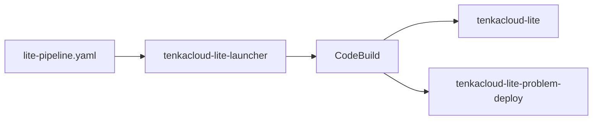

ここからは、作成したAWS問題を参加者へ届ける運営側の作業です。`hello-world`と`hello-world-battle`をチームへ配り、採点するため、TenkaCloud LiteをAWSへデプロイします。

TenkaCloud Liteは、1人の主催者が1つのイベントを運営するための構成です。Application Admin Console、Participant Portal、問題デプロイ用のbackendをAWSへ作ります。

## LPのデプロイ問題から始める

TenkaCloudのランディングページには、AWS上へTenkaCloud Liteをデプロイする手順を問題形式で用意しています。

[deploy-tenkacloud-liteを開く](https://www.tenkacloud.com/portal-demo/?demo=1&goto=%2Fproblems%2F01HZX0KZZ3DR0PW9M4Q7XV2C5D)

この問題は、自分のAWSアカウントへTenkaCloud Liteを作るための案内です。前章で作ったDocker問題を動かすローカルモードとは別の入口です。

問題は、次の4段階で構成されています。

1. デプロイ用のCloudFormation launcherを作る
2. CodeBuildからTenkaCloud Liteをデプロイする
3. 競技者用AWSアカウントを接続する
4. 最初のイベントを作る

本章では、作成されるものと操作の意味を説明します。画面上の最新手順と入力値は、LPから開くデプロイ問題を確認してください。

## launcherとTenkaCloud Liteを分けて考える

最初に作る`tenkacloud-lite-launcher` stackは、TenkaCloud本体ではありません。TenkaCloudのソースと問題カタログを取得し、デプロイを実行するCodeBuild projectを作ります。

launcher stackの`StartBuildConsoleUrl`からCodeBuildを開き、`Start build`を実行すると、TenkaCloud Liteの2 stackが作られます。

この手動操作によって、課金の発生するデプロイを明示的に開始します。launcherの作成だけでTenkaCloud本体が起動することはありません。

## 独自の問題カタログを指定する

公式のTenkaCloudChallengeを使う場合、デフォルト値のままで構いません。

自分のforkや独自branchにある問題を使う場合は、launcherの`ProblemsRepoUrl`と`ProblemsRepoRef`を設定します。

| Parameter | 内容 |
| --- | --- |
| `ProblemsRepoUrl` | 問題カタログのGit URL |
| `ProblemsRepoRef` | branch、tag、またはcommit SHA |

リハーサル中はbranchを指定できます。本番イベントでは、確認済みのtagまたはcommit SHAへ固定します。開催中に参照先が変わると、チームごとに異なる問題内容を取得する可能性があります。

本書で作った2問は公式カタログに存在するため、独自URLを設定しなくても利用できます。

## デプロイ完了を確認する

CodeBuildの最後に、Application Admin ConsoleとParticipant PortalのURLが表示されます。同じURLは、次のCloudFormation stackのOutputでも確認できます。

- `tenkacloud-lite`
- `tenkacloud-lite-problem-deploy`

`TenantAdminEmail`へ届いた案内を使い、Application Admin Consoleへサインインします。

次章では、チームのAWSアカウントを接続し、2問をイベントへ登録します。
