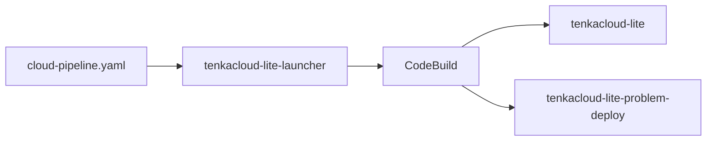

ここからは、作成したAWS問題を参加者へ届ける運営側の作業です。`hello-world`と`hello-world-battle`をチームへ配り、採点するため、TenkaCloudをAWSへデプロイします。

## Cloud 開催とは

TenkaCloudの開催方式はLocalとCloudです。Localは単一のBunプロセスと永続SQLiteで大会を開催します。Cloudは自分のAWSアカウントでLambda・Cognitoを使い、保存先をTursoまたはDynamoDBから選びます。開催者と参加者の画面、チーム、採点、問題配置を提供します。

AWSサービスを扱う問題はCloud、Docker/Compose問題はLocalで動かします。組み込みのCryptography Battleは両方で利用できます。現在のCloud構成はSBTを使いません。新規stackは`tenkacloud-cloud`系で、既存環境は配置済みの`tenkacloud-lite`系stackを使い続けます。名前を変えて別のstackを作らないでください。

環境ファイルで`CDK_PARAM_CONTROL_DATA_BACKEND=turso`または`dynamodb`を指定します。TursoはDB URLと既存のSSM token parameterが必要です。公開cloud-v1のデータは自動移行されません。両DBとも99チーム、SQL coordinationは4 MiB上限です。9個の大型templateは現行のTemplateBody上限を超え、全AWS問題の配置を保証していません。

## デプロイ前に費用と終了方法を確認する

TenkaCloudはOSSですが、実行場所は実際のAWSです。ソフトウェアの利用料とは別に、AWSリソースの利用料が発生します。

競技を開くときは、次の3つを分けて考えます。

| 費用の対象 | 何を動かすか | 費用が増える要因 |
| --- | --- | --- |
| TenkaCloud | 管理画面、参加者画面、認証、採点、データ保存 | 運用期間、アクセス数、保存するデータとlog |
| 問題環境 | 各チームへ配るCloudFormation stack | チーム数、問題数、EC2などの利用時間 |
| デプロイ処理 | launcherが起動するCodeBuild | デプロイと削除の実行時間 |

具体的な金額は、リージョン、問題で使うAWSサービス、チーム数、開催時間によって変わります。開催中はAWS Billingで利用額を確認し、使わない期間は環境を残さない運用にします。

終了時は、次の順番で削除します。

1. 各チームへデプロイした問題stackを削除する
2. CodeBuildで`ACTION=destroy-all`を実行し、TenkaCloud本体と保持データを削除する
3. 削除が完了したことを確認してからlauncher stackを削除する
4. CloudFormation、EC2、DynamoDB、logを確認し、残存リソースがないことを確かめる

launcherは、TenkaCloudを削除する入口です。`destroy-all`が成功する前にlauncherを削除すると、削除をやり直す手順が増えます。

画面に沿って片付ける手順は、ランディングページの[TenkaCloudを片付ける](https://www.tenkacloud.com/portal-demo/?demo=1&goto=%2Fproblems%2F01HZX0M0CLEANUPTENKA0001)で確認できます。本書でも、競技終了後の章で削除と残存確認を実施します。

## LPのデプロイ問題から始める

TenkaCloudのランディングページには、AWS上へTenkaCloudをデプロイする手順を問題形式で用意しています。

[TenkaCloudのCloud配置ガイドを開く](https://www.tenkacloud.com/portal-demo/?demo=1&goto=%2Fproblems%2F01HZX0KZZ3DR0PW9M4Q7XV2C5D)

この問題は、自分のAWSアカウントへTenkaCloudを作るための案内です。前章で作ったDocker問題を動かすローカルモードとは別の入口です。

問題は、次の4段階で構成されています。

1. デプロイ用のCloudFormation launcherを作る
2. CodeBuildからTenkaCloudをデプロイする
3. 競技者用AWSアカウントを接続する
4. 最初のイベントを作る

本章では、作成されるものと操作の意味を説明します。画面上の最新手順と入力値は、LPから開くデプロイ問題を確認してください。

## launcherとTenkaCloudを分けて考える

`infrastructure/templates/cloud-pipeline.yaml`からlauncher stackを作ります。TenkaCloud本体とは別です。既存環境の物理名の例は`tenkacloud-lite-launcher`です。TenkaCloudのソースと問題カタログを取得し、デプロイを実行するCodeBuild projectを作ります。

以下の図には既存環境のstack名を使っています。新規配置の`tenkacloud-cloud`系と取り違えず、実際のstack名を使います。

```mermaid
flowchart LR
    Template["cloud-pipeline.yaml"]
    Launcher["tenkacloud-lite-launcher"]
    Build["CodeBuild"]
    Lite["tenkacloud-lite"]
    Problem["tenkacloud-lite-problem-deploy"]

    Template --> Launcher
    Launcher --> Build
    Build --> Lite
    Build --> Problem
```

launcher stackの`StartBuildConsoleUrl`からCodeBuildを開き、`Start build`を実行すると、TenkaCloudの2 stackが作られます。

この手動操作によって、課金の発生するデプロイを明示的に開始します。launcherの作成だけでTenkaCloud本体が起動することはありません。

## 独自の問題カタログを指定する

公式のTenkaCloudChallengeを使う場合、デフォルト値のままで構いません。

自分のforkや独自branchにある問題を使う場合は、launcherの`ProblemsRepoUrl`と`ProblemsRepoRef`を設定します。

| Parameter | 内容 |
| --- | --- |
| `ProblemsRepoUrl` | 問題カタログのGit URL |
| `ProblemsRepoRef` | branch、tag、またはcommit SHA |

リハーサル中はbranchを指定できます。本番イベントでは、確認済みのtagまたはcommit SHAへ固定します。開催中に参照先が変わると、チームごとに異なる問題内容を取得する可能性があります。

本書で作った2問は公式カタログに存在するため、独自URLを設定しなくても利用できます。

## デプロイ完了を確認する

CodeBuildの最後に、Application Admin ConsoleとParticipant PortalのURLが表示されます。同じURLは、配置したCloudFormation stackのOutputでも確認できます。以下は既存環境の物理名の例です。

- `tenkacloud-lite`
- `tenkacloud-lite-problem-deploy`

`TenantAdminEmail`へ届いた案内を使い、Application Admin Consoleへサインインします。

次章では、チームのAWSアカウントを接続し、2問をイベントへ登録します。
