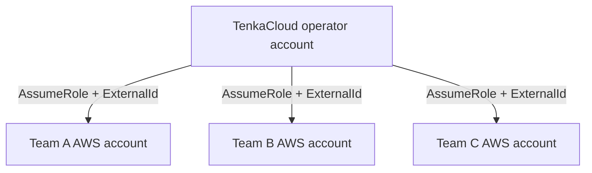

TenkaCloudをデプロイしたら、競技の単位となるeventを作り、teamとAWS accountを関連付けます。

この章で重要なのは、画面を順番にクリックすることではありません。**誰がどのAWS accountへ入り、どの問題stackを操作できるか**を確認することです。

## eventを作る

Application Admin Consoleで、新しいeventを作成します。

例として次を設定します。

```text
Event name: Cloud Rescue Practice 2026
Mode: Battle
Start: 2026-08-xx 13:00 JST
End:   2026-08-xx 14:30 JST
```

日時は、参加者への案内、採点開始、妨害発火、終了処理で共通に使います。運営メンバーのタイムゾーンが異なる場合は、JSTだけでなくUTCも併記します。

## 問題を選ぶ

最初の開催では、問題を詰め込みすぎません。

Cloud Rescue単独の60〜90分イベントであれば、次の流れで十分です。

1. endpoint登録
2. 初期状態の把握
3. nginx停止からの復旧
4. API停止からの復旧
5. 再発に対する監視とrunbook
6. 振り返り

複数問題を並べる場合も、前提関係を確認します。初めてSSMを使う人に、接続説明なしで高度な障害対応を要求しないようにします。

## teamを作る

チーム名は、AWS resource名やログに使われても識別しやすいものにします。

```text
team-fox
team-owl
team-wolf
```

個人名や機密情報をresource名へ入れない方が安全です。

チームごとに次を管理します。

- team ID
- 表示名
- 参加者
- 対象AWS account ID
- trust設定
- deploy状態
- endpoint登録状態
- score

## AWS accountの分離

推奨するのは、チームごとに専用AWS accountを用意する構成です。



同じaccount内でprefixだけを分けるより、次の境界が明確になります。

- IAM
- service quota
- billing確認
- 事故の影響範囲
- resource一覧
- CloudTrail

小規模検証でaccountを共有する場合は、問題templateの権限とresource名衝突を追加で確認します。

## ExternalIdを使う

TenkaCloud operator accountがteam accountのroleをAssumeRoleするとき、ExternalIdを条件にします。

```yaml
Condition:
  StringEquals:
    sts:ExternalId: !Ref ExternalId
```

ExternalIdはteamごと、deploy経路ごとに適切に管理し、問題文、ログ、Gitへ出しません。

## ParticipantViewerRoleの実態を確認する

role名にViewerと付いていても、問題によっては復旧操作が必要です。名前ではなく実際のpolicyを確認します。

Cloud Rescueでは、参加者が次を行える必要があります。

- `SSM Session Manager`で対象EC2へ接続する
- 問題固有のEC2情報を確認する
- 必要なログを読む
- instance内部でサービスを操作する

一方、次は不要です。

- IAM userやroleの新規作成
- 別チームresourceの一覧
- Organizations操作
- billing設定変更
- 新しいEC2やVPCの作成

## AWS Console federationを確認する

Participant PortalからAWS Consoleへ移動できる場合、実際にparticipant権限でログインします。

確認項目は次です。

- 正しいteam accountへ入っている
- セッションの有効期限が競技時間に適している
- 対象resourceのdeep linkが開く
- 不要なresource一覧が見えない
- `SSM Session Manager`が利用できる
- 競技終了後にセッションを失効またはroleを削除できる

管理者の普段使いブラウザーセッションが残っていると、意図せず強い権限で操作することがあります。participant用の別profile、別browser profile、private windowなどで確認します。

## 問題stackをデプロイする

eventへ問題とteamを関連付けたら、teamごとに問題stackをデプロイします。

運営画面では、次を追跡します。

- queued
- deploying
- complete
- failed
- deleting
- deleted

失敗したteamだけを再実行できるか、全teamを最初からやり直す必要がないかをリハーサルで確認します。

## endpoint登録を競技に含める

Cloud Rescueでは、CloudFormation Outputの`Ec2HostHint`を使い、Participant Portalへ次を登録します。

```text
frontend: http://<public-dns>
api:      http://<public-dns>:8080
```

登録後にprobeが始まります。

この操作を競技開始前の運営作業にするか、参加者の最初の課題にするかを決めます。本書では、監視対象を理解させるため参加者に登録させます。

## 開始前チェック

各teamについて、次を確認します。

```markdown
- [ ] team account IDが正しい
- [ ] trust roleをAssumeRoleできる
- [ ] problem stackがCREATE_COMPLETE
- [ ] EC2がSSM online
- [ ] Participant Portalへログインできる
- [ ] AWS Console federationが正しいaccountへ着地する
- [ ] endpointを登録できる
- [ ] 正常時のprobeが成功する
- [ ] 障害注入対象のInstanceIdを解決できる
- [ ] 自動revertが予約される
```

全teamの状態を一覧で確認してから競技を開始します。

次章では、リハーサルと当日運営を、役割、時刻、失敗時の判断まで含めて組み立てます。
