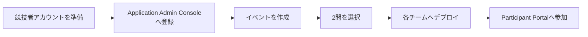

TenkaCloud Liteをデプロイしたら、参加チームのAWSアカウントを接続し、イベントを作ります。

流れは次のとおりです。

## 競技者用AWSアカウントを準備する

各チームのAWSアカウントへ、TenkaCloudが問題stackを作るためのRoleが必要です。

TenkaCloudリポジトリの`infrastructure/templates/competitor-bootstrap.yaml`を、各チームのAWSアカウントへデプロイします。

このtemplateは`TenkaCloud-CompetitorDeploy-Role`を作ります。信頼ポリシーは、次の2項目が一致したTenkaCloudだけを許可します。

- TenkaCloudをデプロイしたAWSアカウントID
- イベント運営側で設定した`ExternalId`

競技者アカウント側で作成されたRole ARNを、Application Admin Consoleへ登録します。

## イベントを作る

Application Admin Consoleで新しいイベントを作ります。最初のリハーサルでは、運営者が参加者役も兼ねる1チームから始めます。

入力する内容は次のとおりです。

- イベント名
- 開始時刻と終了時刻
- 参加チーム
- チームごとのAWSアカウントとリージョン
- 出題する問題

問題カタログから次の2問を選びます。

- `hello-world`
- `hello-world-battle`

最初にChallengeを置き、次にBattleを置くと、参加者は次の順でTenkaCloudの基本を体験できます。

1. AWSへ移動する
2. SSM Parameterを読む
3. flagを提出する
4. EC2へSSMで接続する
5. endpointを登録する
6. 継続得点を確認する
7. 障害を復旧する

## 問題を各チームへデプロイする

イベントへ問題とチームを登録したら、Application Admin Consoleからデプロイを開始します。

TenkaCloudはチームのRoleを`ExternalId`付きで引き受け、各AWSアカウントへCloudFormation stackを作ります。

デプロイが完了するまで、状態を確認します。

| 状態 | 対応 |
| --- | --- |
| 作成中 | 完了まで待つ |
| 作成完了 | Participant Portalで表示を確認する |
| 失敗 | `failureReason`とCloudFormation eventを確認する |

全チームが失敗した場合は、Roleの信頼先か`ExternalId`の不一致を最初に疑います。1チームだけ失敗した場合は、そのAWSアカウントのCloudFormation eventを確認します。

## Participant Portalへ参加する

チームを作成すると、チームごとのログイン鍵が発行されます。これはParticipant Portalへ入るための認証情報です。

ログイン鍵は、対象チームの参加者だけへ安全な経路で渡します。画面に一度だけ表示される場合があるため、発行時に保管します。

参加者へ配るものは次の2つです。

- Participant PortalのURL
- 自分のチームのログイン鍵

ChallengeとBattleの操作は、Participant Portalから始めます。次章では、1チームでリハーサルし、実際の開催へ進みます。
