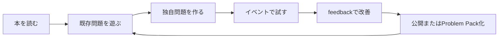

一度開催した競技を、その場限りのイベントで終わらせる必要はありません。

問題を再現可能なファイルとして残せば、個人学習、社内研修、採用イベント、コミュニティ開催へ再利用できます。TenkaCloudでは、問題とプラットフォームを分離しているため、問題カタログを独立して育てられます。

## 公開問題としてコントリビュートする

一般化できる問題は、TenkaCloudChallengeへPull Requestを送ります。

基本の流れです。

```bash
git switch -c problem/cloud-rescue-battle
bun run validate
git add battles/cloud-rescue-battle
git commit -m "feat: add cloud rescue battle"
git push origin problem/cloud-rescue-battle
```

Pull Requestでは、少なくとも次を説明します。

- 学習目標
- 想定対象者
- 初期状態
- 正常条件
- 採点方式
- disruptionとrevert
- 参加者権限
- 費用に影響するresource
- 実AWSで確認したregion
- デプロイ、解答、採点、削除の確認結果

「新しい問題を追加した」だけでなく、安全に開催できる根拠を書きます。

## readyへ変更する条件

`status: ready`は、原稿やtemplateを書き終えた意味ではありません。

```markdown
- [ ] bun run validateが成功する
- [ ] 新しいAWS accountまたはクリーンな環境へデプロイできる
- [ ] participant権限で解ける
- [ ] 採点が設計どおり動く
- [ ] disruptionとrevertが動く
- [ ] 初見者が問題文とhintから完走できる
- [ ] stack削除後に課金resourceが残らない
- [ ] README.mdとREADME.ja.mdが一致する
- [ ] 秘密値、credential、固定flagがGitにない
- [ ] 利用するcommitを固定して再現できる
```

一つでも未確認なら`draft`のままにし、残作業をIssueへ記録します。

## 社内限定問題は公開しない

社内構成、未公開incident、顧客情報、独自の統制ルールを含む問題は、公開カタログへ入れません。

公開版へ抽象化できる部分と、内部だけに残す部分を分けます。

### 公開しやすいもの

- 一般的なAWS設定ミス
- 架空企業のストーリー
- ダミーデータ
- 汎用的なrunbook
- 再利用できるscoring pattern

### 公開しないもの

- 実account ID
- 社内domain、IP address、system名
- 実際のcredentialやsecret
- 顧客データ
- 未修正の脆弱性
- 内部監査でのみ使う判定条件

## Problem Packを使う

TenkaCloudのProblem Packは、問題を公開カタログへmergeせず、特定tenantへinstall、activateするための仕組みです。

作成と検証の基本例です。

```bash
make pack-init ARGS="./my-pack --runtime aws/cloudformation"
make pack-validate ARGS="./my-pack"
make pack-install ARGS="./my-pack"
make pack-activate ARGS="com.example.cloud-rescue@0.1.0 --tenant local"
```

Problem Packは次に向きます。

- 社内限定演習
- 一度だけ開催する問題
- 公開前の試験運用
- 顧客ごとのカスタム問題
- spoilerを公開リポジトリへ置けない問題

pack自体のmanifest、version、lockを管理し、どのイベントでどのversionを使ったかを記録します。

## 問題をversioningする

競技問題は、文章だけでなくAWS resource、IAM、採点、障害注入を含みます。変更によって難易度や解法が変わるため、versionを意識します。

変更例です。

- `0.1.0`: 初回リハーサル
- `0.2.0`: hintと権限を改善
- `1.0.0`: 実AWS、初見者、削除まで確認して正式版
- `1.1.0`: 新しいdisruptionを追加
- `2.0.0`: architectureや勝利条件を変更

Git tagまたはcommit SHAをイベント記録へ残します。

## 一つの問題からカリキュラムへ

Cloud Rescue単体でも教材になりますが、前後の問題を作ると体系化できます。

```text
1. SSMで接続する
2. Linuxサービスを調査する
3. frontendを復旧する
4. 複数endpointを監視する
5. 再発へ対応する
6. IAMやnetworkの別原因を切り分ける
7. 自動復旧とrunbookを設計する
```

問題ごとに`learningGoals`を持たせ、必要になった段階で`track`、`nodes`、`relations`を使って前提関係を表します。

最初から巨大な総合問題を作るより、小さなChallengeを積み上げ、最後にBattleで統合する方が学びやすくなります。

## 生成AIを問題作成へ使う

生成AIは、CloudFormation、metadata、問題文、hintの下書きを速く作れます。しかし、次は実環境でしか確認できません。

- IAMの実権限
- AWS Consoleが内部で呼ぶAPI
- UserDataの完了
- endpointの到達性
- 採点の周期と状態
- disruptionの安全性
- stack削除後の残存resource
- 初見者がどう迷うか

AIが生成した「もっともらしい実行結果」を本文へ書かず、実際に取得した結果だけを記録します。コードと説明が食い違った場合は、実装と検証結果を基準に本文を直します。

## 本がOSSの導線になる

本書を読んだ人は、TenkaCloudを使うだけでなく、問題作者になれます。



この循環ができると、本は単なる操作マニュアルではなく、OSSの問題カタログを増やす仕組みになります。

## 次に作れる競技

Cloud Rescueで基本を理解した後は、次の題材へ発展できます。

- Security Groupの到達性障害
- IAMの過剰権限と権限不足
- ALB target healthの不整合
- S3公開設定と監査
- RDS migration
- WAFとrate limit
- backupからの復元
- CloudTrailからのincident調査
- AI生成アプリを本番品質へ引き上げるPlatform Engineering競技

どの題材でも、順序は同じです。

1. 学習目標を行動で書く
2. 正常系を作る
3. 壊す箇所を一つ決める
4. 外から観測できる勝利条件を作る
5. 参加者権限と費用境界を絞る
6. 自動採点する
7. hintを段階化する
8. 実AWSでデプロイ、解答、削除する
9. 初見者feedbackで直す
10. versionを固定して開催する

## おわりに

クラウド競技の本体は、派手なスコアボードでも、大量の障害注入でもありません。

参加者に体験してほしい判断を一つ選び、その判断が必要になる環境を安全に再現し、結果を自動で観測し、何度でも削除して作り直せることです。

TenkaCloudは、そのためのイベント、team、問題deploy、採点、hint、portal、disruptionを提供します。問題作者は、現場で身につけてほしい知識を競技へ変換します。

最初の一問は小さくて構いません。正常な環境を一つ作り、一箇所だけ壊し、誰かに解いてもらうところから始めてください。
