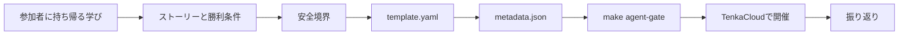

本書では、最小のChallengeとBattleを一から作りました。最後に、自分の題材へ置き換える順番を整理します。

## Challengeを作る

値の発見や、一度の修正完了を採点したい場合はChallengeから始めます。

Claude Codeを使う場合は、TenkaCloudChallengeリポジトリで次を実行します。

```text
/new-problem challenge
```

スキルは、slug、題材、難易度、想定時間、採点方式を確認します。`flag`方式なら`challenges/hello-world`をstarterとして使い、必須のIAM Role、タグ、採点の形を残したまま新しい問題を作ります。

手動で作る場合は、次の順で進めます。

1. `challenges/hello-world`を新しいslugへ複製する
2. 学習目標と勝利条件を書く
3. `template.yaml`の問題固有リソースを置き換える
4. デプロイごとのflagを、参加者が操作した先へ置く
5. `metadata.json`の表示文、採点、ヒントを更新する
6. 日本語と英語のREADMEを更新する
7. `make agent-gate`を通す

flagは、暗記で答えられる固定文字列にしません。参加者が意図したAWS操作をしたときだけ発見できる値にします。

## Battleを作る

サービスの状態を継続的に採点したい場合はBattleを選びます。

Claude Codeでは次を実行します。

```text
/new-problem battle
```

次に、採点方式を選びます。

| 採点方式 | 用途 |
| --- | --- |
| `uptime-flat` | 複数endpointを個別に採点する |
| `uptime-multi` | すべて正常な場合だけ得点する |
| `phased-polling` | 時間帯によって条件を変える |
| `attack-detection` | 検知数などの統計を得点へ変える |

最初のBattleは`uptime-flat`が分かりやすいです。`battles/hello-world-battle`をstarterにします。

Battleでは、次の4点を必ず決めます。

- 参加者が登録するendpoint
- 正常と判定するパスとHTTP status
- 障害を起こす実行方法
- 障害を元へ戻すrevert

URLのOutputは空にし、参加者が登録してから採点を始めます。障害の説明だけを書かず、`action`へ実行方法を定義します。永続障害を防ぐため、`revert`を付けます。

## 問題を公開する

公開問題は、TenkaCloudChallengeへ1問ずつPull Requestを作ります。

Pull Requestには次を含めます。

- 参加者が持ち帰る学び
- 最初の一手と勝利条件
- AWSリソースと権限境界
- 採点方式
- 障害とrevert
- コストと削除方法
- `make agent-gate`の結果

社内限定の題材や公開できない設定を含む問題は、公開カタログへ入れません。TenkaCloudのProblem Packを使い、対象tenantだけへ追加します。

## 本書で身につけた流れ



最初から大規模なGameDayを作る必要はありません。1つの行動を採点できるChallengeを作り、次に状態を維持するBattleへ進みます。問題作者が実装した機能ではなく、参加者が持ち帰った経験を基準に改善します。
