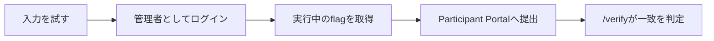

前章では、`sqli-demo`で参加者に持ち帰ってほしい学びと、中心となる行動を決めました。本章では、この1問に必要なストーリー、勝利条件、安全境界を確定します。

AWS ChallengeとBattleの設計は、ローカル問題が完成してから扱います。

## ストーリーを最初の行動へつなげる

ストーリーは、長い設定資料ではありません。参加者が「なぜ、この画面を調べるのか」を理解するために使います。

`sqli-demo`では、次の3点を決めます。

- 参加者の役割: ログイン画面のセキュリティ診断を依頼された担当者
- 現在の状況: 管理者のパスワードは分からない
- 最初に確認する対象: スタッフ専用ログイン画面

この設計から、参加者へ次の状況を渡します。

> 社内スタッフ専用のログイン画面があります。管理者としてサインインできれば、管理者だけが見られる合言葉を取得できます。しかし、管理者のパスワードは誰も知りません。入力の扱いを調べ、正規のパスワードなしで管理者としてサインインしてください。

ストーリーを読んだ参加者は、Participant Portalに表示されたWeb画面を開き、入力による挙動の違いを調べ始められます。

## 勝利条件を決める

「認証を回避できた」という状態を、見た目だけで判定してはいけません。問題環境が外から確認できる成功の証拠を用意します。

`sqli-demo`では、管理者としてログインした場合だけ、実行ごとに変わるflagを表示します。参加者がそのflagをParticipant Portalへ提出すると、問題コンテナの`/verify`が正誤を返します。



勝利条件は、次の一文で表せます。

> 参加者が管理者画面で取得したflagを提出し、実行中の問題環境が正解と判定する。

## ヒントで調査へ戻す

参加者が止まったときは、答えを一度に見せるのではなく、調査へ戻れる順番でヒントを出します。

1つ目のヒントでは、入力した文字が画面の裏側でどう扱われるかへ注意を向けます。2つ目のヒントでは、脆弱性の名前と具体的な入力例を示します。

問題文では脆弱性の名前を伏せ、必要な参加者だけが減点と引き換えに具体的な情報を得られるようにします。

## 安全境界を決める

`sqli-demo`は、意図的に安全でないログイン処理を含みます。そのため、参加者のPC以外から接続できないことを設計条件にします。

- 攻略対象のWeb画面は`127.0.0.1`へだけ公開する
- 採点用の`/verify`も`127.0.0.1`へだけ公開する
- 攻略対象と採点APIを別のportに分ける
- flagをソースコードへ固定しない
- 不正解時に、正しいflagや比較結果を返さない
- `make local-down`で問題環境と採点環境を終了する

ローカルで動かすことは、安全を自動で保証するという意味ではありません。Docker Composeのport設定で外部公開を防ぎ、採点APIから答えが漏れないように実装します。

## 実装前の仕様

ここまでの判断を、実装前の仕様としてまとめます。

```text
sqli-demo

学習体験:
  Web画面を調べ、入力による挙動の違いから認証を回避する

ストーリー:
  セキュリティ診断の担当者が、パスワード不明の管理者画面を調べる

勝利条件:
  管理者画面で得たflagを/verifyが正解と判定する

安全境界:
  Web画面と/verifyを127.0.0.1だけへ公開する
  flagを実行ごとに生成する
  終了時はmake local-downを使う
```

次章では、TenkaCloudChallengeを準備し、この設計を置くディレクトリと作成手順を確認します。
