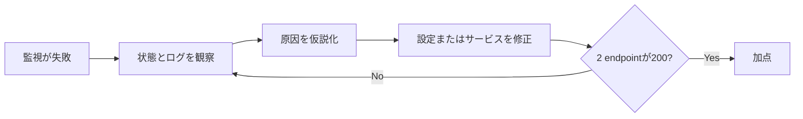

クラウド競技は、設定変更の一覧ではありません。参加者が「なぜ今これを直すのか」を理解できると、同じ操作でも体験の質が変わります。

一方で、物語だけが大きく、成功条件や安全境界が曖昧な問題は運営できません。本章では、ストーリー、勝利条件、安全性を同じ仕様書へ落とします。

## ストーリーには利害と緊急性を置く

Cloud Rescueの物語を次のようにします。

> あなたは天下クラウド株式会社の当番SREです。新機能公開の直前、顧客向けWebページと内部APIの監視が赤くなりました。前任者は引き継ぎを残さず退職しています。公開時刻までに原因を特定し、サービスを復旧してください。

必要なのは長い設定ではありません。最低限、次の4点があれば十分です。

- 誰として行動するのか
- 何が壊れているのか
- 放置すると何が困るのか
- 何を達成すれば終わるのか

物語の役割は、正解を隠すことではなく、参加者の判断に意味を与えることです。

## 勝利条件は外から観測できる形にする

「nginxを再起動したら成功」という条件は実装依存です。参加者が別の正当な方法でサービスを復旧しても、同じ結果なら成功とみなす方が自然です。

Cloud Rescueの勝利条件は、次の外形にします。

- frontendの`/`がHTTP 200を返す
- APIの`/healthz`がHTTP 200を返す
- Battleでは両方の正常状態を継続する



実装方法ではなく結果を採点すると、参加者が自分で考える余地を残せます。

## 解法を一つに縛りすぎない

問題作者が想定したコマンドだけを正解にすると、競技は手順書になります。

たとえばnginxが停止している場合、次はいずれも妥当です。

- `systemctl start nginx`
- `systemctl restart nginx`
- 設定を確認したうえでサービスを再起動する

一方、次は問題の学習目標から外れるため禁止してよいでしょう。

- 新しいEC2を作ってURLを差し替える
- 採点APIを直接呼び出して点数を改変する
- 他チームのAWSアカウントへアクセスする
- CloudFormation管理外の課金リソースを作る

禁止事項は「作者の想定と違うから」ではなく、安全性、削除可能性、学習目標への影響で決めます。

## 安全境界を先に設計する

競技用のAWS環境では、問題を面白くする前に安全境界を決めます。

### アカウント境界

TenkaCloudは、チームごとのAWSアカウントへ問題stackをデプロイする構成を取れます。競技者は`ParticipantViewerRole`をAssumeRoleし、自分の問題リソースへアクセスします。

少なくとも次を守ります。

- `ExternalId`を必須にする
- 権限を問題の`NamePrefix`へ限定する
- 他チームのリソース一覧を見せない
- 管理者権限を参加者へ渡さない
- 障害注入も対象チーム内で完結させる

### ネットワーク境界

公開エンドポイントが必要な場合も、管理ポートをインターネットへ開けません。

- SSHの22番ポートを開けず、`SSM Session Manager`を使う
- アプリケーションに必要なポートだけを許可する
- 管理APIやflagを公開レスポンスへ混ぜない
- Security Groupの送信元範囲を意識する

### 費用境界

問題作者は「1回の競技でいくらかかるか」だけでなく、削除し忘れた場合の上限も考えます。

Cloud Rescueでは、最小構成を次のようにします。

- EC2は1台
- NAT Gatewayを使わない
- Elastic IPを不要にする
- ログ保持期間を短く設定する
- 高額なマネージドサービスを使わない
- 自動復旧や妨害を無制限に繰り返さない

料金はリージョンや契約条件で変わるため、本文に固定額を断定しません。開催前にAWS Pricing Calculatorと実際の請求設定で確認します。

## 削除を最初に設計する

問題環境では、作成より削除の方が難しくなります。参加者がトップレベルリソースを新規作成すると、CloudFormation stackを削除してもそのリソースは残ります。

そこでCloud Rescueでは、次の原則を採用します。

1. 必要なリソースは全て`template.yaml`で作る
2. 参加者は既存リソースの設定またはサービス状態だけを変える
3. 保存データは競技中に必要な最小量へ絞る
4. `DeletionPolicy: Retain`を安易に使わない
5. 終了後にstack削除と残存確認を行う

問題の面白さより、繰り返し開催できることを優先します。

## 妨害には必ず安全網を置く

Battleでは、運営側がnginxを停止するような障害注入を行えます。しかし永続的な停止は、参加者が接続できない場合に競技を詰ませます。

妨害には次を持たせます。

- 対象を1つのチーム、1つのリソースへ限定する
- 実行内容を監査可能にする
- 参加者が観測できる症状を作る
- 復旧方法を用意する
- 一定時間後の自動復旧を安全網として設定する

「予想外」と「理不尽」は違います。参加者が証拠から原因へたどり着ける妨害にします。

## Cloud Rescue仕様書

ここまでをまとめます。

```markdown
# Cloud Rescue 仕様

## ストーリー
公開直前のWebページとAPIで監視障害が発生した。担当SREとして復旧する。

## 正常条件
- frontend `/` がHTTP 200
- API `/healthz` がHTTP 200

## Challenge
接続、観察、復旧を自分のペースで行う。必要ならflag提出で完了する。

## Battle
2つのendpointを登録し、1分ごとのprobeで正常状態を維持する。

## 障害
nginxまたはAPIサービスを停止する。対象は1チームのEC2のみ。

## 安全境界
- チーム専用AWSアカウント
- ExternalId付きAssumeRole
- SSH非公開、SSM接続
- 問題固有リソースだけを操作可能
- 一定時間後に自動復旧

## 削除
CloudFormation stackとTenkaCloud環境を削除し、残存リソースを確認する。
```

次章では、採点が参加者の行動へ与える影響を整理します。その後、TenkaCloudChallengeで実装を始めます。
