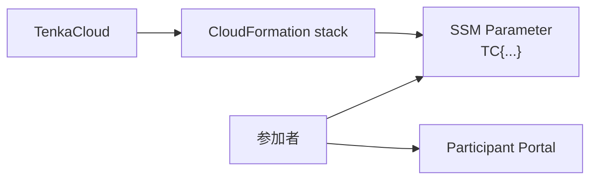

TenkaCloudChallengeでは、各問題に`README.md`と`README.ja.md`が必要です。`metadata.json`はTenkaCloudが読み取る表示と採点の定義で、READMEは問題作者、レビュー担当者、イベント運営者が設計を確認する文書です。

## READMEに書く内容

`hello-world`のREADMEは、次の順で書きます。

1. 問題の目的
2. ストーリー
3. デプロイされるAWSリソース
4. 参加者の解き方
5. 採点
6. ヒント
7. コスト
8. 学習目標
9. 関連ファイル

READMEの説明は、`metadata.json`と`template.yaml`から確認できる事実に合わせます。

`hello-world`では、SSM Parameterの値は次の形式です。

```text
TC{デプロイごとのランダム値}
```

以前の値やサンプル値をREADMEへ残すと、参加者と運営者が誤解します。Output名、点数、ヒント減点、AWSリソースは、実装を変更したときにREADMEも更新します。

完成した日本語READMEは[README.ja.md](https://github.com/susumutomita/TenkaCloudChallenge/blob/main/challenges/hello-world/README.ja.md)、英語READMEは[README.md](https://github.com/susumutomita/TenkaCloudChallenge/blob/main/challenges/hello-world/README.md)で確認できます。

## 日本語版と英語版を同じ内容にする

`README.md`を英語、`README.ja.md`を日本語とします。直訳である必要はありませんが、次の事実は一致させます。

- 作成されるAWSリソース
- 参加者の最初の一手
- 提出する値
- 点数と減点
- ヒントの段階
- 削除方法
- コスト

片方だけを更新すると、言語によって異なる問題に見えます。Pull Requestでは両方を同時に確認します。

## diagram.svgで流れを見せる

`diagram.svg`はParticipant Portalの問題詳細へ表示されます。`hello-world`では、情報の流れだけを示せば十分です。



構成図へ正解値や、参加者が発見すべき情報を書きません。リソースの関係と操作の流れを短く見せます。

次章では、作成したChallengeを参加者の操作順に通して確認します。
