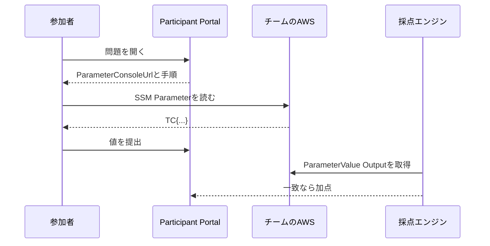

ここまでの内容を、`challenges/hello-world/`へそろえます。

```text
challenges/hello-world/
├── metadata.json
├── template.yaml
├── README.md
├── README.ja.md
├── diagram.svg
└── simulation.json
```

## ファイル同士の接続を確認する

最初に、名前が一致している箇所を確認します。

| 接続元 | 接続先 | 一致させる値 |
| --- | --- | --- |
| ディレクトリ名 | `metadata.json` | `hello-world` |
| `metadata.json.cfnTemplate` | ファイル名 | `template.yaml` |
| `metadata.json.cfnParameters.FlagSeed` | `template.yaml.Parameters` | `FlagSeed` |
| `metadata.json.scoring.flagOutputKey` | `template.yaml.Outputs` | `ParameterValue` |
| `metadata.json.simulationOverlay.entry` | ファイル名 | `simulation.json` |
| 日本語ヒント | 英語ヒント | `hint-1`、`hint-2` |

## 参加者の流れを通して読む

問題を開いた参加者は、`shortDescription`と`instructions`を読みます。

次に`ParameterConsoleUrl`を開くか、CLIで`aws ssm get-parameter`を実行します。`ParticipantViewerRole`は、自分の`NamePrefix`配下にあるParameterだけを読めます。

取得した`TC{...}`をParticipant Portalへ提出します。TenkaCloudは`ParameterValue` Outputを正解として比較し、一致すれば得点を記録します。



## 完成形と比較する

本書で説明した内容と、公開中の完成形を比較します。

- [問題ディレクトリ全体](https://github.com/susumutomita/TenkaCloudChallenge/tree/main/challenges/hello-world)
- [metadata.json](https://github.com/susumutomita/TenkaCloudChallenge/blob/main/challenges/hello-world/metadata.json)
- [template.yaml](https://github.com/susumutomita/TenkaCloudChallenge/blob/main/challenges/hello-world/template.yaml)

完成形には、AWS Consoleの表示を成立させる権限や、入力値の制約、説明コメントも含まれます。コードを短くするために削除せず、`AGENT.md`の理由と合わせて確認します。

次章では、リポジトリが定めたコマンドで問題を検証します。
